# 【Crystal入门与实践】LA、FA - 有穷自动机与正则引擎实现
## 引言 & 标题解释
&nbsp;&nbsp;你好，我又是Makiror，一月不见如隔一月。我在这段时间事挺多，每到节假日也是到处跑...挺累的同时也开始降低更新频率了。第一次写涉及到算法的博客是紧张又兴奋...我的数学基础一直挺薄弱，是典型的学渣啊，搞算法对我而言是个不小的挑战。    
&nbsp;&nbsp;最近发现自己以前的文章质量低，感到很焦虑，于是下定决心要提高文章的内容质量，我的此类技术文章现在大概保持月更的节奏，我很希望让它的质量一个月比一个月高到足以见证我的进步<b>（如果你发现我近一两篇文章内容稍微进步了，不用感到意外，这只是那段时间努力的结果）</b>。这期间我也会逐渐删掉/重写过去的低质文章。    
&nbsp;&nbsp;正如标题所写，本文的主题是Crystal，你很可能从来没有听过这个编程语言，因为它真的太小众了。在我决定做这件事之前我也不知道它的存在，Crystal是我在ググ一些论文时无意中见到的，那几天挺闲的就决定试一下。没错，起因真的就那么轻率和单纯。    
<br>
（战术喝水 *1）  
<br>  
&nbsp;&nbsp;你可能对标题的词语有些不解，不要紧，我们先搞懂标题是什么再开始内容吧。    
&nbsp;&nbsp;这次我们的内容涉及到一本书 *Compilers: Principles, Techniques, and Tools* ，也就是著作《编译原理》，其中的一章，计算机科学、软件工程系的学生应该对这本书一点也不陌生，编译原理是本科的一门专业基础课。我们习惯叫它的昵称『龙书』，这个昵称来自它封面的屠龙勇士和恶龙搏斗。    
> 天呐！原来Markdown的斜体是用星号的！英文书名使用中文的书名号真的好怪。（感动）

&nbsp;&nbsp;标题中的LA是龙书第三章-词法分析（Lexical Analysis）。在本章第3节提到了正则表达式，进而讲到词法分析其生成工具Lex，其生成工具本身也叫Lex compiler，它会将输入的模式转为一个状态转换图，而FA就是 *有穷自动机（Finite automata）* ，它看起来类似状态转换的图，不过它是识别器（Recognizer）。本文我们将详细探讨它们。      
&nbsp;&nbsp;*正则表达式（Regex）* 是一种描述文本模式的方式，可用于搜索、替换和验证文本，正则引擎则是一种解析和匹配正则表达式的程序，本文的重点即解析和匹配正则表达式，我相信很多小伙伴对正则表达式也不会很陌生。
&nbsp;&nbsp;这次的目标并不难，使用Crystal语言实现一个支持基础运算符的正则引擎，我们着重于这其中会使用到的算法，然后你就能基于它很容易拓展出其他运算符的支持了。    
<br>
&nbsp;&nbsp;本文没有假设读者的门槛，甚至可以说不那么熟悉编程都不要紧（毕竟这次使用的语言，你很大可能没接触过），我们着重的还是思维，只要你理解了内容即可理解编程实战的代码。先从简单了解这次的编程语言和开发目标开始吧。
<br> 
> Wechat平台发布，评论区置顶有本文pdf版本，因为Wechat公众号不能上传矢量图所以直接看影响观感。

## Crystal语言简介
### 编程范式简介
> Crystal Github：https://github.com/crystal-lang/crystal

&nbsp;&nbsp;Crystal是开源的，如果你有兴趣可以先去阅读一下源代码试试水。    
&nbsp;&nbsp;它是一种通用编程语言，上次的文章已经讲过此类编程语言的定义了，即【被设计为各种应用领域服务的编程语言】。Crystal的编程范式是面向对象编程（Object Oriented Programming）为主，但是它也支持多范式（例如过程式编程和函数式编程）。既然如此我们这次就主要使用面向对象编程的方式来对待实践内容好了。
<br> 

### Ruby替代品？
&nbsp;&nbsp;Crystal语言总是把『Ruby的替代品』挂在嘴边，它也确实在语法、代码风格上和Ruby很相似。但是Ruby是一种解释型编程语言——这意味着它执行速度慢，在这方面Crystal在向C语言看齐，它旨在有更高抽象的前提下，提供与C类似的性能。从类型安全上看，而Crystal是静态语言，很多运行错误在编译时就能被发现，而Ruby作为动态语言，很多时候会在运行时才发现一些错误。这个做法的同时还帮了垃圾回收机制一个大忙，使得在它无需手动分配内存的同时不耽误性能（相比之下的Ruby因为其动态而在垃圾回收上会耗费更多性能）    
> Fast as C, slick as Ruby

&nbsp;&nbsp;当然在很多语言特性方面，Crystal都尝试总结Ruby以及其他编程语言的经验并做的更好，例如改用类型推断之类的，我是比较看好它的。如果你对它的更多语言特性感兴趣还是一样——去看文档和阅读源代码。
<br> 

## 实践目标
&nbsp;&nbsp;我们想要的是一个正则表达式库，可以被这样调用：
```
  regex = MRegex.new("abc")
  result1 = re.match("abc") // return true
  result2 = re.match("abd") // return false
```
&nbsp;&nbsp;同时它支持基本运算符*?+|.和转义符\。所以我们的难点在于构建这个MRegex的过程，其中涉及到正则表达式解析成有穷自动机和简化的算法。一个正则表达式输入后会经过这样的处理：
<br>
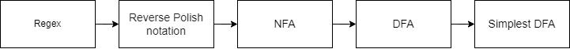
<br>
&nbsp;&nbsp;将正则表达式转为逆波兰表达式，然后构建NFA，再将NFA转为DFA，最后简化DFA。此图中的每一段我们都会用一章来实现，所以不用着急，后面就懂了。其中我们最重要的部分也就是涉及有穷自动机的后三部分。　　　　
&nbsp;&nbsp;不得不说书中定义相关的内容真的很变态，看完脑瓜子嗡嗡的。
<br>

## 初识有穷自动机
### 概念和形式定义
&nbsp;&nbsp;有穷自动机（Finite automata），也可以说Finite state machine，是一种抽象的计算模型，它包含了一组有限的状态以及在每个状态下接受的输入和转移规则。在实际应用中，有穷自动机常被用来描述各种系统的行为模式，例如编译器、通信协议、电路设计等等。    
&nbsp;&nbsp;一般我们会用状态图来形象地表示一个有穷自动机（Finite Automata）。一个有穷自动机有且只有一个起始状态，和接受状态（数量不定），它的输出只有接受或者拒绝。尽管定义类的东西真的很烦人，但为了更好的理解，我们本段还是先简单讲讲有穷自动机的形式定义    

&nbsp;&nbsp;一个有穷自动机是一个5元组 $M = \langle Q,\Sigma,\delta,q_0,F \rangle$：
+ 一组有限的状态集合Q
+ 一个有限的输入字母表Σ
+ 一个状态转移函数δ：Q × Σ → Q
+ 一个起始状态q0 ∈ Q
+ 一个终止状态集合F ⊆ Q

&nbsp;&nbsp;A × B 记号为笛卡尔积，即第一个元素是A的成员，第二个元素是B的成员的所有有序对组成的集合。
&nbsp;&nbsp;f：A → B 为映射关系。
&nbsp;&nbsp;起始状态有且只有一个，而接受状态可以有多个。Q包含的一组状态也包括它们。    
&nbsp;&nbsp;假设我们有一个正则表达式<code>a.b</code>，也就是它能接受由a开头，一个任意字符，b结尾的字符串。假设这个任意字符使用#表达，我们就可以画出这样的有穷状态自动机转移图：
> 本文会用到大量的状态转移图，我觉得用drawio一个一个画太慢了，然后我发现Graphviz很好用。
> https://graphviz.org/

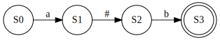
&nbsp;&nbsp;其中S0是起始状态，S3是终止状态之一（此自动机只有它一个终止状态），通过依次接受字符a，#（表任意单个字符），b并转移到下一个状态，最后到终止状态，匹配完成。    
&nbsp;&nbsp;这是一个最简单的自动机，但我们都知道正则表达式有很多运算符，什么或（|）、括号、前一子表达式出现任意次数（*），上述例子它只有一条路线，唯一一个终止状态，而加入各种运算符这个问题就会更复杂。包括不同的输入不同的走向，如果走向发现无法匹配怎么往回走...当然这并不是唯一解决方法，所以有穷状态机还有NFA（Nondeterministic Finite Automaton）和DFA（Deterministic Finite Automaton）这两种主要分支。    
另外，接下来类似上述的状态转移图，我会使用双圈样式来表示终止状态，而起始状态不做特殊标记因为它是唯一的。
<br>
（战术喝水 *2）  
<br>  

### 非确定有穷状态自动机
&nbsp;&nbsp;首先我们从非确定有穷状态自动机（NFA，Nondeterministic Finite Automaton）开始介绍，其实先介绍哪个感觉不重要，但是我们会先构造NFA再转DFA，所以按照这个顺序吧就。    
&nbsp;&nbsp;现在我们再写一个正则表达式<code>a(b|c)</code>，它出现了或运算，不过并不复杂，我们可以很容易脑补出一个有穷自动机：
<br>
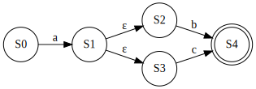
<br>
> 注：现阶段你只需要将ε转移理解为无条件转移即可，这对于我们后面构建自动机而言很有必要

&nbsp;&nbsp;虽然在构造的过程中实际搞出来的自动机会与这个有出入，但是它关系就是这样的，在理论章暂时先不想那么多。重点在于，如果a匹配完成，S1到了这个分岔路口怎么走，因为程序不知道输入的内容会被哪个状态所接受。NFA选择的是回溯机制，简单的说就是当有多种选择，程序可以在其中一条路径上进行状态转移，但如果在后续过程中发现该路径行不通，则可以回到之前的状态，并选择其他路径进行状态转移。简单粗暴，但是效率相对更低。它匹配时不断尝试，所以这叫做“非确定性”。    
&nbsp;&nbsp;很显然的是，相比构建时的成本高低，我们一般更优先考虑匹配效率，所以就不能使用这种挨个试一遍的方法了。NFA一般更适合用于处理比较不规则的表达。
<br>

### 确定有穷状态自动机
&nbsp;&nbsp;确定有穷状态自动机（DFA，Deterministic Finite Automaton），也就是同一个输入只会有一个转移到可能，所以叫确定的。相比NFA，它不能有ε转移，不能同一个输入具有多个抓一状态，不能有不确定的转移。所以在匹配这种自动机时我们不需要回溯机制，直接匹配过去就好了。同样是上述<code>a(b|c)</code>正则表达式的例子，如果变成DFA的话就长这样：    
<br>
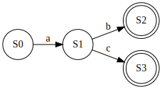
<br>
&nbsp;&nbsp;或者b、c输入都指向同一个接受状态也可以：    
<br>
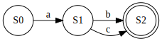
<br>
&nbsp;&nbsp;无论如何，DFA的重点在于每一个输入对应的下一个状态都是确定的，这种特性使得它匹配时会更快，所以我们的最终目标就是生成一个最简DFA。最后匹配时程序只在意根据提供的内容走，能不能走到自动机的接受状态。    
&nbsp;&nbsp;还有一点我觉得需要提醒一下的，目前我们展示的状态图都是很简单的形式并且最简的情况，实际我们构建时会出现更多复杂的情况。此处作为理论阶段才没有考虑这种情况。
<br>

### FA和正则表达式的等价性
&nbsp;&nbsp;正则表达式和有穷状态自动机之间存在一种等价性，即可以通过正则表达式来表示它接受的语言，反之亦然。这个概念我们在后面会用到，先记着吧啊。

<br>

## Thompson构造法实现
&nbsp;&nbsp;NFA明显更容易构造，所以我们先从构建NFA开始。
<br>

### Thompson构造法简介
&nbsp;&nbsp;Thompson构造法是将正则表达式转为等价NFA的算法，非常普遍的一种正则引擎实现思路。老规矩，这是论文链接，我认为啃论文是最简单粗暴的一种学习方法了：
> Programming Techniques: Regular expression search algorithm：
> https://www.oilshell.org/archive/Thompson-1968.pdf
> 
> 此外，因为Crystal太冷门了，先例很少，所以这可能是本章唯一的参考资料（语言文档除外）

简要概括主要步骤就是：
+ 将正则表达式转换为逆波兰表达式。
+ 从左到右扫描逆波兰表达式并根据操作符构建NFA自动机
+ 当逆波兰表达式处理完成时，使用ε转移将构建的NFA合并成一个。

&nbsp;&nbsp;其思想就是将正则表达式分为一个个子表达式并转为NFA，再拼接在一起，我们举一个最最最简单的例子，正则表达式<code>ab</code>。首先把它分为a和b两个部分，然后分别构造NFA自动机：
<br>
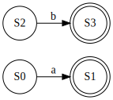
<br>
&nbsp;&nbsp;因为a在先b在后，并且它们是连续的，所以将第一个子表达式的接受状态（S1）变成普通的非接受状态，然后首尾使用ε转移连接变成这个样子：
<br>
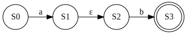
<br>
&nbsp;&nbsp;这个NFA就等价于正则表达式<code>ab</code>

不过在具体实现中，有一些名词你也可能还没接触过，所以我们一一了解并实践就好了。
<br>

### 逆波兰表达式
&nbsp;&nbsp;从我们幼儿园开始接触的四则运算开始，就已经有了运算优先级的概念，先算乘（*）除（/）后算 加（+）减（-），有些时候为了消除歧义就需要用括号来指明运算优先级，例如<code>(1 + 2) * 3</code>和<code>1 + 2 * 3</code>就是不一样的，正则表达式的操作符同理。这种符号在操作数中间的表达式叫做中缀表达式，我们常用并且熟悉它，因为它最好看懂。但是程序分析那个正则表达式时，是以一个特定的顺序扫的，它不会自动像人一样分析一个表达式的运算先后，所以我们需要另一种更容易给程序识别分析的表达式。
&nbsp;&nbsp;波兰表达式（Polish notation），也叫做前缀表达式，也就是操作符在前操作数在后，例如上述的例子变成波兰表达式就是<code>\* + 1 2 3</code>，这种表达式有个好处就是操作符都是二元的，就算没有括号表达也不会有歧义，对于我们而言后面会更方便构建自动机。    
&nbsp;&nbsp;为了让处理顺序更方便，我们使用的是逆波兰表达式（Reverse Polish notation），又叫后缀表达式，和波兰表达式基本一样，只是操作数在前，操作符在后，例如上面的例子变成逆波兰表达式就是<code>1 2 + 3 *</code>，我们将使用Dijkstra双栈算法来实现。    
<br>
&nbsp;&nbsp;我们创建一个新的Crystal项目：
```
crystal init lib ror_cr
```
&nbsp;&nbsp;里面包含了源文件、开源协议（MIT License）、README、测试代码目录和包管理器的配置文件。
```
./
├── LICENSE
├── README.md
├── shard.yml
├── spec
│   ├── spec_helper.cr
│   └── ror_cr_spec.cr
└── src
    └── ror_cr.cr
```
> ror_cr是我使用的项目名，全写为ROR Crystal Regex

&nbsp;&nbsp;在new一个MRegex对象时，它首先就要将传入的正则表达式转为后缀表达式，所以我们先创建一个源文件并且定义MRegex类。
&nbsp;&nbsp;这个类暂时没有任何成员，将正则表达式转为逆波兰表达式的函数在本文件定义。
```
// src/regex.cr

class MRegex
  def initialize(regex : String)
      # todo
  end
end
```
&nbsp;&nbsp;在Crystal中，initialize是一个特殊的函数，用于初始化类或对象的实例。当创建一个类或对象的实例时，Crystal会自动调用该类或对象的initialize函数来进行初始化。    
&nbsp;&nbsp;然后我们定义一个函数to_rpn，它会接受一个字符串类型的正则表达式并将其转为Char数组类型的等价逆波兰表达式：
```
// src/regex.cr

  def self.to_rpn(regex : String) : Array(Char)
  end
```
&nbsp;&nbsp;此处的self表示该方法是一个对象方法（instance method），需要通过实例调用，它表示引用当前对象本身。我们在此显性定义函数的返回值类型Array(Char)。如果没有显性定义的话，Crystal会使用类型推断（type inference），但是我觉得应该养成显式声明返回值的好习惯，尤其是在比较复杂的场景。    
&nbsp;&nbsp;我们需要定义一个HashMap来表示每个操作符对应的优先级，目前我们只是基础正则引擎，所以除了|操作符优先级最高以外，其他运算符（*+?.）的优先级是同等的，当然，括号是表示优先级的，后面做特殊处理。这个HashMap我们没有显性定义数据类型，因为我们从来不需要更改它，但是很显然它是<code>Char => Int32</code>
```
// src/regex.cr

  def self.to_rpn(regex : String) : Array(Char)
    operators = {
      '|' => 0,
      '*' => 1,
      '+' => 1,
      '?' => 1,
     }
  end
```
&nbsp;&nbsp;我们将输入的中缀表达式变成Char数组，并且定义一个逆波兰表达式数组（即最后返回的结果）和一个操作符栈：
```
// src/regex.cr

    infix = regex.chars
    postfix = [] of Char
    stack = [] of Char

    i = 0
    should_splice = false
```
&nbsp;&nbsp;这边使用栈来处理操作符和括号。可能有的小伙伴知道Leetcode有一题很有名的题叫做*valid-parentheses*（听说这玩意还是BiliBili的2021春招面试真题，这可真是捡到了）。栈遵循先进先出的规则，Crystal没有栈这个数据结构，但是我们可以通过弹出数组顶部的操作来模拟栈。    
&nbsp;&nbsp;此外，有些情况会在表示两个字符应为同一个子表达式（有关联性的）时用括号括起来，例如<code>(a|b)c</code>和<code>a|(bc)</code>是不同的，前者表示a或b，然后c，后者表示a或bc。但由于我们是遍历处理字符的，所以最好是用一个布尔值标记“现在这个字符是否应该和上一个字符连续处理”。    
&nbsp;&nbsp;在正则表达式的处理中，转义符\应该永远最优先处理并匹配，并且我们将表示转义符的\插在逆波兰表达式中对应元素的前面，后面构建时再做处理即可。（实质上\\\表示的是\，但是在Crystal代码中要将它本身转义）并且i向后移两位，因为已经处理了转义符和后面一个符号。如果需要做字符拼接，不能忘记加入.号。在一般此类表达式中.号代表连接，但是在正则表达式中.号代表任意单个字符，所以在后面如果我们遇到了想表示任意单个字符的.，就把它替换成#再加入逆波兰表达式。

```
// src/regex.cr

    while i < infix.size
      case infix[i]
      when '\\'
        postfix << '\\'
        postfix << infix[i+1]
        if should_splice == true 
          postfix << '.'
        end
        should_splice = true
        i += 1
      end
      i += 1
    end
```
&nbsp;&nbsp;当匹配到左括号时，将它压入栈，匹配到有括号时就将栈内所有操作符弹出并加入逆波兰表达式，直到遇到左括号，左括号会被弹出但是不会被加入。遇到任何不当字符处理的符号时，需要将should_splice设为false。
```
// src/regex.cr

      when '('
        should_splice = false
        stack.push(infix[i])

      when ')'
        should_splice = false
        while stack.last != '('
          postfix << stack.pop
        end
        stack.pop
```
&nbsp;&nbsp;当遇到其他操作符时，则不断向逆波兰表达式加入栈内操作符直到当前操作符优先级高于栈顶元素，或者栈顶元素为左括号再或者栈空了。最后将自己加入操作符栈。
```
// src/regex.cr

      when '|', '*', '+', '?'
        should_splice = false
        while !stack.empty? && stack.last != '(' && operators[stack.last] >= operators[infix[i]]
          postfix << stack.pop
        end
        stack.push(infix[i])
```
&nbsp;&nbsp;最后就是处理普通字符了，如果遇到.号就要替换成#，然后将处理的字符加入逆波兰表达式。如果有连续字符导致应该连接这两个字符，并且操作符栈顶为作括号，就加入连接符，处理完普通字符后要将should_splice设为true。    
&nbsp;&nbsp;例如<code>(a|(bc))</code>中，bc就会被加入连接符并处理，值得注意的是尽管连接符不算入操作符，它总是被特殊处理，但它也像其他操作符一样以逆波兰表示的方式被加在了字符后面。
```
// src/regex.cr
      else
        if infix[i] == '.'
          postfix << '#'
        else
          postfix << infix[i]
        end

        if should_splice == true && !stack.empty? && stack.last == '('
          postfix << '.'
        end
        should_splice = true
```
&nbsp;&nbsp;若最后操作符栈还有剩余内容则全部加入逆波兰表达式的末尾，并返回它。
```
// src/regex.cr
    while !stack.empty?
      postfix << stack.pop
    end
    return postfix
```
&nbsp;&nbsp;到此为止，将正则表达式转为逆波兰表达式的函数就完成了，然后我们可以在MRegex的initialize加入调用代码，并且准备继续编写构建自动机的代码：
```
// src/regex.cr

  def initialize(regex : String)
      postfix = MRegex.to_rpn(regex)
  end
```
<br>

### 操作符和闭包
&nbsp;&nbsp;我们已经完成了Thompson构造法的第一步：转换逆波兰表达式，所以现在我们可以开始构建NFA自动机了。    
&nbsp;&nbsp;我们使用HashMap来描述状态转移关系，关系为Char => Set(NFAState)，Set集合相比Array有些不同，它是无序的，并且元素不可重复，在NFA中同一个字符可能会有多条可能会转移的状态，所以我们这样定义一个NFA状态和它的转移关系。accepting字段则表示这个状态是否被接受。
```
// src/regex.cr

class NFAState
  property transitions : Hash(Char, Set(NFAState))
  property accepting : Bool
end
```
&nbsp;&nbsp;随便举一个例子，下图转移关系的NFA在程序内的数据结构实际上长这个样子，所以在匹配时实际上只需要提供作为起始状态的S0。当然别人同时也能指向这个S1，在不复制的情况下，即便多个地方指向同一个状态，内存位置也是相同的，其实这对于一个已经熟悉Rust所有权机制的人而言实在是有点...一言难尽，但是，还是学会在正确的时候放弃固有思维吧啊啊啊啊啊啊。


<br>

&nbsp;&nbsp;首先我们定义初始化一个NFA状态的函数，没有任何转移，默认是非接受状态。注意此处我们初始化应该显式声明新的HashMap的数据类型。
```
// src/fa/nfa_state.cr

  def initialize()
    @transitions = {} of Char => Set(NFAState)
    @accepting = false
  end
```
&nbsp;&nbsp;然后我们就可以为NFAState定义两个方法：add_transition和add_epsilon。就是将它与另外一个NFAState用某个字符连接起来，由于我们在构建NFA自动机时会大量使用ε转移，所以我们就专门定义一个只需要一个参数的add_epsilon。定义如下：
```
// src/fa/nfa_state.cr

  def add_transition(symbol : Char, state : NFAState)
    @transitions[symbol] ||= Set(NFAState).new
    @transitions[symbol] << state
  end

  def add_epsilon(state : NFAState)
    @transitions['ε'] ||= Set(NFAState).new
    @transitions['ε'] << state
  end
```
&nbsp;&nbsp;这里我们使用到了或等于（or-equals）运算，它就是一种简写形式：如果被赋值者为falsy（nil或false）值则将其赋值，否则不做操作。放到这里的话就是，如果@transitions没有这个符号对应的NFAState的Set集合，则创建新的NFAState的Set集合给它，然后向这个符号对应的这个集合追加要连接的状态。例如上述代码块第四行等价于：
```
if !@transitions.has_key?(symbol)
  @transitions[symbol] = Set(NFAState).new
end
@transitions[symbol] << state
```
&nbsp;&nbsp;这个运算符很方便，另外，它在Ruby也适用。    
<br>

&nbsp;&nbsp;我们在前面提到了一个有穷状态自动机的形式定义，但是实际编写代码时的数据结构就决定了它会与理论有出入，例如一个start_state就会包含所有转移关系，所以 *状态集合Q* 实际上是不会被直接定义的。或者说我们只需要定义我们实际会需要的内容。    
&nbsp;&nbsp;NFAState已经自带了是否为接受状态的字段，但是对于NFAGraph而言它还需要一个end_state，就一个就行，因为Thompson构造法需要我们将它们拆成多个子NFA再拼一起。无论中途出现多少个分岔路口最后我们都能用ε转移把它们归回这一个end_state。最后一个NFAGraph类只需要以下成员，名字都很浅显地表示了它的用途。
```
// src/fa/nfa_graph.cr

class NFAGraph
    property start_state : NFAState
    property end_state : NFAState
    property symbols : Set(Char)
end
```
&nbsp;&nbsp;再定义新建NFAGraph对象的方法，此处需要提供起始和终止状态：
```
// src/fa/nfa_graph.cr

    def initialize(start_state : NFAState, end_state : NFAState)
      @start_state = start_state
      @end_state = end_state
      @symbols = Set(Char).new
    end
```
&nbsp;&nbsp;怎么把一堆子NFA组成一个NFA晚点再说，我们先把针对每个运算符的子NFA构建写出来。一个最基础的NFA就是将两个状态用对应的符号连接起来，例如提供字符a构建一个基础NFA，就会长这样：
<br>
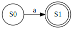
<br>
&nbsp;&nbsp;这个函数是在源文件里单独定义的而不是在类里面，后面类似的函数也是如此（注意观察缩进）。它只需要提供一个转移字符，然后S0和S1都是在构建时创建的。在后面每一个普通字符都会被这样处理。

```
// src/fa/nfa_graph.cr

def basic_nfa(symbol : Char) : NFAGraph
  start_state = NFAState.new()
  end_state = NFAState.new()
  end_state.accepting = true
  start_state.add_transition(symbol, end_state)

  NFAGraph.new(start_state, end_state)
end
```    
<br>

#### 连接（Concat）
&nbsp;&nbsp;将两个NFA自动机连接在一起的操作称为连接（Concat），一般在连续字符出现时我们会执行该操作，将生成的两个子NFA连接成一个。

```
// src/fa/nfa_graph.cr
def concat(first_nfa, second_nfa) : NFAGraph
  first_nfa.end_state.add_epsilon(second_nfa.start_state)
  first_nfa.end_state.accepting = false
  return NFAGraph.new(first_nfa.start_state, second_nfa.end_state)
end
```
很简单，只需要使用ε转移即可：

<br>

<br>

#### 联合（Union）
&nbsp;&nbsp;一般这种操作会用于“或运算”，实际上就是将两个子表达式通过ε转移形成一个新的NFA，在新的epsilon的起始状态中有个ε转移的分岔路口，只要通过了其中一个子表达式即可到达最后的结束状态。例如正则表达式<code>a|b</code>（不用括号不是好习惯，尽管此处无歧义），被转换成了逆波兰表达式<code>['a', 'b', '|']</code>，构建NFA的程序按照顺序遍历它，在轮到运算符'|'时，NFA的集合里已经有了这两个东西：
<br>
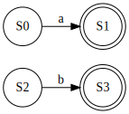
<br>
&nbsp;&nbsp;然后程序将这两个子NFA从集合里搞出来，执行Union操作，也就是分别创建一个起始状态和终止状态，起始状态使用ε转移连接到这两个NFA的起始状态，这两个NFA的结束状态使用ε转移连接到新的终止状态，并且此时它们两个的终止状态的accepting的true就没有意义了，此处将两个自动机的终止状态的accepting更改为false（就目前来看，不更改也是等价的，但是到后面就会出现问题）    
&nbsp;&nbsp;函数定义如下，这里为了节省行数有改动缩进，或许Github上的代码会更好看。（其实这里逐行认真看也是很清晰的），由于建立了关联性，只需要以新的状态来新建一个NFA并返回即可。

```
// src/fa/nfa_graph.cr

def union(first_nfa : NFAGraph, second_nfa : NFAGraph) : NFAGraph
  start_state = NFAState.new()
  accepting_state = NFAState.new()
  accepting_state.accepting = true
  first_nfa.end_state.accepting = false
  second_nfa.end_state.accepting = false
  start_state.add_epsilon(first_nfa.start_state)
  start_state.add_epsilon(second_nfa.start_state)
  first_nfa.end_state.add_epsilon(accepting_state)
  second_nfa.end_state.add_epsilon(accepting_state)
  return NFAGraph.new(start_state, accepting_state)
end
```    
&nbsp;&nbsp;经过Union处理的上图的两个NFA变成了这样的一个NFA，图例为了更清晰有编号，但是实际上每个NFAState状态是没有编号的，它们已经有各自的内存位置了：
<br>
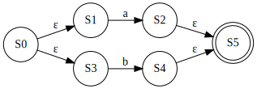
<br>
&nbsp;&nbsp;这是一个最简单情况的示例，但实际上，无论你的NFA多复杂它也只会不断拆分不断拼接，所以再复杂也是同理的。啊就例如<code>((a|b)|a)</code>无非就是这样：
<br>
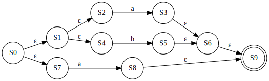
<br>
> 我靠这工具把图画整齐一点会*哦

<br>

#### 克林闭包（Kleene closure）
&nbsp;&nbsp;星号（*）表示前一个子表达式可以出现0次或者多次，我们通过克林闭包（Kleene closure）来将这个NFA处理成允许出现0次或者多次的NFA。分别创建一个起始状态和终止状态，起始状态连接ε转移到目标NFA的起始状态和终止状态，目标NFA的终止状态连接ε转移到它自己的起始状态和终止状态。还是刚才a字符的例子：
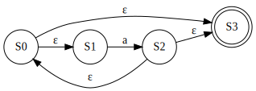
&nbsp;&nbsp;函数定义如下：
```
// src/fa/nfa_graph.cr

def kleene_closure(nfa : NFAGraph) : NFAGraph
  start_state = NFAState.new()
  accepting_state = NFAState.new()
  accepting_state.accepting = true
  nfa.end_state.accepting = false
  
  start_state.add_epsilon(accepting_state)
  start_state.add_epsilon(nfa.start_state)
  nfa.end_state.add_epsilon(accepting_state)
  nfa.end_state.add_epsilon(nfa.start_state)

  return NFAGraph.new(start_state, accepting_state)
end
```
&nbsp;&nbsp;在定义中，\*号比|的优先级要高，这就意味着假设有一个正则表达式<code>a|b\*</code>会被转换成逆波兰表达式<code>['a', 'b', '*', '|']</code>，即“a或者，b出现0次或多次”，如果你希望是表达“a或b，出现0次或多次”，那应该写成<code>(a|b)\*</code>，括号真的是宁多勿少。而构建NFA时程序就不会考虑符号顺序了，匹配顺序与结果没有关联性。
<br>

#### 正闭包（positive closure）
&nbsp;&nbsp;加号（+）表示前一个子表达式可以出现一次或多次，对应的闭包操作叫做正闭包（positive closure）。
<br>
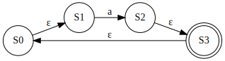
&nbsp;&nbsp;分别创建起始状态和终止状态，将起始状态连接ε转移到目标NFA的起始状态，目标NFA的终止状态连接ε转移到终止状态，终止状态连接ε转移到起始状态。    
&nbsp;&nbsp;加号的优先级与星号相同，所以它只是按照表达式的顺序来执行的。

```
// src/fa/nfa_graph.cr

def positive_closure(nfa : NFAGraph) : NFAGraph
  start_state = NFAState.new()
  accepting_state = NFAState.new()
  accepting_state.accepting = true
  nfa.end_state.accepting = false

  start_state.add_epsilon(nfa.start_state)
  nfa.end_state.add_epsilon(accepting_state)
  accepting_state.add_epsilon(start_state)

  return NFAGraph.new(start_state, accepting_state)
end
```
&nbsp;&nbsp;其实有人可能会产生疑问，为什么不直接把目标NFA的终止状态画一个ε转移到起始状态。那是因为一个状态可能有很多转移，我们如果直接修改原有的转移关系可能会影响到原初始状态或者终止状态的原义，所以要新建两个完全空的状态再建立关系。
<br>

#### 问号闭包（Question mark closure）
&nbsp;&nbsp;问号闭包（Question mark closure）对应的操作符是?，表示前一个子表达式出现0或1次。我们只需要分别创建起始状态和终止状态，将起始状态连接ε转移到目标NFA的起始状态，目标NFA的终止状态连接ε转移到终止状态，起始状态连接ε转移到终止状态。    
<br>
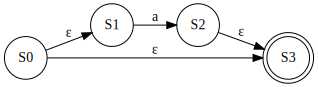
<br>
&nbsp;&nbsp;问号的优先级与加号和星号是同等的。    
&nbsp;&nbsp;函数定义如下：

```
// src/fa/nfa_graph.cr
def positive_closure(nfa : NFAGraph) : NFAGraph
  start_state = NFAState.new()
  accepting_state = NFAState.new()
  accepting_state.accepting = true
  nfa.end_state.accepting = false
  
  start_state.add_epsilon(accepting_state)
  start_state.add_epsilon(nfa.start_state)
  nfa.end_state.add_epsilon(accepting_state)

  return NFAGraph.new(start_state, accepting_state)
end
```
&nbsp;&nbsp;这几个函数定义好后，就可以编写构建nfa的函数了。
<br>

### 构建NFA
&nbsp;&nbsp;我们通过不断构建子NFA，最后拼接成一个NFA的方式来完成这个操作。子NFA是有顺序的，所以我们需要使用一个有序数组来存放子NFA，并且在处理操作符时像栈一样遵循先进先出的原则来处理。为了后面构建DFA的需要，我们使用一个symbols集合来存储出现过的非ε转义字符。此处我们必须显性定义它们的数据类型。
```
// src/fa/nfa_graph.cr

def build_nfa(postfix : Array(Char)) : NFAGraph
  stack = [] of NFAGraph
  symbols = Set(Char).new
end
```
&nbsp;&nbsp;然后匹配逆波兰式并对对应的子表达式做处理，此处除了普通字符和代表任意字符的#必须最后处理以外，操作符匹配先后顺序无关。但是如果说栈内已经没有子NFA时还尝试弹出子NFA处理的话就会报错（数组越界），例如本来就错误的正则表达式<code>|b?a</code>，|号前面应该有一个子表达式才能正常构建，这一步不会在转换逆波兰表达式时出错，而是在构建NFA时出错。    
&nbsp;&nbsp;这里不使用each迭代器的原因是，我们在处理转义符时会涉及到当前元素下一个元素和跳过循环的操作，就算使用索引迭代器也会比较麻烦，所以还是最简单的while循环好了（
```
// src/fa/nfa_graph.cr

  i = 0
  while i < postfix.size
    case symbol
    when '*'
      nfa = stack.pop
      new_nfa = kleene_closure(nfa)
      stack << new_nfa

    when '+'
      nfa = stack.pop
      new_nfa = positive_closure(nfa)
      stack << new_nfa

    when '?'
      nfa = stack.pop
      new_nfa = question_mark_closure(nfa)
      stack << new_nfa
```

例如处理一个星号运算符，栈顶的子NFA就会被弹出，处理再把新的NFA加回去：

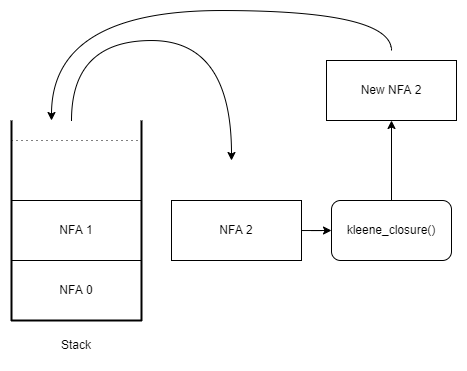
> 这张图真的丑爆看起来很让人不爽

<br>

&nbsp;&nbsp;或运算和连接操作涉及到两个子NFA，就要从栈中弹出两个，但是别忘了第二个弹出的才是在先的子NFA，最后把一个NFA加回去：
```
// src/fa/nfa_graph.cr

    when '|'
      second_nfa = stack.pop
      first_nfa = stack.pop
      new_nfa = union(first_nfa, second_nfa)
      stack << new_nfa

    when '.'
      second_nfa = stack.pop
      first_nfa = stack.pop
      new_nfa = concat(first_nfa, second_nfa)
      stack << new_nfa
```
&nbsp;&nbsp;最后就是字符的情况，但是如果遇到转义符则需要将下一个符号当成目标符号来构建NFA（这也是转义符会在被转义符号前面的原因，此处处理无论它是不是运算符都会当成普通字符处理），并且下次循环就会跳过了。在构建完自动机后记得i要加一，继续循环直到处理完。因为在逆波兰表达式中操作符永远在普通字符后面，所以一般字符的NFA都会在操作它的操作符被处理之前就构建好（前提是这个正则表达式是合法的，如果它本身就有问题的话就会越界报错或者构建出错误的NFA）
```
// src/fa/nfa_graph.cr

    else
      symbol = postfix[i]
      if postfix[i] == '\\'
        symbol = postfix[i + 1]
        i += 1
      end
      nfa = basic_nfa(symbol)
      symbols << symbol
      stack << nfa
    end
    i += 1
```
&nbsp;&nbsp;当逆波兰表达式被处理完后，如果栈内只有一个NFA了，那它就是我们需要的NFA。如果有多个则需要从前往后将它们连接再一起，最后把这个NFA返回，NFA构建完成。
```
// src/fa/nfa_graph.cr

  if stack.size == 1
    final_nfa = stack.pop
  else
    final_nfa = stack.shift
    stack.each do |nfa|
      final_nfa = concat(final_nfa, nfa)
    end
  end
  final_nfa.set_symbols(symbols)
  return final_nfa
```
&nbsp;&nbsp;我们构建NFA的函数写好了，现在我们可以简单地写一个函数来从一个正则表达式生成NFA并返回（此方法在NFAGraph类内定义）：
```
// src/fa/nfa_graph.cr

    def self.generate(postfix : Array(Char)) : NFAGraph
      nfa = build_nfa(postfix)
      return nfa
    end
```
&nbsp;&nbsp;但是现在它只是一个NFA，如果我们直接使用它来匹配内容则需要对应的回溯机制，影响效率的同时还很麻烦，这不是我想要的。所以接下来我们将要把构建完成的NFA转为确定有穷状态自动机DFA。    
（战术喝水 *3）
<br>

## 子集构造算法
&nbsp;&nbsp;将NFA转为DFA的算法叫做子集构造算法（Subset construction），在这很久之前其实我刷过麻省的某个线上公开课有提到这个算法（当时没有看完，但是现在看这玩意并不难。这些课程其实很有用的，练听力学计算机两不误：）后来和一位大二计科的老哥聊天时有提到这个词法分析，那位大一就啃完虎书的也是个重量级，那次聊天也了解到了他们大学的一些编译原理有关的课程。算了心路历程不扯那么多了，说不定以后专门写个文章什么的讲讲（我自认为我的兴趣发展史挺曲折的）。我们现在直接开始讲算法吧。
> 本章写的比较急，自己发挥成分比较大且没有太严谨的检查，代码可能有地方有些什么迷惑操作或者没必要的复杂度，后面如果我自己发现了会往Github上传，当然，欢迎指出。

<br>

### 基础定义
&nbsp;&nbsp;写到这章的今天，我其实一整天在学校都在想怎么表述才能通俗，因为思维笨拙的我深知看理科书上定义的痛苦，尽管代码已经写完了，我还是去专门看了一下虎书（ *Modern Compiler Implementation in C* ）有关这部分的内容。个人感觉在理解难度上没有很大区别，只是多看点不同的书籍描述同一个东西会感觉更全面。    
<br>
&nbsp;&nbsp;子集构造法是一种基于集合的算法，用于生成给定集合的所有子集。子集是指从给定集合中选择零个或多个元素所得到的集合。子集构造法的基本思想是利用递归的方式将集合分解成小集合，最终得到所有可能的子集。说白了就是<b>一次把所有可能性都尝试了来避免猜测和回溯</b>。我们需要定义一些操作，此处参考龙书中的定义和前面的有穷状态自动机形式定义：
+ *epsilon_closure(s)*：NFA状态s能通过ε转移直接到达的NFA状态的集合（这个操作我们将它称为ε闭包），满足$s \in Q$
+ *move(T,c)*：NFA状态集T的其中一个NFA状态能通过符号c转移到的NFA状态的集合

&nbsp;&nbsp;还有另一个ε闭包的定义：
+ *epsilon_closure(T)*：从NFA状态集合T的其中一个NFA状态s能通过ε转移直接到达的NFA状态的集合

&nbsp;&nbsp;我们要做的就是对于NFA中的每个状态集合，构建出一个DFA状态代表这个状态集合，然后通过状态转移函数构建出整个DFA。
&nbsp;&nbsp;接下来我们开始实际写代码。不要着急，等完成此处定义内容我们再继续讲如何操作。
<br>

### DFA状态类和方法定义
&nbsp;&nbsp;我们首先定义一个DFAState类：
```
// src/fa/dfa_state.cr

class DFAState
    property transitions : Hash(Char, DFAState)
    property accepting : Bool
end
```
&nbsp;&nbsp;DFAState类的方法很简单，另外为了方便我们再创建一个default方法来创建一个全新的DFA状态。
```
// src/fa/dfa_state.cr

    def initialize(transitions : Hash(Char, DFAState), accepting : Bool = false)
      @transitions = transitions
      @accepting = accepting
    end
  
    def self.default() : DFAState
      set = Set(NFAState).new
      return DFAState.new({} of Char => DFAState, false)
    end
  
    def add_transition(symbol : Char, state : DFAState)
      @transitions[symbol] = state
    end
```
&nbsp;&nbsp;我们的基础定义方法是在NFA状态类里面定义的，首先是*epsilon_closure(s)*。首先定义闭包的结果和一个栈，将NFA状态自身推入栈，然后循环处理如果栈内顶层元素有可以进行ε转移到达的状态则将状态推入闭包结果，并将该状态推入栈继续处理直到它不再有ε转移关系的状态。一个ε闭包至少包含它自己，并且这个函数会返回一个元组：转移的NFAState集合和是否接受，这样可以避免我们调用后还要再any?一次。    
&nbsp;&nbsp;一个状态有可能存在多个ε转移可以到达的状态，它们都会被推入栈中并先后被处理直到所有对应的ε转移都被放进闭包结果并且不再有ε转移，最后所有的状态的ε转移都会被处理完成。这是一种叫做<b>深度优先</b>的算法策略。
```
// src/fa/nfa_state.cr

  def epsilon_closure() : Tuple(Set(NFAState), Bool)
    closure = Set(NFAState).new
    stack = [self]
    closure << self
    accepting = self.accepting
  
    until stack.empty?
      current_nfa_state = stack.pop
      if current_nfa_state.transitions.has_key?('ε')
        current_nfa_state.transitions['ε'].each do |next_nfa_state|
          closure << next_nfa_state
          stack << next_nfa_state
          accepting ||= next_nfa_state.accepting
        end
      end
    end
    {closure, accepting}
  end
```
&nbsp;&nbsp;就例如，有一个NFA长这样。按照我们的深度优先算法，最开始栈内的状态是S0，它把S0弹出并匹配就会先走到S1并把它加进结果，再走到S2做同样的操作，然后才继续走S0->S4的路线，把S4加入结果，所以最后的集合就是 $\langle S1,S2,S4\rangle$。
<br>

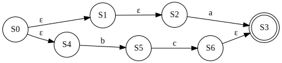
<br>
（其实我真心喜欢Crystal的until和unless语句，真的，简直优雅的不能再优雅了）    
&nbsp;&nbsp;我实现的move操作是对于一个NFA对象而言的（而不是像定义一样直接输入集合），我选择在转换的函数遍历那个集合并依次调用这个函数，逻辑上是一样的啦。

```
// src/fa/nfa_state.cr

  def move(symbol : Char) : Tuple(Set(NFAState), Bool)
    next_states = Set(NFAState).new
    accepting = @accepting

    if @transitions.has_key?(symbol)
      @transitions[symbol].each do |state|
          target_states, accept = state.epsilon_closure()
          next_states += target_states
          accepting ||= accept
      end
    end
  end
```
&nbsp;&nbsp;另外这是我曾经的疏忽，不能排除那种通过ε转移后才通过这个字符能到达的状态。我们在实际构建dfa时会先获取初始状态通过ε转移能直接到达的状态集合（后面会讲到），但假设当前处理的不是这个初始状态集合而是后续的，例如这样：
<br>

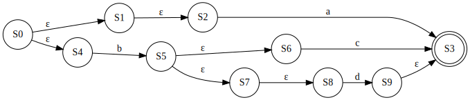
<br>
&nbsp;&nbsp;实际情况往往不会像之前那样那么理想了，这个图很丑但此类情况是很常见的。在这个示例中，程序最开始会调用*epsilon_closure(q0)*，结果的集合是 $\langle S2,S4\rangle$。输入字母表是$Σ = \langle a,b,c,d\rangle$。处理S2的话很简单，遍历这个字母表时遍历到a的话就可以直接得到S3，并且获取它的接受状态（为True）。S4遍历到字符b后会得到S5，继续处理S5时就会发现上述代码的转移都不好使了，因为没有任何一个状态的转移字符属于$Σ$，但是即使通过无条件的ε转移我们可以看到，实际上这里仍然能分别在操作S6时遍历到字符c、操作S8时遍历到字符d时找到S3。这里就会出现构建不准确的问题，所以我们需要再用一点小小魔法（更应该是大力出奇迹x，每次move时把它像初始那样先调用*epsilon_closure(self)*，以保证能得到所有需要的状态）上述代码块从第5行开始应该直接替换成这样。这是没问题的，因为一个ε闭包至少包含它自己。但是注意此处我们不能直接使用当前状态的ε闭包的接收状态作为accepting，因为我们需要的是move转移后的接受状态，所以初始值应该为false。

```
// src/fa/nfa_state.cr

    states, _ = self.epsilon_closure()
    accepting = false

    states.each do |state|
      if state.transitions.has_key?(symbol)
        state.transitions[symbol].each do |state|
          target_states, accept = state.epsilon_closure()
          next_states += target_states
          accepting ||= accept
        end
      end
    end
```

&nbsp;&nbsp;注意到代码第8行，其实我们在这个操作就已经涵盖了*epsilon_closure(T)*，返回后就没必要再调用一遍了，*epsilon_closure(T)*说白了就是遍历一遍调用*epsilon_closure(s)*。在定义里它存在就是为了类似例图S9->S3的这种情况（到达状态后面还有ε转移）。    
&nbsp;&nbsp;然后我们就可以开始编写将NFAGraph转为DFAGraph的函数了。
<br>

### 转换方法实现
首先简单描述一下实现步骤：
+ 初始化：将NFA的开始状态的 *epsilon_closure()* 作为一个新的未标记状态。
+ 标记：对于DFA中的每个未标记状态，考虑其所包含的所有NFA状态。对于每个输入符号，计算由这些NFA状态转移到的所有可能状态,这些状态将成为DFA中的一个新状态。如果新状态尚未被标记，则将其标记为未标记状态，并将其作为下一轮迭代的起点。重复标记直到没有新状态被标记。

&nbsp;&nbsp;最终得到的DFA与原始的NFA具有相同的语言接受能力，但通常情况下DFA具有更小的状态数且转移是确定的。    
&nbsp;&nbsp;首先定义一个DFAGraph类和基本方法：
```
// src/fa/dfa_graph.cr

require "./dfa_state"

class DFAGraph
  property start_state : DFAState
  property states : Set(DFAState)

  def initialize(start_state : DFAState, states : Set(DFAState))
    @start_state = start_state
    @states = states
  end
end
```
&nbsp;&nbsp;我们初始化一个DFA状态和一个HashMap数据结构，类型为<code>Set(NFAState) => DFAState</code>，注意此方法在NFAGraph类里面定义
```
// src/fa/nfa_graph.cr

    def to_dfa() : DFAGraph
      dfa_start_state = DFAState.default()
      transition = {} of Set(NFAState) => DFAState
    end
```
&nbsp;&nbsp;按照标准做法我们应该先尝试获取当前NFA初始状态的ε转移状态集合，将其加入未标记数组。但是我们上述的move操作已经包含了调用过程，所以只需要直接把起始状态推入未标记数组即可。新建的DFA状态的accepting与之关联（其中一个为true则直接为true），建立两者对应关系。另外DFA需要有它的状态集合，这会在以后的最小化用到。
```
// src/fa/nfa_graph.cr

      nfa_start_states = Set(NFAState).new << @start_state
      unmarked = [nfa_start_states]
      transition[nfa_start_states] = dfa_start_state
      dfa_states = Set(DFAState).new
      dfa_states << dfa_start_state
```
然后进入循环直到未标记的集合全部处理完成
```
// src/fa/nfa_graph.cr

      while !unmarked.empty?
        current_nfa_states = unmarked.pop
        current_dfa_state = transition[current_nfa_states]
        
        # todo
      end
```
&nbsp;&nbsp;遍历输入字母表Σ，遍历当前的NFA状态集并依次执行move操作，别忘了Set元素是无序不重复的，所以直接这样加进去即可。并且创建新的dfa状态并获取接收状态。
```
// src/fa/nfa_graph.cr

        @symbols.each do |symbol|
          next_nfa_states = Set(NFAState).new
          accepting = false
          current_nfa_states.each do |nfa_state|
            states, accept = nfa_state.move(symbol)
            next_nfa_states += states
            accepting ||= accept
          end

          next_dfa_state = DFAState.default()
          next_dfa_state.accepting ||= accepting
          # todo
        end
```
&nbsp;&nbsp;完成后建立输入字符->状态的转移关系，从之前建立的转移表去除对应的DFA状态。此外如果处理结果不为空则需要继续把NFA状态集合推回未处理的栈继续循环。这里为了避免访问越界必须要检查。如果什么都没有的话直接把新初始化的DFA状态写进转移就好了：
```
// src/fa/nfa_graph.cr

          if !next_nfa_states.empty?
            if !transition.has_key?(next_nfa_states)
              transition[next_nfa_states] = next_dfa_state
              unmarked << next_nfa_states
            else
              next_dfa_state = transition[next_nfa_states]
            end
          end
          current_dfa_state.transitions[symbol] = next_dfa_state
          dfa_states << next_dfa_state
```
最后返回结果：
```
// src/fa/nfa_graph.cr

      dfa = DFAGraph.new(dfa_start_state, dfa_states)
      return dfa
```

### 转换过程演示

&nbsp;&nbsp;这个描述感觉很难理解，所以为了更好让各位理解，我们来实际用一个简单的例子来描述转换DFA的过程，这是之前Union的图例，它等价于正则表达式<code>a|b</code>：
<br>

<br>
&nbsp;&nbsp;按照最开始的形式定义，这个NFA：

+ $Q = \langle S0,S1,S2,S3,S4,S5\rangle$
+ $q0 = S0$
+ δ 略
+ $Σ = \langle a,b\rangle$
+ $F = \langle S3\rangle$

我们的初始NFA状态为$S0$，它被加入集合$T1$并且加入unmarked并开始循环，假设初始化的DFA状态为A，此时的transition长这样：
| NFA state set | DFA state |
| :----: | :----: |
| $T0 = \langle S0 \rangle$ | A |

&nbsp;&nbsp;接下来迭代转移字符集合$Σ$，第一轮迭代是字符a，然后迭代初始的NFA状态集合T0（只有S0一个，所以只迭代一次），调用move(S0,a)。move函数首先会获取S0的ε闭包，很显而易见的是$\langle S1,S3\rangle$，然后迭代这个集合，第一次操作的状态是S1，它能通过转移和ε闭包获得集合$\langle S2,S5\rangle$，而第二次迭代以S3为出发点就什么都获取不到。由于集合中S5是终止状态，所以最后的返回值是($\langle S2,S5\rangle$, true)。    
&nbsp;&nbsp;由于返回的集合为空，且不存在于NFA state set，将它加入NFA state set并与一个新的DFA状态关联，此处新的DFA状态叫做B，新状态集合命名为T1：
| NFA state set | DFA state |
| :----: | :----: |
| $T0 = \langle S0 \rangle$ | A |
| $T1 = \langle S2,S5 \rangle$ | B |
&nbsp;&nbsp;将T1加入unmarked，然后把状态B与状态A使用转移符号a关联起来，此处实际操作的是状态A的转移表，但我们可以拓宽这个表格来表示（只需分清楚它们实际在数据结构的位置）
| NFA state set | DFA state | Symbol => DFA state |
| :----: | :----: | :----: |
| $T0 = \langle S0 \rangle$ | A | a => B |
| $T1 = \langle S2,S5 \rangle$ | B |
在书或者其他博客其实更常见这样的表格来表示他们的关系，但是我还是觉得上面那样更贴切实际的数据结构。
| NFA state set | DFA state | a |
| :----: | :----: | :----: |
| $T0 = \langle S0 \rangle$ | A | B |
| $T1 = \langle S2,S5 \rangle$ | B |
&nbsp;&nbsp;进入字符集合的第二次迭代，这次是字符b，仍然获取的集合是$\langle S1,S3\rangle$，但是move函数第一次迭代什么都没有，第二次迭代得到$\langle S4,S5\rangle$，命名为$T2$，由于S5为接受状态所以新的DFA状态C也接受。其与字符b关联。同样将T2与状态C关联，T2加入unmarked。
| NFA state set | DFA state | Symbol => DFA state |
| :----: | :----: | :----: |
| $T0 = \langle S0 \rangle$ | A | a => B, b => C |
| $T1 = \langle S2,S5 \rangle$ | B |
| $T2 = \langle S4,S5 \rangle$ | C |
&nbsp;&nbsp;接下来unmarked循环，弹出T2，遍历T2元素，很显然它已经没有任何字符转移了，所以我们可以忽略迭代两个字符的过程直接由于next_nfa_states为空而不进行任何操作，直接建立符号关联和加入DFA状态集合。此处D、E表示两个没有任何转移，为不接收状态的DFA状态。继续循环弹出T1，遍历T1元素同理，没有任何字符转移所以不进行任何操作直接建立关联，状态F、G同样没有任何转移关系且为不接受状态。
| NFA state set | DFA state | Symbol => DFA state |
| :----: | :----: | :----: |
| $T0 = \langle S0 \rangle$ | A | a => B, b => C |
| $T1 = \langle S2,S5 \rangle$ | B | a => F, b => G |
| $T2 = \langle S4,S5 \rangle$ | C | a => D, b => E |
最后观察上表关联性，我们以A为DFA的初始状态可以画出这样的DFA：
<br>
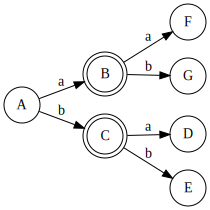
<br>
至少它符合我们的要求，任何输入转移到的状态都是一定的。但是即便它等价于a|b，很明显它有很多东西是不必要的，实际上对于这个DFA它最简形式应该是：
<br>
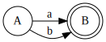
<br>
&nbsp;&nbsp;所以接下来我们要考虑如何将DFA给最简化。
<br>

## Hopcroft 算法
### 基础定义
&nbsp;&nbsp;DFA有它对应的等价正则表达式，但是它未必是最简的，所以我们需要将它最简化以节省内存等资源。
&nbsp;&nbsp;我们将DFA最小化的算法叫做Hopcroft 算法，重点在于<b>可区分和不可区分</b>。若分别从两个状态出发接受的符号串相等则它们等价，即不可区分；若两个状态从其一出发接受符号串，但是从另一出发则不接受，则它们不等价，即为可区分。我们只需要等价的状态视为整体而不用考虑内部细节。就着有穷状态自动机的形式定义我们可以写出Hopcroft算法的形式定义：    

+ 初始化等价类 $P_0 = {F,Q-F}$。
+ 对于每个等价类 $P_i$ 和每个输入符号 $a \in \Sigma$：
计算所有可以从 $P_i$ 中的状态通过输入 $a$ 到达的状态集合 $T$，即 $T=\bigcup\limits_{q\in P_i}\delta(q,a)$。
根据 $T$ 中的状态将 $P_i$ 划分为 $P_i \cap T$ 和 $P_i - T$ 两个子集，如果有至少一个子集包含了 $F$ 中的状态，就将它标记为一个新的等价类。

&nbsp;&nbsp;从定义看就知道这东西很简单的，直接开始写代码吧。    
（战术喝水 *5）
<br>

### 最小化实现
  
&nbsp;&nbsp;我们引用上一张最后一节的DFA自动机示例：
<br>

<br>
&nbsp;&nbsp;首先在转化的开始我们可以直接、清晰地将状态们分为“接收状态”和“非接受状态”两组，因为它们不可能不可区分了已经。如图所示，我们将这个DFA的状态分为接收状态集合 $T0 = \langle B,C \rangle$ 和 非接受状态集合 $T1 = \langle A,D,E,F,G \rangle$
> 习惯使用倒装句的Makiror吧

&nbsp;&nbsp;我们使用分区函数partition()实现分区操作，并且使用partitions数组存储它。（此处没有显示定义它的数据类型，为[] of Set(DFAState)）
```
// src/fa/dfa_graph.cr

  def minimize()
    accepting_states, non_accepting_states = @states.partition(&.accepting)
    partitions = [accepting_states, non_accepting_states]
  end
```
&nbsp;&nbsp;接着我们写对应形式定义第二部分的代码“对于每个等价类 $P_i$ 和每个输入符号 $a \in \Sigma$”，Crystal有一个函数叫group_by，它可以将一个集合按照指定的规则分组。
&nbsp;&nbsp;我们只需要遍历原本的分区，再使用group_by函数对集合内的状态的转移进行分区。返回的结果的键是转移关系，值是具有这个转移关系的状态的数组（序列）。然后我们再把它们加进新分区数组new_partitions，若它与上次（或者原来）的分区数组相等则说明无法继续区分，则跳出循环，否则更新分区数组的值并开始新的一轮区分。
```
// src/fa/dfa_graph.cr

    loop do
      new_partitions = [] of Set(DFAState)
      partitions.each do |partition|
        transition_partitions = partition.group_by { |state| state.transitions }
        transition_partitions.values.each do |states|
          new_partitions << states.to_set
        end
      end
      break if new_partitions.size == partitions.size
      partitions = new_partitions
    end
```
&nbsp;&nbsp;但是上述代码的第6行是不严谨的，观察例图你会发现B和C是等价的，但是即便它们的转移关系相同，由于目标状态的内存地址不同，会导致它们两个被判定为不等价，因为Crystal默认的比较是对内存地址敏感的。你可以试试运行它，这个DFA状态会被分为4组。所以我们需要使用重载操作，允许我们在一个类里面定义多个重名方法，编译器会根据传入参数的类型、数、返回值等不同而区分调用哪个方法，其实就是我们所谓的多态性。此处我们需要自定义DFAState的==方法来重载对象的哈希值和相等性比较逻辑。
```
// src/fa/dfa_state.cr

    def ==(other : DFAState)
      transitions == other.transitions && accepting == other.accepting
    end
```
> 这个问题是在写文章的最后一天才偶然发现的，所幸是意识到问题在哪并且解决了

&nbsp;&nbsp;按照上例，经过此步骤后的集合$T0 = \langle B,C \rangle$ 和 $T1 = \langle A,D,E,F,G \rangle$被划分为了三组：
+ $T3 = \langle B,C \rangle$
+ $T4 = \langle A \rangle$
+ $T5 = \langle D,E,F,G \rangle$

&nbsp;&nbsp;完成了必要的等价类区分步骤，我们就要把等价类转为新的DFA状态集合。由于同一分区内的状态已经等价了，我们只需要任选其一的转移关系和接受状态作为新状态的属性，所以我们选择第一个元素的属性就好了（此处没有必要使用any?等函数来获取属性，这在底层可能涉及到遍历操作只会浪费性能）
```
// src/fa/nfa_graph.cr

    new_states = Set(DFAState).new
    partitions.each do |partition|
      state = DFAState.new(partition.first.transitions, partition.first.accepting)
      new_states << state
    end
```
&nbsp;&nbsp;因为它们等价，所以新的状态集合$Q = \langle B',A',D' \rangle$，属性分别取首个元素B、A、D，除了内存地址以外它们是等价的。
&nbsp;&nbsp;再进行状态转移合并得到新的DFA。此处我们使用了这种语法而非以往的=>来定义HashMap，因为它是两层映射关系的，如果直接像平时一样<code>{} of DFAState => {} of Char => DFAState</code>定义数据类型的话是错误的，逻辑上没问题但是编译器不允许你这样写。    
&nbsp;&nbsp;程序遍历新分区中的每个状态，再遍历了每个状态的转移表。对于每个转移尝试在新分区中寻找一个与next_state具有相同转移表的状态new_state。如果找到了，那么它将原状态的转移表中的next_state替换为new_state。这个过程实际上是将所有通过相同转移表转移到的状态合并为一个新状态，这是将新分区转换为DFA的关键步骤之一。find操作有可能返回nil，所以添加转移前记得写判断。
```
// src/fa/nfa_graph.cr

    new_transitions = Hash(DFAState, Hash(Char, DFAState)).new
    new_states.each do |state|
      state.transitions.each do |symbol, next_state|
        new_state = new_states.find { |s| s.transitions == next_state.transitions }
        if !new_state.nil?
          state.add_transition(symbol, new_state)
        end
      end
    end
```

最后最后，修改对象自身的内容，新初始状态为新状态里面与之等价的那个，虽然程序正常运行的情况下不会出现nil，但是调用find就是有可能，所以还是写一个判断才能让编译器闭上嘴（比起if我还是更想要用unless）。最小化结束。
```
// src/fa/nfa_graph.cr

    new_start_state = new_states.find { |s| s.transitions == @start_state.transitions }
    @start_state = new_start_state unless new_start_state.nil?
    @states = new_states
```
最小化后映射关系如下，比理论的多了一个D'状态，但是这是不可避免的，因为光使用分组机制无法判断它是否应该被删去：

| DFA state | Symbol => DFA state |
| :----: | :----: |
| A | a => B, b => B |
| B | a => D, b => D |
| D |  |
<br>

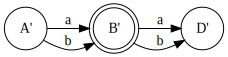
<br>

## MRegex和匹配函数
&nbsp;&nbsp;打开我们梦开始的地方，MRegex类。把我们的成果都集合在一起吧。
```
// src/regex.cr

require "./fa/*"

class MRegex
  @dfa : DFAGraph
    
  def initialize(regex : String)
      postfix = MRegex.to_rpn(regex)
      nfa = NFAGraph.generate(postfix)
      @dfa = nfa.to_dfa()
      @dfa.minimize()
  end
end
```
&nbsp;&nbsp;因为是DFA，所以匹配函数的逻辑很简单。你应该还记得我们把表示任意单个字符的.替换成了#，所以这里只要是#，任何单个字符都能无条件转移，如果中途匹配不符合则返回false，匹配完后再看看到达的是否是接受状态就行啦。
```
  def match(input : String)
    current_state = @dfa.start_state
    input.each_char.with_index do |char, _|
      if current_state.transitions.has_key?(char)
        current_state = current_state.transitions[char]
      elsif current_state.transitions.has_key?('#')
        current_state = current_state.transitions['#']
      else
        return false
      end
    end
    current_state.accepting
  end
```
&nbsp;&nbsp;多么炫酷！你完成了一个正则引擎。

## 最后
&nbsp;&nbsp;其实最开始只打算写Thompson算法，但是强迫症不允许我写一个不完整的东西出来，所以我还是咬咬牙把DFA的部分写出来了。谁知道我写文章这半个月改了多少次，那种细节的逻辑漏洞真的很吓人好吧...其实我作为一个没接触过算法的人突然间想写这个主题，我自己都觉得我是冲动了，但是值得庆幸的是我还是用大半个月实现了它，这对我而言是个大突破，可能是因为之前一直坚信自己学不会算法，做到了就得到了前所未有的成就感。我猜...龙书和虎书我还会继续啃下去的。    
&nbsp;&nbsp;后天就要滚回学校期中考了，这个学期紧张了很多，以后技术类的文章更新频率可能不会比较严格控制在一个月一次了，我也想做点什么比较耗时间有价值的东西来学习。另外今年高考后说不准会搞点什么梦幻联动的文章/作品之类的（有些佬朋友是这一届高考的）...还有想做点什么OC系列发出来...算了到时候再说吧啊。
<br>
这次代码不会上传到examples页面，请前往开源仓库：https://github.com/MAKIROR/Crystal-Regex
<br>

## 主要参考书籍和论文
&nbsp;&nbsp;文章理解不透怎么办？啃论文去啊！啃完你就看得懂了我告诉你（Makiror暴怒）

*Compilers: Principles, Techniques, and Tools*：https://www.dbscience.org/wp-content/uploads/2020/03/ALSUdragonbookcompilers.pdf    
<br>

*Modern Compiler Implementation in C*
http://www.infouem.com.br/wp-content/uploads/2011/03/Modern-Compiler-Implementation-in-C.pdf
<br>

*Programming Techniques: Regular expression search algorithm*：https://www.oilshell.org/archive/Thompson-1968.pdf    
<br>

*Treatment of e-Moves in Subset Construction*：https://aclanthology.org/W98-1306.pdf    
<br>

*AN/N LOG N ALGORITHM FOR MINIMIZING
STATES IN kF I N ITE AUTOMATON*：https://www.cs.cmu.edu/~./sutner/CDM/papers/Hopcroft71.pdf    
<br>


<MAKIROR-gzanan@gmail.com> 01:27 15/04/2023