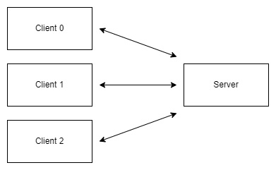
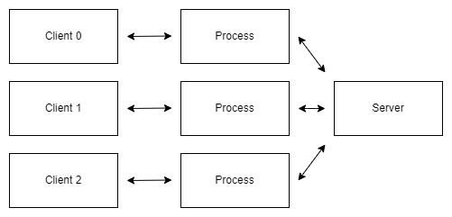
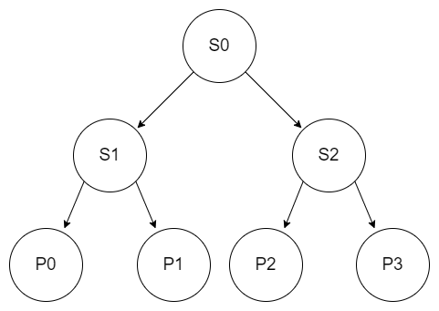
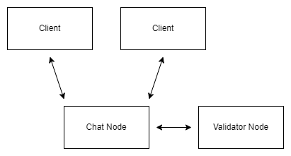
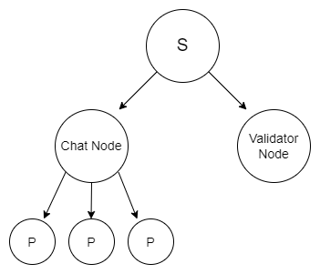
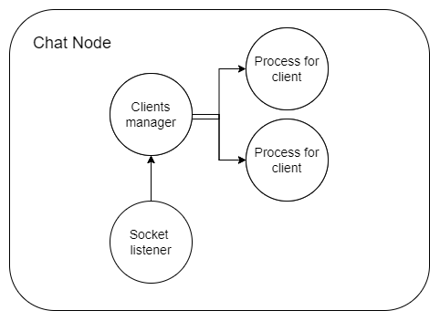
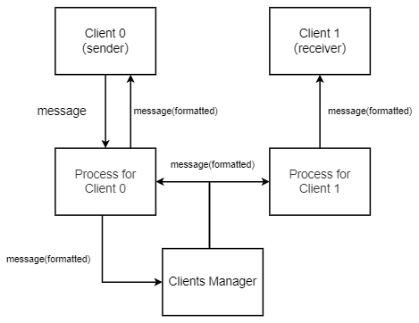
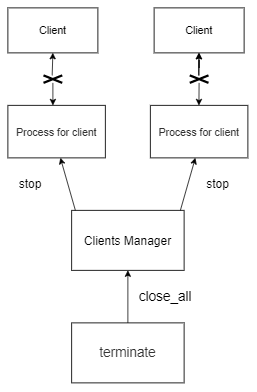

# 【Erlang/OTP入门】基于进程的并发编程和分布式
## 引言
&nbsp;&nbsp;在参加区统考的前一天开始写这篇文章，开学后时间真的紧迫了很多。    
&nbsp;&nbsp;我最近玩Erlang只是一个偶然（？）。这一切的开始是我某天看到一本名为《Erlang and OTP in Action》的书，看了几章发现还挺有意思，我ググ后，发现它有中文版，就买了一本纸质书回学校看。电子产品不能带回学校，我在校时间就用零碎的时间看这本书，然后晚上再写东西。发现它真的好酷。然后我又阅读了一部分的《Learn you some erlang for great good! a beginner's guide》，这个好像没有中文版（也可能是我没有找到），不过不要紧，我认为它们并不难理解，英语不会影响阅读效果。    
&nbsp;&nbsp;Erlang虽然历史悠久，但它是一个比较冷门的语言，如果你不是按这个关键字搜而发现这篇文章的，甚至可能没听过这个语言。这本书将这门看起来很非主流的语言解释的相当通俗，我通过它很轻松地了解到了很多没接触过的新概念，并且顺利地接受了，这真是一种魔力。所以我将在本文分享我从0基础开始，这半个月不到的所学。    
&nbsp;&nbsp;如果你有其他编程语言的网络编程经验就更好了，聪明的你一定能很快学会Erlang。
<br> 
文章假设读者：
+ 没有接触或使用过Erlang
+ 拥有计算机常识以及基本操作能力
+ 认识最基础的编程术语
+ 对网络有基本概念   
<br> 

&nbsp;&nbsp;当然我还阅读了一些其他资料和论文（贴在文末），本文会涉及到理论和结合一些简单的实战内容，我希望以一种简单的方式让正在读文章的你初步了解这个独特的编程语言的理念。
> 本文并不会在语法细节上多讲，不能取代阅读文档，它只是一个针对入门者的理论知识文章。

## Erlang/OTP简述
&nbsp;&nbsp;我个人觉得简述部分非常重要，至少让你知道你在看什么，以及能初步理解一些笼统的、概念性的内容，这样我们在后面可以更好理解细节内容————也就是所谓的“先概括后具体”。
### 什么是Erlang？
&nbsp;&nbsp;按照Wikipedia对Erlang的定义：
>　Erlang（/ˈɜːrlæŋ/）是一种通用的并发函数式程序设计语言。Erlang也可以指Erlang/OTP的通称。

&nbsp;&nbsp;你可能看不太懂它在讲什么，不要急，我们慢慢看。    
&nbsp;&nbsp;首先，它是一门<b>通用</b>编程语言，即【被设计為各种应用领域服务的编程语言】，它主要被用于构建<b>并发</b>应用程序。
<br> 

### 函数式编程
> 注：接下来的内容如果没有特别强调，FP即指函数式编程

&nbsp;&nbsp;这可能对于某些人而言是一个既陌生又熟悉的词，此处函数式编程（Functional programming）指一种古老的<b>编程范式</b>。现在我们耳熟能详的面向对象编程（Object Oriented Programming）、过程式编程（Procedural programming）都是编程范式。编程范式决定了程序或者程序语言的组织风格、方式。    
&nbsp;&nbsp;原谅我的三分钟热度，其实早在去年11月我就想写一篇函数式编程的文章（甚至已经写了几千字了），但是后来被一些奇怪的东西吸引走了，就烂尾到现在了，如果那篇文章有完成的那天，那它内容会更着重函数式编程本身，因为本文能提及的只是这个语言的编程范式。    
&nbsp;&nbsp;函数式编程思维，这个词对于还没有接触过函数式编程的我而言真的很玄幻（好像现在也是）。我有尝试跟没有接触过FP的朋友谈论此话题，他们有不少一部分把【函数】误解为我们在命令式编程的【函数】，但是实际上，我更愿意叫它"程序段"，在某些命令式编程语言中的所谓【函数】会被称为procedure（过程、程序）、subroutine（子程序）等，例如Pascal就是使用procedure关键字，我其实很同意如此，这个歧义在这里就消失了。    
&nbsp;&nbsp;命令式编程的【函数】，可以没有输入，可以没有返回，也可以有两个返回值，函数体不仅可以描述输入输出的关系，还可以使用一些其他的外部参数。而数学的函数是于集合之间的映射关系，两个集合之间的映射被称为函数，你可以把“映射”理解为对应关系。数学中的函数是没有副作用的，就是外部环境的影响，一个函数在输入不变的情况下无论调用多少次输出都是确定的，一个输入只有一个唯一，确定的输出与它对应，而不存在其他的干扰因素（也就是我们口中常说的副作用）。函数式编程的函数指的就是数学的函数，这点不要搞混了。    
&nbsp;&nbsp;用一句话概括函数式编程：    
【函数式编程在意的是数据之间的映射关系】
<br> 
&nbsp;&nbsp;Erlang是函数式语言，但是，它并不是纯粹的，因为它在消息传递方面还是存在副作用的影响，不过即便如此，进程本身运行的程序基本上是纯函数式的。其实我觉得你不用过多在意编程范式这种东西，只是有些思维要稍微变通一下就好了。

<br> 

### 基于进程的并发编程
&nbsp;&nbsp;你在这个程序中有哪些内容是需要各自独立地运行的？而在Erlang中，进程就是并发的最基本的单位，但是它并不是操作系统的，而是由Erlang系统实现的，所以Erlang早就为大量轻量级线程的情况做好了准备，那些进程的开销非常小，书中的形容就是【普通面向对象语言中分配一个对象的开销】。请你尝试接受这个简单但不可思议的概念，但真的对于后续的内容而言非常重要。    
&nbsp;&nbsp;别忘了，并发正是Erlang擅长的领域，它的计算模型就是在这基础上的。往后我们会结合实例来理解这个东西，以及了解进程的一些运作的原理。
<br>

### OTP简述
&nbsp;&nbsp;OTP（Open Telecom Platform），开放电信平台，这是它最初的名字，但是现代的Erlang和OTP都早已不局限于电信应用，可能现在OTP的名字和意思已经分离了，所以请你不要太执着于通过这个名字来理解这是什么。<b>OTP像一个『框架』，用来在常见的场景中尽可能的通用</b>，如何使用OTP？只要通过基于OTP的行为模式开发即可。Erlang与OTP的关系非常密切，我们可以用Erlang/OTP来指代它们或者其中一个。    
&nbsp;&nbsp;Erlang语言本身带有一些功能，你可以用它来设计一些针对并发场景的功能，而在常见的场景下这些最基本的实现其实都差不多，所以为了方便，就出现了OTP将它变成一个比较通用的“框架”，作为开发者的你就不用再为并发的细节想太多了，而是可以专注于实际功能的实现。    
&nbsp;&nbsp;我这样说你可能会觉得这个概念很抽象，但是不用担心，你很快就能搞懂了。
<br>

### ERTS和BEAM VM
&nbsp;&nbsp;ERTS（Erlang Run-Time System）是Erlang实现的核心，这是一个负责Erlang底层内容的应用。Erlang是运行在虚拟机上的编程语言，而BEAM VM则是ERTS很重要的一部分。你可能听说过一个很类似于Erlang的编程语言叫Elixir（没听过的话也很正常，它也属于非主流语言），这个编程语言也是基于BEAM的，说到底这个东西的性质就类似于JVM（除了Java以外也有不少运行于JVM的编程语言，例如Kotlin、Clojure、Scala等）    
> BEAM VM可以指BEAM加上ERTS，它们两个在概念上没有明确的边界线。

&nbsp;&nbsp;不得不说，在我阅读这本书时所了解到了ERTS的一些方面真的震撼到我了，所以我又抱着好奇心去看了几篇论文，总之我后面也会分享它们的。或许以后有机会专门写文章讲这个。
<br>

## 第一个Erlang程序
&nbsp;&nbsp;你第一次接触编程时做了什么？我相信几乎所有人都会回答『输出一个HelloWorld』。我自己貌似对输出HelloWorld这个习惯十分执着，明明都是接触过编程的人了，我几乎，在任何时候尝试用一个新的编程语言，第一件事一定会是HelloWorld。因为这是一个编程语言里最简单的输出操作，任何人都能接受得了。     
&nbsp;&nbsp;但是这次我并没有如此，所以让我们以一个简单的Socket服务端作为学习Erlang的开局吧。不必惊讶，它的难度，就像作为初学者的我们对Erlang说“HelloWorld”。
> 本文并不是实战向文章，此处也不是本文重点内容，仅作为一个简单的练习。
### 使用Erlang Shell
&nbsp;&nbsp;我们在平时的开发，可能更多会将程序编译成操作系统的可执行文件后运行，但是Erlang却不是这样，它更多是为了交互式开发和调试而设计的。  
&nbsp;&nbsp;从下载和安装你的Erlang开始吧：https://www.erlang.org/downloads
<br>
&nbsp;&nbsp;在Erlang Shell，我们通过REPL（Read-Eval-Print Loop）模式与Erlang系统进行交互，我们将在Erlang Shell对代码进行实验、调试等。启动后大概长这样：

```
Erlang/OTP 25 [erts-13.1.4] [source] [64-bit] [smp:6:6] [ds:6:6:10] [async-threads:1] [jit:ns]

Eshell V13.1.4  (abort with ^G)
1> 
```
&nbsp;&nbsp;与很多编程语言的交互式解析器一样，我们可以在里面输入表达式，例如1+1之类的。然后我们还能调用一些Shell自带的函数，就例如memory()之类的（此处具体内容请查阅对应版本的文档）。后面我们要调试一些简单的东西会用到Erlang Shell，所以我才提一下。
<br>

### 从模块和首部内容开始
&nbsp;&nbsp;我有好几个项目的名字都以ROR作为前缀（我的名字后三个字母），那我们就叫它ROR Erlang Server好了，简称rores！    
&nbsp;&nbsp;老习惯，作为新上路的Erlang开发者，应该先了解它的编程规范再进行编写，没有人愿意看到乱七八糟且邋遢的代码。https://github.com/inaka/erlang_guidelines    
&nbsp;&nbsp;我们创建一个名为rores_server.erl的源文件，写入这样的代码：
```
// rores_server.erl

%%%-------------------------------------------------------------------
%%% @author Makiror
%%% Created : February 2023
%%%-------------------------------------------------------------------

-module(rores_server).

% API
-export([]).
```
&nbsp;&nbsp;前五行时位于文件首部的注释，此处使用三个%是因为它是文件级注释，这是一种规范。第一项代码是module属性，它的名字必须和文件名一样（不包含源文件后缀部分）。然后使用.（英语句号）作为代码的结尾。然后使用export来导出我们的API，现在我们还没有编写任何内容，所以就用[]留空好了。    
&nbsp;&nbsp;你可能注意到了，我们文件名和模块名使用snake_case命名法来命名，而我们一般习惯加上前缀的原因是在实际开发时，Erlang使用的是【平面的命名空间】，这会导致在实际的开发中，模块名很容易冲突，尤其是像sup（监督者，后面会提到）、server这类常见的词汇，所以我们在文件名应该养成加前缀的好习惯。
<br>

### 宏定义
&nbsp;&nbsp;我们使用define定义宏，此处为了让各位初步了解Erlang的宏，我选择了使用宏来定义服务端的默认端口和TCP的选项配置。
```
// rores_server.erl

...
-define(TCP_OPTIONS, [binary, {packet, 0}, {active, true}]).
-define(DEFAULT_PORT, 9527).
```
&nbsp;&nbsp;宏的命名格式并没有很严格的限制，但是此处我将它作为类似一个常量这样的东西，所以就像我平时写Rust一样全大写好了。（全小写也适用，自己选择）    
&nbsp;&nbsp;你可能好奇，TCP_OPTIONS的内容都代表什么，不要着急，我们后面会慢慢讲，现在你只需要做就行啦，你现在只是在像当时输入HelloWorld那样输入一串代码尝试一个新事物。
<br>

### 实现最简C/S架构
&nbsp;&nbsp;所以前面我们做了一点点简单的铺垫，并且为这个server定义了它所需要的首部内容。接下来我们将直接写内容————基于TCP的服务器。当然，这是Erlang，这一切很简单。我们就以最简单的C/S架构实现一个一对多的TCP服务器吧，它会接受客户端的连接并专门开一个进程处理客户端的消息，它不会对客户端做任何事，只是接收消息并输出，仅此而已。
> C/S 即 Client/Server。关于TCP通信和C/S概念属于网络常识这里就不多做解释了（文章假设读者的第四条）。但是你可以去我的文章更详细地了解TCP
> [MAKIROR：TCP原理，Socket与网络编程入门（Wechat）](https://mp.weixin.qq.com/s?__biz=MzI1MzA4MjQyMg==&mid=2247483915&idx=1&sn=72a8b5af38b19ac4e903f43ef5b8c511&chksm=e9d8ac52deaf2544a3c053b1d673d6e63786b10ccf0ba530a52698251256de21e517e1e3f066&token=51229094&lang=zh_CN#rd)  

&nbsp;&nbsp;原理没什么可讲的，就只是长这样：

&nbsp;&nbsp;更确切的说是这样，因为服务端会为每个客户端开一个处理进程：


&nbsp;&nbsp;其实按照我的习惯，我是从底往上写的，但是为了更清晰展示此处的逻辑，我选择从上往下讲如何实现这样的服务器，不要紧张，它只有短短20来行代码。我们假设已经完成了控制客户端的内容，只需要一个函数来启动服务端：
```
// rores_server.erl

%%%===================================================================
%%% API
%%%===================================================================

start(Port) ->
    {ok, Listener} = gen_tcp:listen(Port, ?TCP_OPTIONS),
    spawn(fun() -> acceptor(Listener) end).

start() ->
    start(?DEFAULT_PORT).
```
&nbsp;&nbsp;当调用start并提供端口参数时则使用该端口，如果不提供的话就使用默认端口来作为参数调用start/1。此处acceptor就是一个负责接收客户端连接请求的函数（我们还没开始编写它）    
&nbsp;&nbsp;我们通过spawn函数来派生一个进程，然后调用acceptor函数并做一些操作。我们后面会详细了解这个东西，此处你只要知道这些就好了。    
<br>
&nbsp;&nbsp;你知道吗？Erlang作为一门函数式编程语言是没有循环语句的，如果是我们平时常用的编程语言那样的模式，我们可能会这样：
> &nbsp;&nbsp;假设有一个Listener作为监听者，然后调用函数accept会阻塞等待客户端的连接请求，并接收后通过调用thread(Socket)为其开一个新线程以控制该客户端，然后继续阻塞等待新的客户端请求。Socket是指一个Socket类型。while(true)则代表永远为true，一直循环。
> &nbsp;&nbsp;此处代码并非任何一个正式的编程语言，也就是我们所谓的伪代码（Pseudocode），在上述假设下我们写出这样的代码：

```
while(true) {
    Socket s = accept(Listener)
    thread(s)
}
```
&nbsp;&nbsp;我很喜欢用引文样式来写这类模拟某种情况的描述，因为区别它们会显得篇幅没有那么乱XD。  
<br>
&nbsp;&nbsp;或许在这里我们应该抛弃对循环语句的执着：因为递归可以取代它。我们要开始写一个acceptor函数了，但是与上述的逻辑略有不同：
+ 阻塞监听客户端的连接，接收后输出提示并将Socket赋值为变量Socket
+ 输出接收到连接的提示（次要步骤）
+ 创建一个新的调用acceptor的进程，监听下一个连接的客户端并重复上述步骤。
+ 将Socket交给一个控制客户端信息的函数（此处假设它叫做handle_client/1）

&nbsp;&nbsp;当然你也可以选择开启一个新进程调用handle_client，然后本进程进行调用acceptor的递归，逻辑上过得去就行了。
```
// rores_server.erl

...
acceptor(Listener) -> 
    {ok, Socket} = gen_tcp:accept(Listener),
    {ok, {Address, Port}} = inet:peername(Socket),
    io:format("New connection: ~s:~p ~n",[inet:ntoa(Address), Port]),
    spawn(fun() -> acceptor(Listener) end),
    handle_client(Socket).
```
&nbsp;&nbsp;上述步骤的实现，逻辑已经理清楚了，所以不用关心太多。但是看到函数内的第2，3行，获取客户端的IP地址和端口并输出。虽然它们是次要内容但我还是决定讲讲，可能后面就不会专门讲这些了，Erlang格式化输出还是挺好的；）    
&nbsp;&nbsp;上述io:format()的内容看起来对于初学者而言有点乱，如果用Rust写的话大概是这样：
```
print("New connection: {0}:{1} \n", inet:ntoa(Address), Port)
```
> 如果你是一位Rustacean可能看到这样的代码会不爽，但是此处请忽略变量命名规范的差异，为了更清晰地表述，换行符也保留了，而不是使用println。我只是为了完全一样地写出来才这样做的。

&nbsp;&nbsp;但是Address本不是一个字符串，而是一个元组(tuple)，所以我们通过inet:ntoa()来将它转化为字符类型。此处引用文档的一个类型对比：https://www.erlang.org/doc/man/inet.html

<b>IPv4 address examples:</b>
```
Address          ip_address()
-------          ------------
127.0.0.1        {127,0,0,1}
192.168.42.2     {192,168,42,2}
```
&nbsp;&nbsp;关注到\~这样的符号，玻璃符号在format里代表转义符，当需要真正输出时应该进行转义。\~s代表字符串输出时精度为实际宽度。\~p会尝试把需要输出的类型转为字符串（因为Port不是字符类型），~n则代表换行。    
&nbsp;&nbsp;所以服务端会输出类似这样格式的内容：
```
New connection: 127.0.0.1:9527
```
&nbsp;&nbsp;好，现在这个进程就是专门为这个客户端服务的了，我们写一个函数专门用于循环接收信息并处理，就叫它handle_client吧。

```
// rores_server.erl

handle_client(Socket) ->
    receive
        {tcp, Socket}->
            handle_client(Socket);
        {tcp_closed, _} ->
            io:format("Close a client connection ~n");
        {tcp, Socket, Msg} ->
            io:format("Got a new message: ~p ~n",[Msg]),
            handle_client(Socket)
    end.
```
&nbsp;&nbsp;我们使用receive接收消息并匹配，如果是关闭连接，就输出一个内容然后结束该进程。如果是一条消息，则将其输出，再递归调用接受下一条消息。

<br>

&nbsp;&nbsp;就这么简单，你就完成了一个能接受多个客户端连接并输出消息的服务端了！
&nbsp;&nbsp;然后我们回过头看看首部内容，将服务端内的函数export（此处为节省长度删去了换行）。
```
// rores_server.erl

% API
-export([start/1, start/0]).
```
接下来你可以写一个客户端的函数来试试，例如：
```
test()->
    {ok, Socket} = gen_tcp:connect({127,0,0,1}, 9527, [binary, {packet, 0}, {active, true}]),
    gen_tcp:send(Socket, "A message"),
    gen_tcp:close(Socket).
```
&nbsp;&nbsp;你可以尝试编写这个函数并在服务端运行时调用，看看会发生什么。
<br>

### 编译执行
&nbsp;&nbsp;然后我们将这个Erlang程序编译成目标代码，获得一个后缀为.beam的文件，或者生成一个可以直接指向的二进制文件。    
<b>Example：</b>
```
1> compile:file(rores_server).
{ok,rores_server}
2> rores_server:start().
<0.89.0>
```
&nbsp;&nbsp;编译rores_server文件并调用start()运行服务器。在执行完第一行代码后你应该能在同一目录下看到一个rores_server.beam这样的文件。

<br>

## 从进程开始理解Erlang
### 我们刚才做了什么？
&nbsp;&nbsp;我们以一个Erlang编写的服务端开始了接下来的内容。你可能仍有些不解，所以我们后面的内容会以刚才的内容为基础继续展开，首先我们来概括一下我们刚才做了什么。    
&nbsp;&nbsp;我们为这个程序定义了它的首部信息，并且用宏定义了默认端口和TCP选项，写了一个能接受多个客户端并接收消息，C/S架构的服务端，最后编译执行它。这个看似简单的程序背后是Erlang优秀的设计，所以接下来，我们将进一步地了解它的机制。
<br>

### Erlang中的进程
&nbsp;&nbsp;在刚才的实例中，我们为每个客户端创建一个新的监听进程，建立连接后此线程会专门用来处理这个客户端的消息，并且建立一个新的监听线程等待下一个客户端...如此反复。    
&nbsp;&nbsp;所以我们在监听到新的客户端连接后调用进程派生函数spawn()，并以一个fun函数作为进程的入口函数。
```
spawn(fun() -> acceptor(Listener) end).
```
&nbsp;&nbsp;派生一个新进程后，调用acceptor()，即递归，为新客户端从创建一个监听进程后，这个进程将会为刚才接受连接的客户端进行服务。    
&nbsp;&nbsp;另外，进程派生函数spawn()还有一种三个参数的调用方法，以模块名、函数名和参数列表为参数，并且作为参数的函数在模块中必须是被export的，这种方式会始终采用模块的最新版本，进程用于避免远程的模块版本和本地不一致。
```
spawn(Module, Function, Args).
```
&nbsp;&nbsp;此函数会返回一个进程pid值，即进程标识符，这个值可以自定义，它可以用于进程间通信的地址，所以你可以这样写来获取pid，并向它发送一条信息“Hey”：
```
Pid = spawn(fun() -> acceptor(Listener) end).
Pid ! "Hey"
```
&nbsp;&nbsp;Erlang有一个默认的宏叫MODULE，即模块名，假设我们以这种方式派生与上面一样的进程，应该这样写：
```
spawn(?MODULE, acceptor, [Listener]).
```
&nbsp;&nbsp;都用到这了，就顺便提一下高阶函数和匿名函数吧，对于spawn而言这个函数是一个参数，在函数式编程中函数可以作为参数使用。而这种以函数为输入/输出的函数就是所谓的<b>高阶函数</b>，请尝试理解并运用这个概念，它很有用。此处我们派生进程只是调用acceptor而已，它已经是一个函数了，所以可以作为参数提供给spawn。不过如果你要派生一个进程执行一些操作，而不是单纯调用一个函数，你还需要为spawn提供函数作为参数怎么办？很简单，Erlang有一种函数叫<b>匿名fun函数</b>，它可以作为函数或它本身的返回值，也可以直接作为高阶函数的参数，例如我们要派生一个进程输出HelloWorld：
```
spawn(fun() -> io:format("HelloWorld ~n") end).
```
&nbsp;&nbsp;fun在这里会作为参数提供给spawn，它作为新进程入口的函数。另外除了匿名fun函数外还有一种fun函数用作给现有函数作为别名，它可以与变量绑定，或者作为参数提供给程序，一般情况这两个东西用起来很像，也都依赖于当前的模块版本，但如果你使用别名fun函数来定其他模块函数的别名，它依赖于那个模块的最新版本。
<br>
&nbsp;&nbsp;好了话题扯回进程。Erlang的进程看起来工作方式跟操作系统进程一样，它们之间互不干扰，有各自的内存空间，但是Erlang的进程实现于Erlang虚拟机，由调度器来决定进程的执行。在后面我们会详细讨论调度机制的负载均衡操作，在本章我们只需要以一个不在乎细节的程序员的角度来看Erlang。    
&nbsp;&nbsp;所以我们继续以刚才的实例进一步了解Erlang的进程。
<br>

### Socket消息接收模式
关注到最开始我们的TCP选项：
```
[binary, {packet, 0}, {active, true}]
```
&nbsp;&nbsp;binary表示服务端接收二进制串，{packet, 0}表示以Bytes为单位，包头的长度，在我们接受数据时包头和内容会被自动解析。重点在于active，它代表我们设置的Socket消息接收模式，Erlang提供了三种模式，并且我们应该这样定义它：
| Mode | Options |
| :----: | :----: |
| active | true |
| passive | false |
| active once | once |
&nbsp;&nbsp;该选项决定了Socket接收消息的方式，主动或被动。你可能已经注意到了，我们使用了active模式并且使用receive来接收消息，receive遍历了<b>信箱</b>并匹配内容，我们没有加上after语句的情况下，如果匹配不到对应的内容，进程就会阻塞在这里直到匹配到，然后对匹配到的内容进行处理。因为当数据到达系统时，会向对应的进程发送消息，并且这个消息流对于进程而言是不可控的。    
&nbsp;&nbsp;相比active，如果是passive模式的话，数据对于进程而言是可控的，只有手动调用gen_tcp:recv()时才能接受它。once就是第一次消息是active，后面都是passive，当然在此模式你可以通过某些调用来实现对数据流的控制，所以它成为官方推荐的模式，但是模式的选择更多要根据实际情况来决定。    
<br>

### 进程间消息传递
&nbsp;&nbsp;进程在Erlang中进程绝对是一个很重要的存在，因为这直接事关它最擅长的领域————并发。但进程间如何通信？如何共享数据？每个通信方式都有它的一套说法。    
&nbsp;&nbsp;Erlang使用的进程通信机制是纯粹的消息传递，它貌似很不乐意共享内存这种做法，在《Erlang and OTP in Action》中，作者用“随之而来的是称出不穷的互踩脚趾的机会”来形容这种机制。    
&nbsp;&nbsp;所以在Erlang中，每个进程都有自己的空间，和一个用于接收消息的“信箱”，进程不能通过什么方法直接改变其他进程的状态，如前面所述，我们在进程间通信时应该通过receive来接受消息并处理。    

&nbsp;&nbsp;但是发消息时你应该注意数据的大小，因为Erlang在进行收发时会做复制、保留副本等操作，如果你直接把一大坨数据扔过去怕是会造成不小的内存消耗。另外，发送消息一般有两种方式，第一是阻塞直到消息抵达接收端的，这被叫做“同步模式”，而与之对应的是“异步模式”，它发完消息后就直接继续做自己的事，在这种情况下，你也可以不管消息是否抵达。但是你应该想好再选择它们两个之一的做法，因为没有一个传递消息的方式是绝对完美不会失误的，哪怕概率再低你也应该考虑到数据丢失/出错的问题。    

&nbsp;&nbsp;其实“互踩脚趾”这种情况是可以避免的，如果你看过我的文章[用Rust写一个极简的数据库【2-3】](https://mp.weixin.qq.com/s?__biz=MzI1MzA4MjQyMg==&mid=2247484089&idx=1&sn=1ae1a56a59d34db4dd575c7958d170e5&chksm=e9d8ace0deaf25f68412f1478b9a6311b074880408dce6b38cb240016b866157b33759881c1e&token=1912864546&lang=zh_CN#rd)的话，你应该知道我们在让多个客户端控制线程对数据进行读写的时候使用互斥锁（Mutex），就是一种为了避免这种情况发生的做法。但是在书中作者也对持锁共享内存提出了几条不可否认的缺点：
> + 锁的开销难以忽略
> + 成为内存系统中的竞争热点
> + 出错的进程可能会弃之不顾它持有的锁
> + 锁出问题时很难调试
> 
> ——翻译自《Erlang and OTP in Action》1.1.3-Four process communication paradigms

&nbsp;&nbsp;所以，每种进程间共享资源/通信的方法都各有优缺，Erlang复制消息数据进行通信同样在某些情况也会造成性能损耗，这种东西说到底也没有绝对的好坏，只有每个理念各有的优缺点，我们不能过于片面的关注它的某一点（例如因为这是Erlang的文章，就只赞扬Erlang优秀的设计而忽略它不使用的东西的优点，或者忽略它本身的缺点），对于一个不只会一个编程语言的人而言这更是不应该的。
<br>

### 练习-Actor模型和PingPong测试
> Wikipedia：https://en.wikipedia.org/wiki/Actor_model
> 本段内容可能较为抽象，但是很多与之有关的Erlang概念我已经提过了，所以你应该认真阅读过且理解前面几段的内容再继续。

&nbsp;&nbsp;Actor是一种并发编程模型，而Erlang基于Actor模型实现。首先我们需要再次明确一些概念，首先，顺序执行和并发的概念你应该很熟悉了，并发就是多个任务，不管上一个是否完成也能继续。然后我们常说的串行就是指有一个任务执行单元，物理上同一时间只能有一个任务在执行，并行就是指有多个任务执行单元，它们可以在物理上同时执行。这里有一个我觉得很不错的例子，它是我在昨天晚上睡觉时梦到的：
>  一个马路，是单行道，里面有汽车通过，然后单车和电瓶车也需要走，但是无论如何，路只有一条，所以它们会交替通过（广州的单车和电瓶车就跟蟑螂一样喜欢在车之间钻来钻去的，不知道其他地方是不是也这样），交替通过虽然有可能会增加交通事故发送的概率，但是对于单车和电瓶车这类小型车而言，这样做的效率会高很多，至少比让它们跟汽车一样排队通过快。这就是串行。
>  并行就是有很多条道的马路。

&nbsp;&nbsp;Actor模型=数据+行为+消息，最早的它就是一个概念模型，也没有受到很大关注，现在有很多主流平台都有Actor模型的实现。Erlang算是早期基于Actor模型，最具有代表性的编程语言之一了（非常全面，从语言层面就提供了对Actor模型的支持），Erlang在业界的成就使得更多人开始关注Actor模型，可以说如果没有Erlang就没有今天的Actor模型，所以我们在本段就以Erlang的应用为基础来了解Actor模型吧。    
&nbsp;&nbsp;我觉得Actor在这个模型里很像面向对象编程中的“对象”，Actor与其他Actor之间各自独立，只负责自己的工作而互不干扰，它们管理着自己的状态而非共享，通过消息传递进行沟通。没错，它在Erlang就是以进程的身份出现的，所以这些概念你应该已经很熟悉了。但是严格的说，Actor在这个模型中是计算单元，你不用担心把它们混肴，在Erlang中的进程只是“基于Actor模型”的一个体现，而Actor模型应该只是一个不属于任何语言的理论模型。    

<br>
&nbsp;&nbsp;在本章我们大概了解了Erlang中的进程、并发的基础知识，并且在本段了解了练习的背景，所以我们来做一个简单的Erlang练习吧。    
<br>
&nbsp;&nbsp;PingPong测试，指两个Actor分别叫做Ping和Pong，Ping会向Pong发送消息，Pong接受到后会将消息发送回给Ping，这样反复发送直到设置的时间/次数，就像打兵乓球一样，这个测试经常被用于展示消息传递的效率。

```
// pingpong.erl

%%%-------------------------------------------------------------------
%%% @author Makiror
%%% Created : February 2023
%%%-------------------------------------------------------------------

-module(pingpong).
```
&nbsp;&nbsp;我们将模块名定为pingpong，像之前一样，为了更清晰地展现逻辑，我们从上往下写代码，首先写一个start函数，它需要接收一个参数作为pingpong来回的次数。
```
start(TIMES) ->
    Pid = spawn(fun() -> pong() end),
    spawn(fun() -> ping(TIMES, Pid) end).
```
&nbsp;&nbsp;pong函数不需要参数，而ping函数需要剩余的次数以及pong的进程pid作为参数，所以上面的代码你也可以这样写：
```
start(TIMES) ->
    Pid = spawn(?MODULE, pong, []),
    spawn(?MODULE, ping, [TIMES, Pid]).
```
&nbsp;&nbsp;“ping”要做出我们所理解的，乒乓球的发球动作，理解为两个运动员在打乒乓球再适合不过了，而我们要先启动“pong”，因为对面的运动员在等待发球时必须做好接受随时会打过来的球的准备。    
&nbsp;&nbsp;你应该还记得我前面所讲的，receive会匹配信箱内容，没有after语句的情况下会阻塞直到匹配到，它就像那个一直盯着等球打过来的pong运动员。
```
pong() ->
    receive
        {ping, Times, PingPid} ->
            io:format("Pong ~p ~n", [Times]),
            PingPid ! pong,
            pong();
        stop ->
            io:format("Pong received stop~n")
    end.

```
&nbsp;&nbsp;ping作为主动发球的运动员，它需要向pong发送“乒乓球”（消息），并等待pong的回应，当剩余次数为0时则结束。
```
ping(Pong, Times) ->
    Pong ! {ping, Times, self()},
    receive
        pong ->
            io:format("Ping ~p ~n", [Times]),
            ping(Pong, Times - 1 );
    end.

```
&nbsp;&nbsp;当调用ping剩余的次数为0时，它应该停止进行继续“发球”，并且告诉pong结束了。
```
ping(Pong, 0) ->
    Pong ! stop,
    io:format("Ping stop ~n");
```
&nbsp;&nbsp;上面的逻辑并不复杂，但是你完成了本段的练习！我们在本章了解了Erlang进程的一些基本常识，并且以一个简单的练习结束了本章。    
&nbsp;&nbsp;在进行pingpong测试时，可以记录下每次发送和接收消息的时间戳，然后根据时间戳计算出每次发送和接收消息的时间间隔。可以在每个进程中定义一个计数器来统计发送和接收消息的次数。最后可以计算出平均时间间隔和消息吞吐量等指标来评估系统的性能表现。如果需要更详细的数据，可以考虑使用一些性能测试工具来进行测试和分析。     
&nbsp;&nbsp;接下来我们将更进一步了解Erlang的容错系统。
<br>

## Erlang的容错系统
### 让它崩溃！
&nbsp;&nbsp;Erlang的容错机制是非常强大的。前面提到的它每个进程之间都是相互独立的，这样即使一个进程出现了问题，也不会对其他进程造成影响。此外，Erlang还运用了“Let it crash”（让它崩溃）的哲学，即对于出现问题的进程，Erlang的做法是让其崩溃，释放它占用的资源，然后让上层进程（或者它的监督者进程）来处理这个问题，例如重启该进程。这样可以大大提高系统的可靠性和稳定性。这可能对于你而言有点不可思议，但是Erlang就是认为在这种情况“果断舍弃”就好了。    
&nbsp;&nbsp;只有足够的把握才能做出如此果断的决定，所以在本章让我们来了解一下Erlang的容错系统的基础。
<br>

### 捕捉和抛出
&nbsp;&nbsp;如果你有接触过一些比较大众的编程语言，例如CSharp，Java等，想必对Catch和Throw语句一点也不陌生，这也是非常常见且简单的一种错误处理方式。    
&nbsp;&nbsp;在Erlang的这两个语句用法也与我们所常见的Catch/Throw一样，当保护的代码块中出现异常，catch语句会中断正在执行的代码并获取异常信息，在Erlang中的用法如下：
```
try
    % do something
catch
    Type:Exception ->
        % handle the exception
```
&nbsp;&nbsp;并且在上述代码中，我们还匹配了错误类型Type:Exception，这会用于针对不同的异常类型而采取不同的处理措施。    
&nbsp;&nbsp;然后我们通过throw语句抛出异常信息，例如（此处错误类型和原因是我瞎掰的，你应该根据你的实际需求使用这个语句）：
```
throw({lost_connection, "lost connection"})
```
&nbsp;&nbsp;假设上述的错误是一个叫做send_message/1的函数可能会抛出的错误，如果在正常情况下这个函数会返回一个ok，我们就可以在调用它时这样处理：
```
try
  Result = send_message("hi"),
  % do something with Result
catch
  {lost_connection, Reason} ->
    % handle the invalid_input exception
end.
```
&nbsp;&nbsp;这并不难理解，也不是什么很令人感到陌生的概念，所以接下来我们将会把重心放在能体现Erlang独特之处的错误处理机制。
<br>

### 进程隔离的意义
> 由于本段更着重于强调Erlang进程隔离对于容错系统的意义，所以将本段归于容错系统章而不是进程章。

&nbsp;&nbsp;前面提过的，Erlang的进程是相互隔离的，它们之间的状态不会共享。    
&nbsp;&nbsp;进程隔离保证了一个进程的错误不会直接影响到另一个进程，不会出现因为一个并不严重的异常导致整个程序崩溃的情况，根据预设的行为，例如重启异常的进程来使其恢复正常（或初始状态）。当然，这种做法还能增强程序的可拓展性，例如你想增加一个新进程或者删除一个进程，你可以将整个程序看成一个整体且把每个独立的进程看成它的组成部分，这有助于你更好的理解它，或者是在出现错误时能更容易找到并分析它。    
&nbsp;&nbsp;紧接着进程相互独立相互隔离的机制，我们接着看Erlang的监督机制，你就会意识到这有多重要了。

<br>

### 监督者和监督树
&nbsp;&nbsp;Erlang的容错系统是其最重要的特性之一，它允许在分布式系统中创建高可靠性的应用程序。其中最核心的概念是监督者和监督树。    
&nbsp;&nbsp;监督者（supervisor）是一种特殊的进程，它负责监管子进程。子进程可能是任何类型的进程，例如应用进程、工作进程、网络进程等。如果子进程出现了问题，例如崩溃或者进入了死循环，监督者将会接收到相应的错误信息，并根据预设的策略来决定如何处理这个问题，例如重新启动子进程、关闭子进程，或者继续向上抛错误通知上层监督者来解决问题。    
<br>
&nbsp;&nbsp;既然存在这种类型的特殊进程，那就应该将它们组织起来，所以在Erlang我们就通过监督树实现分层的容错，例如：

&nbsp;&nbsp;这个监督树中分别有监督进程S0、S1、S2，进程P0、P1、P2、P3，其中S0监督S1和S2，S1和S2分别监督P0和P1、P2和P3。    
&nbsp;&nbsp;前面提过监督者是一种『特殊』的进程，这主要的体现之一就是在它信号的传播行为，这种进程会捕捉信号并进行处理，例如进一步向上汇报异常或者重启子进程。下代码块是定义“监督者行为模式”
```
-behaviour(supervisor).
```
&nbsp;&nbsp;假设P1意外崩溃了，并且S1发现了，那大部分情况S1所管理的两个进程P0、P1都会重启，S2不受影响，但是有可能这个错误使得S1向上将这个错误汇报给S0，S0决定将这整个树都重启。这取决于实际遇到的错误和预设的行为。    
&nbsp;&nbsp;这么说可能还是有点乱，像应试的习题那样描述真的很无趣。所以我们来以一个和上图一样结构的实际例子来理解：
> 一个聊天的服务器，它需要支持多个聊天室，现在它正在运行中，每个进程对应一个正在连接的客户端，连接到同一个聊天室的客户端对应的控制线程会被分到同一个监督者下。
> 假如一个控制客户端的进程发生异常了，是客户端强行断开连接引起的，这个进程就会向该聊天室的监督者报告情况并让监督者做出相应的处理，例如如果客户端没有提出重连则终止该进程，并告知其他客户端的进程『这个客户端已经离线了』

&nbsp;&nbsp;我们可以自己定义监督者对于异常的处理行为，在树形监督结构下，一个进程崩溃时常见的做法有：
+ one for one：只重启崩溃的进程，处理的全程不会影响到其他进程
+ one for all：重启所有被监控的进程
+ rest for one：重启该进程以及其子节点
  
&nbsp;&nbsp;当然你还是要结合你程序的实际情况决定，以确保程序的可靠性。
<br>

### 进程链接和协作
&nbsp;&nbsp;在 Erlang 中，进程链接是一种使得多个进程可以相互监控和协作的机制。当两个进程链接起来时，它们会相互监视对方，以便在其中一个进程崩溃时，另一个进程能够得到通知并采取相应的措施。我们前面已经知道了每个进程都有它唯一的pid，所以两个进程就能通过这个pid互发消息。而Erlang有一个东西叫做“进程链接器”，它可以通过一种结构对来讲两个进程的pid关联在一起，以让它们可以双向链接。    
&nbsp;&nbsp;在实际场景中它会很重要，例如有一组相互链接的进程，如果其中一个进程出现了必须连带整组进程重启才能恢复的错误，那这将会变得非常容易：只需要向它所链接的进程发送退出信号即可。只要链接关系是正确的，你不用担心还有残余的进程会影响重启工作。    
<br>
这种信号叫做EXIT信号，格式如下：
```
{'EXIT', Pid, Reason}
```
&nbsp;&nbsp;其中Pid是要终止的进程的pid，Reason是原因，它可以是任何Erlang项式。    
&nbsp;&nbsp;进程的链接是双向的，并且在其中一个进程要终止时，它的所有链接将被删除，当然你可以在Erlang中通过spawn_link创建链接，或者用unlink删除链接。
<br>
&nbsp;&nbsp;进程链接和协作提供了一种可靠和有效的方式来管理多个并发任务，使得程序可以更加容易地编写、调试和维护。通过使用进程链接，可以确保所有相关进程都能够得到通知并采取相应的措施，从而避免程序中出现潜在的错误。
<br>

## 分布式系统和Erlang
&nbsp;&nbsp;到此为止大概是一万字的界限，我们已经了解了不少Erlang的基本概念，接下来我们将基于我们刚才所了解的内容，进入Erlang最擅长的领域之一，分布式系统。    
&nbsp;&nbsp;在本章我们将结合实战来了解Erlang和分布式系统的设计，所以让我们继续吧。
### 重要性和挑战
&nbsp;&nbsp;现代，随着业务越来越复杂，服务器的负担也越来越重，很多时候单机早已无法满足一个庞大系统的性能需求，所以就出现了分布式系统的概念。这个名字并不难理解，通过多台机器和拆分系统形成一个分布式架构，这就是分布式系统。    
&nbsp;&nbsp;要说到分布式架构，那它们之间的联系，容错和可用性就绝对是不可忽视的东西，而这又是Erlang的擅长之处。

> 在&nbsp;Erlang and OTP in Action&nbsp;第三章-开发基于TCP的RPC服务&nbsp;非常详细地带你实现了一个小巧精致的RPC服务器，所以我们就不重复地使用这个教程了（好像我也不能这样做），本文作为结尾的练习将会是一个Erlang分布式聊天服务器

<br>

### 集群、节点互联和RPC
&nbsp;&nbsp;Erlang的分布式系统一般是由多个节点组成的一个集群。分布式系统？多台机器？但是在Erlang中我们所指的机器未必是物理上的多个机器，一个VM也可以作为一个节点，同一个集群的节点之间都直接相连，你可以理解成一个网状结构，它们协同工作来提供服务。    
&nbsp;&nbsp;在这个全联通的结构下，节点之间的联络在量大时的开销不可小看，它以平方规模在增长。不能允许这种情况在多节点的时候发生，所以它们并不会自动连接。每个节点由一个原子的节点名称和一个节点标识符组成，它全局唯一并且用来标识节点。    
&nbsp;&nbsp;当Erlang使用静态连接时，节点需要在启动时手动指定连接的其他节点的信息。动态连接时，则自动发现其他节点并连接，但是这可能会让集群的拓扑结构变动比较频繁。

> 此处节点互联协议参考Erlang Reference Manual User's Guide - Distributed Erlang：https://www.erlang.org/doc/reference_manual/distributed.html

&nbsp;&nbsp;Erlang还有一种节点连接时认证的机制，用于标记身份的Magic Cookie。当一个节点向另一个节点发送连接请求时，会把Magic Cookie一起发过去，对面节点会根据它来判断这个连接请求是否可以通过，这很好理解，而且可以防止两个不应该互联的节点莫名其妙连上的情况。总的来说，就是要用各种方式防止Erlang的几个节点有意外的、不应该的互联，这不仅是性能的问题，更可能是一个隐患。    

&nbsp;&nbsp;远程进程间通信？听起来又是一个复杂的东西，但是你别忘了你在使用的是Erlang，如果你不关注它的运行细节，此处的远程进程间通信用起来就跟我们前面的"进程间通信"没有区别，只不过它通过分布式进程间通信实现，它们之间的连接可以基于一些网络协议，例如我们常见的tcp、udp等。当然Erlang还支持一种东西叫做RPC（Remote Procedure Call，远程过程调用），它同样会基于某种网络协议，实现在通过网络连接的两个进程之间进行函数调用等。RPC的目标是让远程的函数调用等操作与本地无异，当然这里有一个无法排除的不稳定因素就是网络，不过，这个东西能使得我们的分布式系统开发变得更简单。

> RPC并不是Erlang独有的，严格来讲它属于一种通信协议。

&nbsp;&nbsp;Erlang有基于模块的RPC和基于进程的RPC，它们分别用于调用远程模块的函数和调用远程进程的函数。Erlang的RPC保证：

+ 透明性：远程调用透明，与调用本地的函数无异
+ 安全性：保证调用的安全性，并且可以通过配置来限制远程调用的权限

&nbsp;&nbsp;另外Erlang的RPC有很好的异步支持来保证调用效率，它发生一条异步消息（即调用请求）后会执行其他操作而非等待结果，在被调用方将请求完成后再返回给调用方，在高并发场景下这能更显著地提高系统吞吐量和响应速度。

<br>

### 关于分布式架构设计的思考

&nbsp;&nbsp;没错，本章是作为最后的实战章，你可能还没反应过来我们已经把Erlang的不少基础概念过了一遍，现在你已经可以开始考虑设计一个实战项目了。    
<!-- &nbsp;&nbsp;还记得最开始的那个C/S服务器吧，在第二章"第一个Erlang程序"我们已经简单地理解了C/S架构并实现了一个简单的程序，所以让我们顺着这个理论知识来设计一个分布式系统吧。 -->
> 碍于篇幅，这个分布式系统的功能是不完整的，我只会在本章带你打好一个“地基”，并且告诉你下一步可以怎么做。如果你想做一个完整的分布式系统，可以看文末的链接。

&nbsp;&nbsp;考虑一个服务端的分布式架构，其中有两个节点：
+ validator：验证客户端连接和提供的信息
+ Chat：与客户端交互并且处理消息

&nbsp;&nbsp;在客户端向服务端发起连接时，它们关系如下：


&nbsp;&nbsp;我们的重点在于分布式而不是具体的功能，所以就不浪费太多口水讲功能实现了，而是一个很简单的聊天服务器：
+ 客户端向服务端发送连接请求，并发送一条带有用户名的数据
+ 验证节点验证该用户名没问题，与这个客户端关联，交由Chat节点处理
+ Chat节点为每个客户端创建一个子进程处理消息，每个客户端将消息发送给它后，如果是普通文字消息则广播给所有客户端
+ 当客户端发送stop时与它断开连接并释放资源

&nbsp;&nbsp;在成功与服务端建立连接后，关系与最开始的聊天室一样：


&nbsp;&nbsp;Validator节点只有在有客户端连接需要验证信息时才会发挥作用，当客户端通过验证后，Chat节点就会为它创建一个进程并提供聊天室服务，所以这些结构都是与我们第二章的内容都是一样的。    
&nbsp;&nbsp;但是你已经不是HelloWorld等级的Erlang使用者了，自然我们要做一个在架构上更完整的分布式服务端，所以它应该是一个应用，允许用户配置服务端的运行信息，当然这些都不是重点所在。（注意此处的结构仅限于应用，对于两个节点而言不是必需的）以应用的结构来看，我们的服务端应该是这样的：


&nbsp;&nbsp;此处S即监督者，P则代表对应每个客户端的服务进程，有了前面的经验，我们可以很快理清楚它们的关系。至于Validator节点，它会向与它通信的节点发送验证结果，我们在本章会写的只是简单的用户名长度验证，但是有了这个分布式架构，你可以很容易的拓展出使用数据库的用户系统，反正架构都搞出来了，而数据库验证的功能谁都会写，又与本文内容无关，就不多浪费篇幅了。
<br>

### 我们将要做什么？
&nbsp;&nbsp;分布式之所以叫做分布式，就是它可以分布在不同的机器运行（这好像已经是废话了），据我们上面简单的架构设计，我们应该先从这两个节点做起，并且在提供相应的参数的情况下让它们能够正常运行。    
&nbsp;&nbsp;然后为了方便使用，我们可以先尝试将它们组织在一个应用里，并在同一个机器运行这两个节点，在这种情况下就会是上段的第二张图那样的结构。（组织应用的段落是单独的，因为对于这两个节点而言，它并不是必需的）    
&nbsp;&nbsp;Chat节点在一定的程度上会依赖Validator节点，所以我们还要注意不能在Chat节点无法联系Validator节点时，出现错误用户却一概不知，当然在Erlang这一切工作都并不会复杂。    
&nbsp;&nbsp;理论结束，实战开始。
> 平台信息：Linux 5.19.0-32-generic #33~22.04.1-Ubuntu x86_64 GNU/Linux
> 部分操作（例如工具安装）请根据你自己的平台做调整

<br>

### 验证节点及其行为模式
&nbsp;&nbsp;虽然我不愿意为了做对接数据库的用户验证系统花时间，但是我会教你如何实现一个完整的gen_server行为模式，并且将它作为验证节点。这挺重要的，因为这个行为模式在后面我们也会用于设计Chat节点。    
&nbsp;&nbsp;我们的验证内容很简单：验证用户名的长度是否介于6-20之间并返回对应结果。所以无论是谁都能写出一个这样的函数：

```
// src/rores_validator.erl

verify_username(Username) ->
    case length(Username) of
        0 -> 
            {error, "Username cannot be empty."};
        Len when Len >= 6, Len =< 20 -> 
            {ok, Username};
        _ -> 
            {error, "Username must be between 6-20 characters."}
    end.
```
&nbsp;&nbsp;然后我们就能专注于行为模式的实现而不是这个无关的东西了，这个函数之后你爱怎么写就怎么写。
<br>

&nbsp;&nbsp;从定义首部内容开始，这是它的模块名和行为模式：
```
// src/rores_validator.erl

-module(rores_validator).
-behavior(gen_server).
```
&nbsp;&nbsp;其实在Erlang中，行为模式是很重要的一个概念，但它也很抽象，所以我才到这里才讲，感觉结合实例会更好理解，它的概念就像面向对象编程中的设计模式。相关功能由用户定义，但并不是直接实现用户定义的功能，而是通过行为模式中指定功能对应的函数来实现对用户定义的功能的具体实现。（你最好把这句话的动词和名词分清楚）
&nbsp;&nbsp;我们前面实现应用时用到了application行为模式，实现监督者时用到了supervisor行为模式，而在这个节点中，我们为它实现gen_server行为模式。    
&nbsp;&nbsp;gen_server(通用服务器)行为模式，提供了这样的几个行为函数：
+ init/1
+ handle_call/3
+ handle_cast/2
+ handle_info/2
+ terminate/2
+ code_change/3
  
&nbsp;&nbsp;这个行为模式提供了C/S关系的服务器行为模式，你可以通过它实现通用的服务器进程。其中有一些预定义的库函数会调用回调函数，例如：
| 库函数 | 回调函数 | 描述 |
| :----: | :----: | :---- |
| gen_server:start_link | Module:init/1 | 用于初始化服务节点的状态。它必须返回一个元组，包括状态和超时时间。 |
| gen_server:stop | Module:terminate/2 | 在终止时用于清理资源。它必须返回服务节点的最终状态。|
| gen_server:multi_call | Module:handle_call/3 | 处理同步请求消息，接收三个参数：请求消息、发送请求的进程标识符和服务节点的状态。它必须返回一个元组 |
| gen_server:abcast | Module:handle_cast/2 | 处理异步消息，接收两个参数：消息和服务节点的状态。它必须返回一个元组 |

&nbsp;&nbsp;那我们先来写启动和链接进程，以及初始化的函数好了：
```
// src/rores_validator.erl
start_link() ->
    gen_server:start_link({local, ?MODULE}, ?MODULE, [], []).

init([]) ->
    io:format("Validator started.~n"),
    {ok, []}.
```
&nbsp;&nbsp;现在我们要考虑到一个问题：它们连接成了一个集群，如何执行验证。既然函数都写出来了，那么直接调用就是最方便的吧，所以我们只需要为这个验证节点实现RPC支持即可。这也就是我们选择gen_server行为模式的原因。    
&nbsp;&nbsp;gen_server行为提供了一种基于状态机的通用服务器实现，提供了消息处理、状态管理、超时处理和错误处理等功能，所以很多事情我们都不用顾虑了。    
&nbsp;&nbsp;另外我们要理清一个关系：Chat节点需要Validator节点，所以应该是Chat节点在需要时主动找Validator节点，对于Validator节点而言，它只需要在初始化时启动自己作为节点即可，所以我们对函数init做一点小更改：
```
// src/rores_validator.erl

init([ValidatorName]) ->
    net_kernel:start([ValidatorName]),
    ...
```
此处ValidatorName参数由应用启动时提供，如果你不打算在后面把它组织成一个应用，或者不打算允许配置它，也可以直接写进去而非以传递参数的形式进行。格式例子：rores_validator@127.0.0.1。    
&nbsp;&nbsp;但是此处我们并不需要用到gen_server的其他函数，但是这个行为模式仍然要求我们提供handle_call和handle_cast的回调函数（虽然在大部分情况它们都不会被用到），所以我们就定义它，在被调用时返回noreply原子和状态。
```
handle_call(_Msg, _From, State) ->
    {noreply, State}.

handle_cast(_Msg, State) ->
    {noreply, State}.
```
<br>

### Chat节点和广播消息
&nbsp;&nbsp;就像第二章一样，我们的Chat节点是一个TCP服务器，不过在本章我们要稍微弄的复杂一点。建立一个连接后，第一条接收到的，且符合条件的消息应该是用户名，验证完成后发送回复，才允许该客户端发送消息并广播。    
&nbsp;&nbsp;相对而言的难点就是广播，在我们画的结构图中，每个接收消息的都是子进程，按理来说它们互相都不知道存在。所以我们可以在该节点启动时启动一个子进程，它负责管理客户端进程以及广播，值得注意的是，它也是子进程，只不过工作特殊一点。接下来这个进程我们成为clients manager或者客户端管理者。
&nbsp;&nbsp;从整体运行结构上看，Chat节点里面的进程们关系是这样的。



&nbsp;&nbsp;此处强调从整体运行结构上看，是因为如果你以进程来看的话，会非常乱且复杂。Listener实际上会在接收到请求并验证通过后创建一个新的进程继续监听（Listener不变，进程变），而它自己直接成为Process for client。客户端管理者则是从这个节点初始化时就一直存在的，从始至终都是它。而这个关系我实在不知道如何用结构图表达出来，密密麻麻的箭头只会更乱。总之你就记住一点，每个客户端进程都是Listener变的，每次有新的客户端连接，Listener进程就不再是原本的那个进程了。
> 这是在第二章就开始的做法，只是因为没有Clients manager存在，所以就没有特别提了。

&nbsp;&nbsp;同样，我们要为它实现gen_server行为，首先定义头部信息：
```
// src/rores_server.erl

%%%-------------------------------------------------------------------
%%% @author Makiror
%%% Created : February 2023
%%%-------------------------------------------------------------------

-module(rores_server).
-behaviour(gen_server).
```
&nbsp;&nbsp;这四个函数会返回noreply原子和状态，它们并不是很必要，此处定义即可：
```
// src/rores_server.erl

handle_call(_Request, _From, State) ->
    {noreply, State}.

handle_cast(_Msg, State) ->
    {noreply, State}.

handle_info(_Info, State) ->
    {noreply, State}.

code_change(_OldVsn, State, _Extra) ->
    {ok, State}.
```
&nbsp;&nbsp;在验证节点中，我们的terminate函数只是很草率地返回一个ok原子即可，但是在Chat节点不行，它必须关闭占用端口和客户端连接才能安心地结束，但是这涉及到状态的问题，所以我们先把其他内容写好。     
&nbsp;&nbsp;为了启动服务器、启动节点、与验证节点联系，我们需要提供三个参数启动：
```
// src/rores_server.erl

start_link(Port, ValidatorName, ServerName) ->
    gen_server:start_link({local, ?MODULE}, ?MODULE, [Port, ValidatorName, ServerName], []).
```
&nbsp;&nbsp;要确保监听套接字正确开启我们才能启动其余的工作进程，所以我们先从创建监听套接字开始：
```
// src/rores_server.erl

init([Port, ValidatorName, ServerName]) ->
    case gen_tcp:listen(Port, [binary, {packet, 2}, {active, true}]) of
        {ok, Listener} ->
            % todo
            {ok, []};
        {error, Reason} ->
            io:format("Unable to start server: ~s~n", [Reason]),
            {stop, Reason}
    end.
```
&nbsp;&nbsp;我们的消息模式仍然是true，这是为了降低待会处理的难度，但是如果你在实际应用的话，就不应该那么草率了。为了防止粘包，每条消息会加上长度为2的包头，此处选项定义为{packet, 2}。（此处的选项都是要根据实际情况选择的，但是消息模式等的差异还是要注意）    
&nbsp;&nbsp;启动Chat节点，通过ping函数检查和连接验证节点，若出现错误的话Chat节点也不能启动。此处代码直接插进上代码块的%todo注释处：
```
            net_kernel:start([ServerName]),
            case net_adm:ping(ValidatorName) of
                pong ->
                    % todo
                pang ->
                    io:format("Unable connect to validator~n", []),
                    {stop, "Unable connect to validator"}
            end,
```
&nbsp;&nbsp;pong代表一个正常的回复，这个词你可以当作是打乒乓球的ping-pong，它被正常的回复了。pang代表无法连接，这个词的含义在《Erlang and OTP in Action》有提到：
> 在瑞典语中，pang是拟声词 “嗙” ，这就好像是在说 “崩溃啦，嗙，执行失败”。
>
> ——翻译自《Erlang and OTP in Action》8.2.2. Connecting nodes

&nbsp;&nbsp;init回调函数规定了几种返回值，其中{stop, Reason}是一种，所以当出现错误时我们按照这个格式返回就好了。    
&nbsp;&nbsp;执行成功后，我们就需要输出服务端启动的提示，启动客户端管理者、第一个监听进程，并且设置"状态"：
```
                    io:format("Chat server started: ~p~n", [self()]),
                    Manager = spawn(fun() -> manage_clients([]) end),
                    spawn(fun() -> acceptor(Listener, ValidatorName, Manager) end),
                    {ok, #state{port = Port, manager = Manager}};
```
&nbsp;&nbsp;spawn会返回进程的Pid就不用多说了吧，然后这个管理者的Pid就会在后面被传来传去传来传去...它很重要。    
&nbsp;&nbsp;此处有一个你可能没接触过的概念“状态”，在Erlang中，状态通常是指在代码执行期间存储数据的变量或数据结构。Erlang的状态可以被视为在代码执行期间保留的一组变量的值。这些变量可以被修改或更新，以反映程序的当前状态。我们在写下这行代码的同时，应该在首部定义它，注意命名是小写，并且要指定数据类型：
```
-record(state, {
    port :: integer(),
    manager :: pid()
}).
```
&nbsp;&nbsp;然后来写acceptor函数，它会接收三个参数：监听套接字、验证节点名和客户端管理者的Pid，不同于第二章的acceptor，验证的内容也得在acceptor进行，这是接收连接、输出提示并开启新进程的部分：
```
// src/rores_server.erl

acceptor(Listener, ValidatorName, Manager) -> 
    {ok, Socket} = gen_tcp:accept(Listener),
    {ok, {Address, Port}} = inet:peername(Socket),
    io:format("New connection: ~s:~p ~n", [inet:ntoa(Address), Port]),
    spawn(fun() -> acceptor(Listener, ValidatorName, Manager) end),
```
&nbsp;&nbsp;值得注意的是我们在验证之前就开启新进程，你设想，验证节点还可能不在同一个机器，可能有网络延迟甚至崩溃，我们不能指望它的延迟很低或者稳定，一切都应该做好最坏打算。如果客户端很多，连接很频繁的话，后面的客户端都得等它验证完才能建立连接吗难道？所以为了不让验证的时间耽误下一个客户端，我们先开启新进程再验证。  
&nbsp;&nbsp;无论客户端发来的第一条消息是什么，都会当成它验证的用户名接收，出错时及时关闭连接：
```
    receive
        {tcp, Socket, Username} ->
            % todo
        {error, closed} ->
            io:format("Client closed the connection~n"),
            gen_tcp:close(Socket);
        {error, Reason} ->
            io:format("Error receiving message: ~p~n", [Reason]),
            gen_tcp:close(Socket)
    end.
```
&nbsp;&nbsp;然后通过调用rpc:call函数来进行验证，前面我们已经为验证节点实现了RPC功能。这里可能会出现三种情况：成功、验证失败、无法调用。而第三个情况是最糟糕的，因为这可能是整个节点的问题，总之我们先把前两个简单的情况写了：
```
                {ok, User} ->
                    io:format("Verification passed: ~s:~p~n",[inet:ntoa(Address), Port]),
                    Manager ! {add_client, self()},
                    Manager ! {msg, io_lib:format(" ~s joined chat room", [User])},
                    send_msg(Socket, {ok, User}),
                    receive_msg(Socket, User, Manager);
                {error, Reason} ->
                    io:format("Verification failed: ~p~n", [Reason]),
                    send_msg(Socket, {auth_failed, Reason})
```
&nbsp;&nbsp;我们假设Manager的工作已经写好了，我们只需要向它发送请求即可得到处理，那我们就先在成功时将这个进程的Pid（它后面会成为Process for client）加入列表，并广播“xxx 加入了聊天室”，然后发消息告知客户端验证通过，再调用递归接收消息的函数receive_msg。    
&nbsp;&nbsp;无法调用意味着什么？可能后续其他客户端也会遇到这样的情况，那真的太糟糕了，我们必须原地处理它，如果重连失败的话就不得不输出报错并结束一切了。在rpc:call中，因为网络、崩溃、函数不存在等原因无法调用的话会返回{badrpc, Reason}。重新尝试ping，如果成功的话就提示客户端再连接一次；如果还是不行的话就告知客户端服务端出错并结束一切，输出提示。
```
                {badrpc, Reason} ->
                    case net_adm:ping(ValidatorName) of
                        pong ->
                            send_msg(Socket, {try_again});
                        pang ->
                            io:format("Unable connect to validator: ~s~n", [Reason]),
                            send_msg(Socket, {server_error})
                    end
```
&nbsp;&nbsp;此处的错误处理很草率，这类影响整个服务端运行的错误不应该就这么草草带过，实际应用应该做更多处理（或者直接关闭整个服务端，这里只有终止当前连接请求）。    
&nbsp;&nbsp;在递归的receive_msg函数中，有下列几种消息会被处理：
+ {msg, Msg}：由客户端管理器发送的消息，这种一般是经过格式化的、字符列表类型或者字符类型的消息，可以直接发给客户端。
+ stop：由服务端主动发起的断开连接
+ {tcp, Socket}：无实际意义，一般会忽略并继续
+ {tcp_closed, Socket}：客户端主动发起的断开连接，或者该连接被关闭
+ {tcp, Socket, Msg}：客户端发送的消息
```
// src/rores_server.erl

receive_msg(Socket, Username, Manager) ->
    receive
        {msg, Msg} ->
            send_msg(Socket, {msg, Msg}),
            receive_msg(Socket, Username, Manager);
        stop ->
            io:format("Close a client connection ~n"),
            gen_tcp:close(Socket);
        {tcp, Socket} ->
            receive_msg(Socket, Username, Manager);
        {tcp_closed, Socket} ->
            io:format("Close a client connection ~n"),
            gen_tcp:close(Socket),
            Manager ! {remove_client, self()};
        {tcp, Socket, Msg} ->
            Str = io_lib:format("~s: ~s ~n",[Username, Msg]),
            Manager ! {broadcast, Str},
            receive_msg(Socket, Username, Manager)
    end.
```
&nbsp;&nbsp;前两者是我们自己定义的。总之它会根据消息类型做出相对的处理，在我写的这个聊天室逻辑中，接收到了客户端信息并不会被直接发回去，而是该消息格式化后发给客户端管理者，由它发给所有客户端（包括当前客户端），而直接对接客户端Socket套接字的也是这个函数。
&nbsp;&nbsp;元组不能直接被发过去，所以我们定义了send_msg来将内容编码成二进制发送，对应的客户端应该将数据解码后再处理。
```
// src/rores_server.erl

send_msg(Socket, Msg) ->
    BinData = term_to_binary(Msg),
    gen_tcp:send(Socket, BinData).
```
&nbsp;&nbsp;所以整体来看，聊天消息就是这样处理的：



&nbsp;&nbsp;好，现在就差这个Clients Manager了。我们并没有把客户端进程列表列进状态，这个列表只能在Clients Manager中递归，怎么变也只能它一个进程说了算，如果其他进程需要它对这个列表做些什么，只能以发送消息的形式让它做预设的工作。我们为它预设四种消息对应的处理方式：
+ {broadcast, Msg}：将消息以 {msg, Msg} 元组格式发送给所有客户端
+ {add_client, Pid}：将一个进程Pid加入客户端列表
+ {remove_client, Pid}：从客户端列表删除一个进程Pid
+ close_all：向所有客户端发送stop消息。（会用于节点终止时的资源清理）

```
manage_clients(Clients) ->
    receive
        {broadcast, Msg} ->
            lists:foreach(fun(Pid) -> Pid ! {msg, Msg} end, Clients),
            manage_clients(Clients);
        {add_client, Pid} ->
            manage_clients(lists:append([Pid], Clients));
        {remove_client, Pid} ->
            UpdatedClients = lists:delete(Pid, Clients),
            io:format("Client removed: ~p~n", [Pid]),
            manage_clients(UpdatedClients);
        {close_all} ->
            lists:foreach(fun(Pid) -> Pid ! {stop} end, Clients),
            manage_clients([])
    end.
```
&nbsp;&nbsp;看，一目了然，我很喜欢这个思路，我本来对广播功能毫无头绪，这个方式是我在前几天，数学课发呆的间隙想到的（以牺牲了一题堂测的计算题为代价的，推到最后一步就神游了，但是没被发现x）    
&nbsp;&nbsp;然后我们就能写terminate函数了，关闭监听的端口占用，向客户端管理者发送关闭所有进程的要求。
```
terminate(_Reason, State) ->
    Port = State#state.port,
    Manager = State#state.manager,
    ok = gen_tcp:close(Port),
    Manager ! close_all,
    ok.
```
&nbsp;&nbsp;这样做是因为必须让持有客户端Socket的进程释放Socket，在Erlang中如果只是单纯进程没了，没有显式的关闭Socket，那它就还有残留或者没被释放的可能性。    
&nbsp;&nbsp;整个close_all流程长这样：



&nbsp;&nbsp;最后把函数们导出即可。
```
-export([start_link/3, init/1, handle_call/3, handle_cast/2, handle_info/2, terminate/2, code_change/3]).
```
&nbsp;&nbsp;现在，你提供参数并分别启动这两个节点的话，它们就能运行了。但如果我们要在同一台机器部署呢？为什么还要那么麻烦。也是为了演示监督者实现，接下来我将演示将它们组织成一个应用，并且在启动时建立一个监督树。（集群结构不变）
<br>

### 构建应用框架
&nbsp;&nbsp;Erlang也有一些可以快速构建一个项目的工具，就例如rebar3，在我的平台可以直接用apt安装它，或者你可以从Git仓库拉取源文件自行编译安装：
```
sudo apt-get install rebar3
```
&nbsp;&nbsp;然后创建一个名为rores的应用框架
```
rebar3 new app rores
```
> ROR ES(Erlang Server) 只是一个临时的名字，我没有将它作为我项目的名称

&nbsp;&nbsp;然后让我们看看这个项目有些什么：
```
./
├── LICENSE
├── README.md
├── rebar.config
└── src
    ├── rores_app.erl
    ├── rores.app.src
    └── rores_sup.erl
```
&nbsp;&nbsp;嗯，都是浅显的文件名，也与我们平时所常用的项目结构很相似（LICENSE和README等）。它默认为我们使用Apache-2.0 license开源协议（它未必具有法律效力，但是开源协议在我们为我们的开源软件维权时是一个很重要的证据，此处知道就好，在我们的实验项目这不是必需的）    
&nbsp;&nbsp;通过src你可以看到，rebar3已经为你创建好app和sup的源文件了，虽然没有任何实际内容，但你可以启动它，通过下命令编译它并进入Erlang Shell：
```
rebar3 shell
```
<br>

### 应用和监督者实现
&nbsp;&nbsp;监督者的实现就如我们前面所画的结构图，我们只需要动在项目中src/rores_sup.erl文件里的init函数，Oh！它长这样：
```
init([]) ->
    SupFlags = #{strategy => one_for_all,
                 intensity => 0,
                 period => 1},
    ChildSpecs = [],
    {ok, {SupFlags, ChildSpecs}}.
```
&nbsp;&nbsp;这是Erlang监督者的初始化函数，它初始化一个监督者进程的状态，最后返回一个二元组，第一个是原子ok，第二个是监督者启动的配置和子进程配置。    
&nbsp;&nbsp;显而易见，SupFlags就是监督者的配置，它是一个包含三个键值对的Map：
+ strategy：策略，one_for_all指子进程失败时重启所有子进程
+ intensity：强度，为0代表不存在在崩溃次数达到一定时应采取措施的阈值
+ period：周期，为1代表每次重启时等待1秒的时间

&nbsp;&nbsp;此处我们需要调整的是策略，你看，我们假设基础功能已经完成了，而对接数据库的Validator节点因为某些原因崩溃了，那重启时有必要一起重启Chat节点吗？没必要啊，因为Chat节点重不重启都与它无关，并且没有对Validator节点无时无刻的依赖（仅在新客户端需要验证时会找它），重启后也与Chat节点是否正常无关。反过来想，当Chat节点崩溃时，Validator再重启又有什么用，Chat如何也与它正常运行无关，所以我们应该使用one_for_one策略而不是one_for_all。 所以它变成了这样：
```
// src/rores_sup.erl

...
    SupFlags = #{strategy => one_for_one,
    ...}
...
```
我不喜欢自问自答的说话风格，我不会再使用这样的句子了。
<br>

&nbsp;&nbsp;接下来我们看到ChildSpecs，在原本的代码中这个监督者不需要管理任何进程，所以它什么都没有，现在我们要为它定义两个子进程：Validator和Server，当然，此处我们假定这两个模块已经完成，它们的文件名和模块名分别是rores_validator和rores_server；进程名分别是validator和server。    
&nbsp;&nbsp;在启动时我们需要为server节点提供参数Host和Port，它们是可配置的，不过此处我们先不管这个，只是init函数需要这两个参数。
```
// src/rores_sup.erl

init([Host, Port]) ->
...
    ChildSpecs = [    
        {validator, {rores_validator, start_link, []}, permanent, 5000, worker, [rores_vaildator]},
        {server, {rores_server, start_link, [Host, Port]}, permanent, 5000, worker, [rores_server]}
    ],
...
```
&nbsp;&nbsp;此处定义很简单，先看第一个，validator作为进程名，以rores_validator模块中的start函数作为创建该进程的函数名，不需要任何参数，使用permanent策略作为重启策略，在出错时重启最多5000次，指定它为worker类型进程，重启工作由监督者完成，最后一项就是子进程会使用的模块列表，此处只需要它本身即可。（如果你要拓展则需根据实际情况更改）server同理，但是它需要Host和Port参数。    
&nbsp;&nbsp;关注到代码：
```
-define(SERVER, ?MODULE).

start_link() ->
    supervisor:start_link({local, ?SERVER}, ?MODULE, []).
```
&nbsp;&nbsp;默认代码中定义了一个SERVER宏（它的值是src/rores_sup），然后定义start_link函数用于启动该监督者和它的子进程，返回监督者进程的标识符。但是init函数在前面经过我们的更改，它需要两个参数，所以start_link应该改成这样：
```
// src/src/rores_sup.erl

start_link(Host, Port) ->
    supervisor:start_link({local, ?SERVER}, ?MODULE, [Host, Port]).
```
&nbsp;&nbsp;很好，我们已经完成了监督者的启动了，现在我们开始写应用启动时应该做的事：读取配置文件并提供参数给监督者。
<br>

&nbsp;&nbsp;创建配置目录下的配置文件config/server.config，里面允许自定义Host和Port，格式如下，方便使用Erlang直接读取：
```
// config/server.config

[
    {hostname, '127.0.0.1'},
    {port, 9527}
].
```
&nbsp;&nbsp;hostname是原子类型，加单引号是因为内容含有 . 符号可能会引起歧义。    
&nbsp;&nbsp;然后我们看看默认的rores_app有些什么：
```
// src/rores_app.erl

-module(rores_app).

-behaviour(application).

-export([start/2, stop/1]).

start(_StartType, _StartArgs) ->
    rores_sup:start_link().

stop(_State) ->
    ok.
```
&nbsp;&nbsp;啊，无非就是应用程序启动和停止的函数，但是StartType, StartArgs在此都是无用的，所以被标上了_，我们也不会用到这个。而在停止应用时也不需要根据其状态执行些什么操作，所以stop直接返回ok即可。    
&nbsp;&nbsp;我们只需要更改，在启动应用时读取配置文件参数并提供给rores_sup:start_link()，若读取不到则输出提示后使用默认配置。
```
// src/rores_app.erl

start(_Type, _StartArgs) ->
    case file:consult("config/server.config") of
        {ok, [[{hostname, Host}, {port, Port}]]} ->
            ValidatorName = list_to_atom(atom_to_list(rores_validator@) ++ atom_to_list(Host)),
            ServerName = list_to_atom(atom_to_list(rores_server@) ++ atom_to_list(Host)),
            rores_sup:start_link(Port, ValidatorName, ServerName);
        Result ->
            ValidatorName = 'rores_validator@127.0.0.1',
            ServerName = 'rores_server@127.0.0.1',
            io:format("Failed to read config file: ~p~n", [Result]),
            rores_sup:start_link(9527, ValidatorName, ServerName)
    end.
```
&nbsp;&nbsp;我们通过file:consult()函数读取Erlang代码格式的配置文件并将它转化为Erlang数据结构。如果此操作失败则自动使用默认配置，将参数提供给rores_sup:start_link即可。
&nbsp;&nbsp;此处我们不得不将原子拼接并传递，在这里拼接一次已经是尽力了。这个操作会在原子和列表格式间转来转去，很浪费性能，所以能不做就尽可能不要做，在这个应用内，两个节点名总共只会分别拼接一次。如果无法解析配置文件则直接使用默认的。
> 「9527」在广东话中可翻译成「9唔易7」，9音同鳩，指男性xxxx，唔代表不能，易是容易，7代表「出」，串联起来就是「该硬起來的时候不硬」，形容人『没种』
> 认真写项目时可别用这个啊kora。

<br>

&nbsp;&nbsp;好了，现在我们启动这个应用试一下：
```
rebar3 shell
```
&nbsp;&nbsp;在一切配置都正常，端口没有被占用的情况下节点无法连接的话（会输出提示Unable connect to validator），请检查你的EPMD是否有开启。EPMD是Erlang端口映射守护进程（Erlang Port Mapper Daemon）。EPMD是Erlang分布式节点之间通信的关键组件之一。当一个Erlang节点启动时，它会尝试连接到EPMD进程，以便能够注册自己的节点名称、监听端口以及其他信息。    
<br>

### 客户端连接示例
&nbsp;&nbsp;这是一个不全面的客户端示例，能在理想情况连接并接收消息，包括数据的解码和格式化输出。但是只要你理解了上文内容，写出一个对应的客户端绝对不是难事。
```
-module(test).

-export([run/0]).

run() ->
    {ok, Socket} = gen_tcp:connect({127,0,0,1}, 9527, [binary, {packet, 2}, {active, true}]),
    gen_tcp:send(Socket, "Makiror"),
    receive
        {tcp, Socket, BinData} ->
            case binary_to_term(BinData) of
                {ok, Username} ->
                    io:format("Hi! ~s~n", [Username]),
                    loop(Socket);
                {auth_failed, Reason} ->
                    io:format("Verification failed: ~s~n", [Reason])
                Result ->
                    io:format("Verification failed: ~p~n", [Result])
            end
    end.

loop(Socket) ->
    receive
        {tcp, Socket, BinData} ->
            case binary_to_term(BinData) of
                {msg, Msg} ->
                    io:format("~ts~n",[Msg]),
                    loop(Socket)
            end
    end.
```
<br>

### 改进和拓展
&nbsp;&nbsp;到目前为止它仍然只是一个练习，我不想在理论文章写很多实战细节，但是在这个设计中，有一些很明显的你可以改进的地方：
+ 拓展监督树结构，在目前为止的设计中它只有一个监督者，你可以为管理很多进程的Chat节点设置其他监督树，这可能对于客户端管理者等进程而言挺有必要的。
+ 改进集群的结构，如果你对分布式比较熟悉，你可能早就发现了这个设计的可拓展性很低，仅仅两个节点也没有很充分地发挥出分布式的优势。所以，如果这个聊天服务器用于消息量巨大的情况，你可以考虑拓展消息处理节点，例如写一个分配器来分配客户端请求给多个Chat节点。
+ 拓展Chat节点的进程结构，你可以通过拓展的进程树来实现多聊天室等功能，这个应该是最容易做的，例如搞很多个客户端管理者，子进程是它的子节点，而不是现在这样，它们是同级的。
+ 完善用户系统，你不可能把上述那个简陋的验证过程用于实际，所以你应该另外弄一个数据库验证之类的用户系统，验证权限、密码等。

&nbsp;&nbsp;这些地方是我在写代码示例时想到的，我们写的东西也可以很容易的做这些拓展，另外，我会将本文的示例上传到GitHub的文章仓库。
<br>

## 最后
&nbsp;&nbsp;Ahh，转眼间半个月过去了，中途被一些奇怪的东西打断了几天，还因为去HK耽误了一个周末，总共用了一周多写完了。其实，即便没很多人关注，我仍然是有『一个月没写博客』的压力，可能这个才让我能以爆发的速度，用一周多的时间从对Erlang完全没了解到写出这篇文章。但我的基础实在是薄弱，如果文章内容有错误/愚蠢的做法，请提出谢谢。
&nbsp;&nbsp;计算机只是我的业余爱好，就跟画画一样，我很欢迎同好来找我交流/整活，如果你有很酷的想法，可以的话就通过联系方式找我吧；）
<br>

## 相关书籍和资料链接
Erlang and OTP in Action：https://livebook.manning.com/book/erlang-and-otp-in-action/chapter-8/
Learn you some erlang for great good! a beginner's guide：https://learnyousomeerlang.com/

<MAKIROR-gzanan@gmail.com> 2023-3-11 21:33
