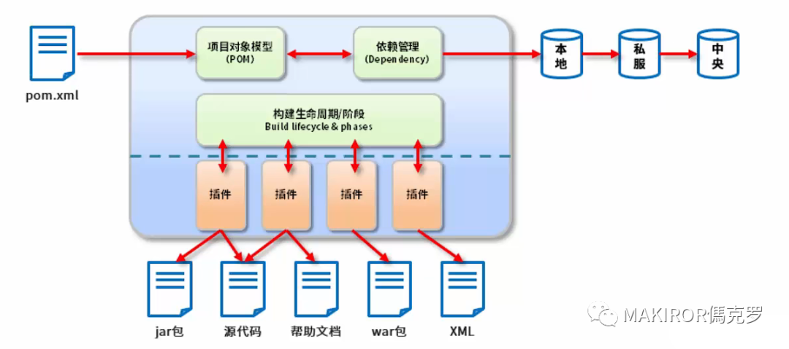
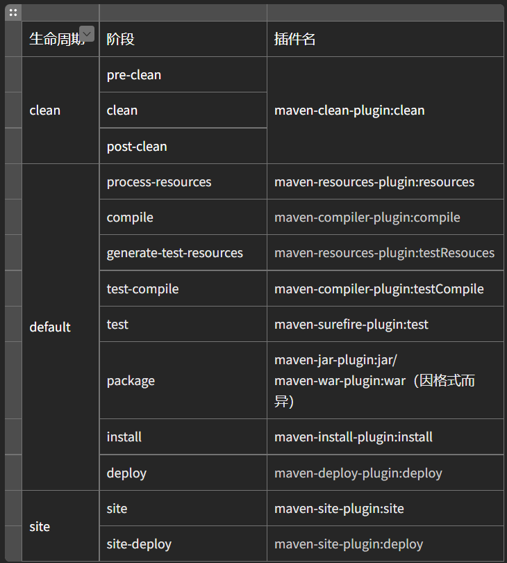
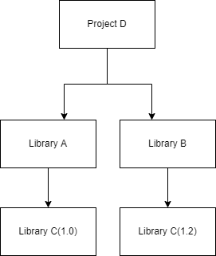
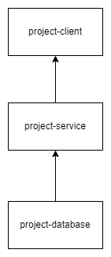
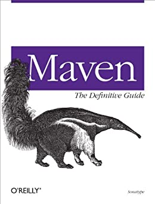

# 简单易懂的Maven快速入坑
&nbsp;&nbsp;如果要提到我第一个【真正】学到的编程语言，那大概是Java吧。我选择它并不是因为喜欢，而是简单，仅此而已。最初要搞Java时简直是各种碰壁，尤其是令人抓狂的依赖管理。而Maven正是能让你更优雅的管理项目的工具。    
“优雅 简直太优雅了”     
文章仅会介绍Maven在理论方面的内容，安装下载之类的实际操作不会提及。

## Maven是什么？它能做什么？
&nbsp;&nbsp;Maven是一个开源的项目管理和构建工具，主要服务基于Java的项目构建，用于项目信息管理和依赖管理。他能够让你 有序优雅标准化地 管理Java项目。
 
它为你的项目：
+ 提供了一套标准的构建流程
+ 提供了标准的项目结构
+ 提供了标准的依赖管理



## Maven比较重要的几个名词
POM：工程对象模型（Project Object Model）是Maven最核心的XML文件，决定了Maven如何工作，通常位于工程的根目录。POM将工程看作是一个对象（Object），而一个工程在Maven中要用唯一的【坐标】来表示。分别是groupId、artifactId、version、classifier、type这五个，以及其他内容，例如Dependenc。    

GroupId：工程的唯一标识符，与其他同类型的工程区别。    
Dependency：一个Java工程会有它需要依赖的包，这些被依赖的包在Maven中就被称为【Dependency】。通过<dependency>及其的子标签，定 位了一个唯一的依赖包。    
Plugin：Maven构建项目的整个生命周期是抽象的，需要由Plugin（插件）来完成任务执行。Maven为大多构建步骤绑定了默认插件，但是当用户有其他需要时，可以自己配置插件和行为，或者自己编写。    
  
## Maven的仓库
&nbsp;&nbsp;在Maven中，目所依赖的第三方库所在的位置叫做仓库。其中任何依赖，插件，或者项目构建的输出，能成为【构件】。    

&nbsp;&nbsp;Maven的仓库有三种类型：    

+ Local（本地仓库）：在运行Maven时，需要的所有构件都是优先从本地仓库直接获取，若在本地仓库中没有，它会尝试从远程仓库获取。
+ Central（中央仓库）：Maven中央仓库是Maven社区提供的，里面包含了常见的Java构件及其信息，简单的项目需要的构件大多可以从这里获取。
+ Remote（远程仓库）：由开发人员自己搭建的仓库，内容可自己定制
  
## Maven的生命周期

&nbsp;&nbsp;Maven有一套完善可扩展的生命周期，对构建过程做一个统一。大致包含项目的清理、初始化、编译、测试、打包、集成测试、验证、部署和生成。Maven的生命周期是抽象的，实际的执行操作都是由插件完成。   

### 三套独立的生命周期
&nbsp;&nbsp;Maven有三套独立的生命周期，分别为【clean】【default】【site】。其中每个生命周期都包含一些Phase（阶段），它们有前后顺序。简单概括一下三个生命周期的步骤：    
      
#### Clean（清理项目）
+ pre-clean：执行清理前的工作
+ clean：清理上次构建的文件
+ post-clean：执行清理后的工作
  
#### Default（build）
- validate：校验项目是否正确并且必要信息可以完成构建
- initialize：初始化
- generate-sources：生成源代码
- process-sources：处理源代码
- generate-resources：生成包含在项目中的资源文件
- process-resources：处理资源到目标目录
- compile：开始编译
- process-classes：处理类文件
- generate-test-sources：生成包含在编译阶段中的测试源代码
- process-test-resources：处理测试资源到目标目录
- test-compile：编译测试代码
- process-test-classes：处理测试类文件
- test：使用合适的测试框架测试
- prepare-package：打包前的工作
- package：打包
- pre-integration-test：集成测试前准备
- integration-test：集成测试
- post-integration-test：集成测试后的工作
- verify：验证项目
- install：安装项目包到本地仓库
- deploy：部署项目
  
#### Site（建立和发布项目站点）
- pre-site：生成站点前的准备工作
- site：生成站点文档
- post-site：生成站点后的工作
- site-deploy：将生成的站点发布
  
## Maven 插件
&nbsp;&nbsp;前面提到，这些阶段（phase）是抽象的，实际操作由绑定的插件完成。相当于Maven提供一个统一的接口，插件来完成这些Phase。  这样说，Maven实际是一个依赖插件执行的框架。
  
### 插件目标与插件绑定
&nbsp;&nbsp;Maven的插件主要以【.jar】的格式存在仓库中，与其他构件一样通过坐标访问。一个插件可能有多个功能，而每个功能就叫做插件的目标（Plugin Goal）
  
#### 描述目标
&nbsp;&nbsp;为了完成某个构建，我们需要将插件绑定在相应的Maven生命周期阶段。而Maven默认给某些核心的生命周期阶段绑定了插件目标，当用户调用这些阶段时，便会执行相应的任务。当然，我们也可以自己定义插件的绑定。

例如，这是三个生命周期阶段默认的对应的插件绑定表格


  
## Maven 依赖处理
&nbsp;&nbsp;这是Maven最核心的功能之一，当我们有一个规模大的多模块项目，它们之间的依赖关系会很复杂，管理起来也十分令人抓狂。
  
### 可传递性依赖
&nbsp;&nbsp;为了能更方便理解，我先举一个最简单的，有依赖关系的例子。
  
AB分别是两个库
C是一个项目
A库依赖B库，而项目C需要使用A库
那项目C也需要使用B库
  
&nbsp;&nbsp;而Maven可以通过读取项目的pom.xml，分析出它们的依赖关系，而并非花费时间搜索所有库的需求。我们需要做的很简单，仅仅是在POM文件中定义好直接的依赖关系。    
&nbsp;&nbsp;前面提到，库A需要依赖库B，那它们就是一个直接的依赖关系；而项目C因为需要引用库A，所以也要使用库B，那项目C和库B就是一个间接的依赖关系。    
  
### 依赖范围

&nbsp;&nbsp;在依赖配置中，有一个叫做<scope>的标签，即依赖范围。依赖范围则是定义相应的插件在哪个阶段能有效。

- compile：默认，在构建的全过程都有效
- Provided：编译和测试阶段有效
- runtime：运行和测试阶段有效
- test：测试阶段有效
- system：不依赖本地仓库，而是通过SystemPath指定路劲
- import：引用依赖的范围，一般解决多继承问题。

### 依赖冲突
  
下图是一个依赖冲突的例：


&nbsp;&nbsp;这样就相当于D需要通过AB库，间接依赖库C，但是两个库C版本不一样。若选择版本的方式是引入AB的顺序而定，那会非常不靠谱。如果引入A的代码在引入B的后面，那选择了低版本的库可能会导致出现错误。    
&nbsp;&nbsp;Maven面对冲突有两个原则：    
路径近者优先原则，第一声明者优先原则。    
&nbsp;&nbsp;单看上述例子，冲突的两个库路径长度相同，第一原则无法判断，那就依照第二原则，第一声明者优先 
  
### 覆盖策略
  
&nbsp;&nbsp;若相同类型版本不同的情况发生，两个原则都无法判断，则会使用覆盖原则。

```
<dependencies> 
  <dependency> 
    <groupId>test-cli</groupId> 
    <artifactId>test-cli</artifactId> 
    <version>1.2</version>  
  </dependency> 
  <dependency> 
    <groupId>test-cli</groupId>  
    <artifactId>test-cli</artifactId>
    <version>1.4</version> 
  </dependency> 
  <dependency> 
    <groupId>test-cli</groupId>  
    <artifactId>test-cli</artifactId>
    <version>1.5</version>  
  </dependency> 
</dependencies>
```

则会后者覆盖前者，最后选择版本1.5
  
## Maven 多模块项目
  
&nbsp;&nbsp;一些具有一定规模的项目会进行分层开发，就例如我要整一个Java项目，那可能会分成以下几个模块    

```
project
    　　|----pom.xml 
    　　　　
    　　|----project-client 
        　　　　　|----pom.xml
    　　|----project-service 
        　　　　　|----pom.xml 
    　　|----project-database
        　　　　　|----pom.xml 
```

&nbsp;&nbsp;我们可以用Maven来构建上面这些层，来方便开发。    
这些子模块有依赖关系，我画个图

  
&nbsp;&nbsp;我们在父模块和各个子模块的pom.xml内可以配置它们的依赖关系，最后完成构建这个多模块项目。    
&nbsp;&nbsp;各个子模块需要的依赖和信息应该在该子模块的pom.xml中配置，而父模块project的pom.xml则用于决定父子模块之间的关系。
  
## Maven快照
&nbsp;&nbsp;Maven构件的jar包分为两个版本，Snapshot（快照）版本和Release（发布）版本。    
&nbsp;&nbsp;若AB分别是两个服务，同时开发，A依赖于B。B项目每次更新，A也需要在pom.xml中配置，如此往复，即繁琐又烦人。而Maven的解决方法就是B服务可以发布快照版本，带有时间戳的，然后发布到私服仓库，A构建的时候可以自动下载仓库内B服务的最新快照版本。     
&nbsp;&nbsp;Maven会通过pom.xml中的“-SNAPSHOT”后缀来判断是否是快照版本，

### 项目快照（Snapshot） 与版本（Version）
&nbsp;&nbsp;每次开发团队中构建它们的项目时，Maven会自动获取最新的快照。若在两次构建中版本号没有变化过，那Maven就不会更新。     
&nbsp;&nbsp;版本（Version）存放在Release发布仓库。快照（Snapshot）存放在Snapshot快照仓库。Release则是用来放要正式发布的版本的。
  
## 结尾
那...文章也要接近尾声了，我在本文提及的Maven一些基础，若你有兴趣对Maven进行深挖，可以去阅读相关的书籍。
Maven: The Definitive Guide（Maven权威指南）



