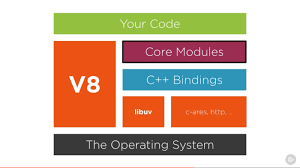
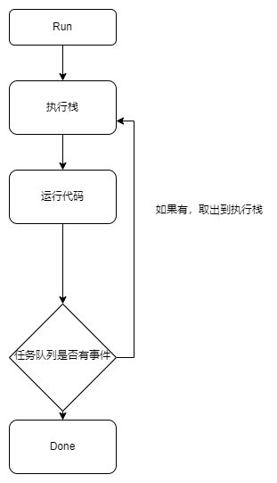

# 异步非阻塞I/O与Nodejs

## 开篇
&nbsp;&nbsp;在我某篇文章《浅谈Javascript与Promise》有提到：
> 正因为Nodejs的非阻塞I/O模型，使它有很强大的并发处理能力 

&nbsp;&nbsp;非阻塞式I/O是学习Nodejs不可缺少的知识点，不夸张可以被称为Nodejs的灵魂。当然它并不是什么难以理解的东西，可以说是非常基础，你可以当作这是Nodejs的入门文章来阅读（好像本来就是？）。     
&nbsp;&nbsp;虽然是属于入门类型的文章，但是在开始之前，你应该需要有些基本知识才能高效的阅读：
+ JavaScript的基础知识和概念
+ 计算机和编程的常识
+ 对于编程和Nodejs常用术语的正确认识

&nbsp;&nbsp;不多说了，就直切主题吧。     
***

## 基础概念
### 阻塞(blocking)与非阻塞（non-blocking）
&nbsp;&nbsp;当一个代码在不能马上得到返回（需要等待时间，哪怕很短）的情况下，若要等到这个代码完成再开始下一个，那这个等待就叫阻塞(blocking)。非阻塞就是等待的同时继续执行，不等待它完成。   

```javascript
const fs = require("fs")
var result;
result = fs.readFile("./x.txt","utf8");
console.log(result);
```

&nbsp;&nbsp;这段代码在阻塞式中是没问题的，但是这是Nodejs，它是非阻塞式。变量result还没读完文件就已经执行输出的代码了，程序并不会等待第三行完成再继续。    

### 同步(synchronous)与异步(asynchronous)
&nbsp;&nbsp;同步/异步关注的是消息通信机制(synchronous communication/asynchronous communication)。用一个实际的例子来解释，快餐厅出餐，一个订单完成再接下一个订单，这个逻辑就是同步(synchronous)。而异步(asynchronous)就是这个餐厅把所有订单都接下来，然后哪个先做好就先出哪个。同步在发出一个调用后，得到结果返回后才会继续，而异步可以同时做很多，哪个快就哪个先完成，并没有固定的先后顺序。    
     
### 阻塞，同步
&nbsp;&nbsp;阻塞(blocking)和同步(synchronous)看似概念上没什么区别，有人会将它们混为一谈。    
&nbsp;&nbsp;首先，【阻塞】在没有得到返回时会等待，即阻塞这个线程，而【同步】的重点是【调用的结果】，它在调用后一直等到有结果才返回，没结果就等着，但是线程仍然是激活的状态。

### 非阻塞I/O
&nbsp;&nbsp;I/O（Input/Output）指对磁盘文件系统或者数据库的写入和读取。阻塞I/O会完成整个获取数据的过程，而非阻塞I/O江是不带数据直接返回，需要通过文件描述符再次读取才能获取数据。

## Nodejs架构组成
### 搞清楚JS和Nodejs
&nbsp;&nbsp;JS(JavaScript)是一门编程语言，网页上的js会在浏览器的JS引擎上执行。Nodejs是一个执行JS的环境，运行于V8引擎上，而V8是Google Chrome的JS引擎。
（原谅我担心有些人会把JS和Nodejs混为一谈）

### Nodejs的功能
&nbsp;&nbsp;Nodejs是一个执行JS的环境，而因执行环境不同，除了提供浏览器Web API的什么console、setTimeout之类的以外，还会有一些API提供给开发者使用，例如文件读写的fs、处理网络请求的http等。

### Nodejs组成



(图片来源于网络)
Node
&nbsp;&nbsp;Nodejs由V8，Libuv和第三方库组成。
+ V8是由Google开源的高性能JS引擎，Nodejs运行于V8引擎上，V8解析JS代码，执行。并且同时支持自定义拓展。（我觉得细解V8引擎可以专门写一篇单独的文章了XD）
+ Libuv是一个事件驱动的异步I/O库，使用C语言开发，它管理者一个线程池，还有提供异步I/O、文件系统I/O、事件循环等功能。

### Binding和Addon
&nbsp;&nbsp;NodeJS的很多底层依赖库是使用C/CPP开发的，需要通过中间层Binding来让JS应用代码能与这些底层库互相调用，在Nodejs，Binding会把C/C++写的库接口暴露给JS。在中间层还有一个东西叫做Addon，若你需要在应用中包含第三方的C/C++库，那就需要你自己来写这些胶水代码，这些代码被称为Addon。

### Libuv
&nbsp;&nbsp;前面有说过，Libuv是一个事件驱动的异步I/O库，使用C语言开发。Libuv封装了各种平台底层的，异步I/O模型的实现，所以它具有Windows和Linux等都能使用的跨平台。本来这个库是为Nodejs设计的，但是因为它事件驱动异步I/O的高效，逐渐被许多语言和项目作为底层库。

### 跨平台的Nodejs
&nbsp;&nbsp;Nodejs基于Libuv实现了跨平台。在Nodejs刚出来时用的是libev而不是libuv，它本身也是一个异步I/O的库，可惜只能在POSIX下使用，后来Nodejs开始考虑跨平台的问题，而选择了Libuv来做抽象封装层。Libuv作为中间层提供跨平台的抽象，根据系统来决定Libev/Libio/IOCP，再往后的0.9.0版本，Libuv删除了Libev的内容。

## 单线程的Nodejs
### 单线程
&nbsp;&nbsp;众所周知，Nodejs是单线程的方式运行的。    
&nbsp;&nbsp;多线程的条件下可以实现应用并行处理，从而提高程序的性能，但js是单线程。原因并不复杂，JS经常被作为网页的脚本语言，用户互动和操作DOM就会显得很重要，而如果以多线程的方式操作DOM，就可能会出现冲突。设想两个线程同时操作一个DOM，一个删除一个更改就会出现协调问题，当然，有时可以引入锁机制来解决他们，但是这可能会很复杂，所以Nodejs一直以来都是单线程的。但为了单线程同时使js高效，就有了异步的特性。

### Web Workers API
&nbsp;&nbsp;js的单线程模式在较为耗时的操作中可能会有些不好的影响，例如长耗时导致页面假死。在HTML5中，这个问题得到了很好的解决。    
&nbsp;&nbsp;Web Workers使Web应用程序可以在与主线程分离的后台线程中运行一个脚本，从而让主线程不被阻塞，相当于为js创造了一个多线程的环境，主线程创建一个线程，把任务分给它，完成后再返回给主线程。但是请不要搞混，这并不是js语言的本身支持多线程，而是依靠浏览器提供一个js多线程运行的环境。既然都讲到了，就顺便提提它的部分限制吧（避免踩坑）：
+ 同源限制：Worker线程执行的脚本文件必须与主线程的脚本文件同源
+ DOM操作：Worker线程无法操作主线程所在网页的DOM对象，它运行在另一个全局上下文，而不是与主线程一样。但是它仍然可以使用浏览器的API
+ 文件限制：Worker线程所有文件必须来源于网络而不是本地，并与主线程同源


<!--
## I/O
### I/O多路复用
&nbsp;&nbsp;并发量巨大时，阻塞I/O和非阻塞I/O都不太合适，I/O多路复用正是为了这种情况而生。 
-->

## 事件循环
### 概念
&nbsp;&nbsp; Nodejs 有一个基于事件循环的并发模型，Nodejs运行时包含一个【消息处理队列】，每一个【消息】关联着一个用于处理这个消息的回调函数。主线程循环的处理任务队列的东西，这个机制叫做『事件循环』Event Loop。
&nbsp;&nbsp;所有任务都会在主线程执行，形成一个执行栈（execution context stack）一旦执行栈所有同步任务执行完成，js就会将队列中事件对应的回调函数放入执行栈中开始执行。



### 事件队列（Event queue）
&nbsp;&nbsp;在主线程之外，js引擎线程还维护着一个事件队列（Event queue），执行栈空时线程就会从队列读取任务，【任务】是指异步回调函数。你可以把事件队列理解成队列之类的数据结构。另外，消息队列遵循First In, First Out (FIFO)原则，先进先出。

### 轮询
&nbsp;&nbsp;前面提到，js遇到一个事件会将其挂起，继续执行执行栈中的任务。js会将这个事件加入到事件队列，主线程空闲时，会去查找事件队列里的任务并将事件对应的回调加进执行栈并开始执行代码。这个不断往复的过程就是轮询。

### Macrotask与Microtask
&nbsp;&nbsp;js会将事件返回结果放到一个队列，但是这个事件会因类型被分到对应的宏任务队列或者微任务队列，主线程会在执行栈空时查看微任务队列，若里面没有事件再去宏任务队列取出最前面的事件并把对应的回调加入执行栈。
#### 宏任务
&nbsp;&nbsp;宏任务（Macrotask）是由宿主发起的（浏览器和Node），它会触发新一轮Tick。属于宏任务的包括但不限于：
+ Ajax
+ DOM监听
+ SetTimeOut    
  
&nbsp;&nbsp;可以有多个宏任务队列，宏任务可以在不影响当前执行宏任务的同时创建微任务。
#### 微任务
&nbsp;&nbsp;微任务是由js引起发起的，它永远会优先执行。Promise的then回调就属于微任务队列，它并不会触发新一轮的Tick。

## Nodejs的设计思想
### 让JS在服务端运行
&nbsp;&nbsp;Nodejs不是一个语言，也不能说是某些『即是语言也是平台』的东西，它使用JS进行编程，运行在JS引擎上。相比PHP之类的需要运行在服务器程序之上，例如Naginx、Tomcat。Nodejs不需要基于任何服务器程序之上。与LAMP（Linux、Apache、MySQL、PHP）等设计理念和架构截然不同。
### 为了Real-time Web诞生的平台
&nbsp;&nbsp;Nodejs可以说是为了实时Web应用诞生的平台，为此它摒弃了传统的『多线程实现高并发』这种做法，而是使用了单线程和异步I/O、以及事件驱动程序设计模型来提升性能，不仅巨大减少了程序设计复杂性，还大大提高了开发效率。

## 最后
&nbsp;&nbsp;好吧，因为某些原因我这篇不长的文章实际分了好几天来写，可能会有一些内容重复或者错漏的问题，有补充建议纠错的欢迎留言或者发邮件gzanan@gmail.com。顺便，临近开学季了（我现在还是初中生），祝各位学生朋友能在新学期有新的进步，然后毕业的小伙伴事业顺利。啊，大概就这样。   
