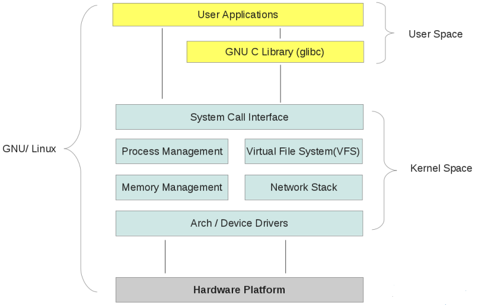

# 你好，Linux内核架构和原理
## 开篇
&nbsp;&nbsp;Linux一直以来是一个很受开发者们欢迎的操作系统，Linux存在不同的发行版（我曾经简单介绍过），但是它们都是Linux内核。或许我们想了解这个系统，就得从最基本的【内核】开始吧。    
&nbsp;&nbsp;我希望能让更多人看到并看懂。操作系统入门并不会那么复杂，前提是正在阅读的你愿意积极思考。    
&nbsp;&nbsp;篇幅有限，我不能在每一个点都非常详细的解释，语言会更偏向概括性，在文章的最后我会放几本书推荐，它们有非常深入的解释。
## 相关的历史
### 传奇人物
&nbsp;&nbsp;最早在1991年10月5日，Linus Torvalds首次发布这个操作系统的内核。这最开始只是他的一个实验项目，他当时年仅21岁！至今Linux已经发布30多年，而Linux内核还在不断更新。顺便一提，Linux的吉祥物是一只小企鹅，大家应该都不陌生。   
&nbsp;&nbsp;Linus为了在更好的管理庞大的Linux内核源码的同时开放源代码使世界各地的优秀开发者们能共同维护它，又开发出了一个分布式版本控制软件Git，现在我们常见的GitHub、GitLab等都是采用git的方式来运作。Linus的开源理念和作品为全世界做出了巨大贡献。

### 继Unix以后
&nbsp;&nbsp;Unix系统第一次诞生，在1969年，贝尔实验室。在1970年C语言又诞生，Unix内核被重新编写。Linux是一个在外观、性能不比Unix差的操作系统，但是Linux与Unix的源代码无关，只是像Unix。

### GNU通用公共许可证
&nbsp;&nbsp;GNU（GNU General Public License）是被广泛使用的自由软件许可证，缩写也可以是GNU GPL或者GPL。Richard Stallman被称为自由软件之父，他在1988 +1年撰写GPL的条文，四个最主要的需求是：
* 可以使用软件做任何事
* 可以自由与他人分析软件
* 可以根据自己需要修改软件
* 可以与别人分享自己对软件的修改
&nbsp;&nbsp;Linux目前使用的是GPLv2，理论而言，所有Linux发行版都遵循GPL许可协议。

## 操作系统内核
### 操作系统的定义
&nbsp;&nbsp;操作系统（Operating System）缩写OS，是一个管理计算机硬件和软件资源的系统软件。就例如常见的Windows，Android和IOS。
### 操作系统内核与分类
&nbsp;&nbsp;操作系统内核通俗的讲，可以说是位于硬件和软件之间的层，应用程序没有与硬件的直接联系，而是与内核联系，在应用程序的视角，内核是已知层次的最底层。内核抽象了实际工作的细节，它将应用程序的请求传递给硬件。也作为底层驱动程序，对系统的组件、设备什么的寻址。
#### Micro Kernel
&nbsp;&nbsp;在微内核中，用户服务和内核服务在不同的地址空间，因此用户程序崩溃并不会影响到内核服务。另外，在微内核添加一个功能，只需要建立一个新的服务到用户空间里就行了，使得微内核的扩展性强成为它的优势之一。
#### Monolithic Kernel
&nbsp;&nbsp;单内核（Monolithic Kernel）在有些文章被翻译成『宏内核』，它的用户服务和内核服务是在同一个空间的。单内核需要管理的东西比微内核要多，大小自然也大。但是因为单内核用户服务与内核服务在同一空间的架构，使它比微内核要更快。相比微内核的劣势也显然，当某个服务崩溃时会连带整个内核。Linux是基于单内核的机制实现的。

## Linux内核的组成

### Linux的进程
&nbsp;&nbsp;Linux的进程分为两种，分别是交互式进程（又称前台进程）与非交互式进程（又称后台进程）。交互式进程由终端会话控制，而非交互式进程没有链接到终端，也不需要任何的用户输入。    
&nbsp;&nbsp;Linux的进程采用树状的结构，每一个进程都依赖一个父进程。【init】是这个进程树的根。但是你pstree命令实际上得系统第一个进程是【systemd】。这是因为systemd是系统中最新的初始化系统，现在ubuntu与许多其他发行版也采用了systemd。init是串行启动，而且当sysvinit系统初始化时，它会等待所有需要的后台服务进程全部启动就绪后才允许用户登录，这个耗时和效率是systemd开始替代它的主要原因。   
&nbsp;&nbsp;每个进程有它的ID（PID）和它父进程的ID（PPID）来识别。

### Linux内核的层次
&nbsp;&nbsp;Linux系统中，最上层是用户空间，也就是应用程序执行的地方，之下是内核空间，而最底层就是硬件。而在Linux内核中，可以概括三个层次，最上层是系统调用的接口，在接口之下的是内核代码，它们在所有Linux支持的处理器体系结构中通用，而再往下就是依赖于体系结构的代码。
（图片来源于网络）



### 提供系统调用的接口
&nbsp;&nbsp;系统调用是在用户空间进程与硬件之间加了一个中间层，为用户空间提供了抽象的接口，又保证了系统的稳定和安全性。如果程序可以随意的访问硬件而不是通过内核抽象的接口，那会存在安全的风险。在Linux中，系统调用的接口是用户空间访问内核唯一的方式，唯一合法的入口。

### Linux内核的五大子系统
&nbsp;&nbsp;在前面有提及，Linux采用的是宏内核（monolithic kernel）架构，主要是由五个子系统组成。


#### 内存管理（Memory Manager）
&nbsp;&nbsp;内存管理（Memory Manager）的部分主要用于控制多个进程共享主内存区域，确保这个过程的安全。另外，Linux是支持虚拟内存的，内存管理子系统会负责完成每个进程的虚拟内存到物理内存的转换。Linux内核为每一个进程在可用资源上建立一个虚拟地址空间。虚拟空间避免了用户直接访问物理内存的地址，或者一些有危害的操作。并且用户程序可以使用比实际物理内存更大的地址空间。无论是用户空间还是内核空间，使用的都是虚拟地址，进程需要访问内存时，内核的把虚拟地址转换为内存的物理地址。

#### 进程调度（Process Scheduler）
&nbsp;&nbsp;进程调度（Process Scheduler）是Linux处理进程们的输入和输出，创建和销毁，以及它们之间通信的子系统。Linux内核需要负责控制进程对CPU的访问，这是Linux最基本的功能，处于结构图的中心位置。

#### 进程间通信（Interprocess Communication）
&nbsp;&nbsp;Linux的进程间通信（Interprocess Communication）机制的基本是从Unix的机制继承过来的，Linux同时继承了早期Unix进程间通信、基于System V进程间通信、POSIX进程间通信和基于Socket进程间通信的机制。进程间通信多为了数据传输、共享数据、通知、进程控制和资源共享，这个我们在后面会开一个大章来讲。

#### 虚拟文件系统
&nbsp;&nbsp;虚拟文件系统（Virtual File System）子系统为用户程序提供文件和操作的统一接口，用户程序可以借助VFS直接使用各种系统调用操作文件，它将文件系统之间的差异与操作的细节抽象化了。

#### 网络接口
&nbsp;&nbsp;网络接口（Network Interface）包含了网络协议与网络驱动程序，它需要支持不同的协议簇、网络设备等。它负责实现可能的网络传输协议，与相关硬件设备的通信。

## 用户空间与内核空间

### 用户态与内核态
&nbsp;&nbsp;Linux Kernel以系统调用（System Calls）为边界，将指令执行的状态分为用户态与内核态，它更多是把CPU特权给区分开。Linux为了保障操作系统在多用户环境下的可靠性，会根据CPU的指令类型来把代码运行模式区分为用户态和内核态两种，以用户态模式运行的代码被限制了操作权限以及访问资源的范围，而内核态的代码不会受到操作以及资源访问上的限制。内核态与用户态之间的切换被称为模式切换。   

### 内核空间
&nbsp;&nbsp;内核空间（Kernel space）是为操作系统内核存在的，操作系统与驱动程序都运行在内核空间中，它常驻于内存中并且不允许用户的应用程序直接对它进行调用或者读写。前面有提到。

### 用户空间
&nbsp;&nbsp;一般来说，每一个普通的用户进程都各自有一个用户空间（User space），也就是说它一个进程处于用户态时它不能访问内核空间，也不能直接进行调用内核的函数，当需要调用时将进程切换到内核态。用户态可以通过系统调用（System Calls）、库函数、Shell脚本来访问内核态资源。

### Shell
&nbsp;&nbsp;Shell是一个命令解释器，是一个比较特殊的应用程序。它像一个通向系统和应用的一个胶水，连接和协同不同的程序。并且Shell是可进行编程的，这些被称为【Shell】脚本，Shell语句对系统调用做了一个封装以让用户使用，而一般而言一个Shell有一个对应的终端来呈现图形化窗口给用户，用户的输入将直接被Shell这个命令解释器解析并执行。

### 用户态线程与内核态线程
&nbsp;&nbsp;很多程序在比较现代的操作系统中并不是以线程为单位执行，而是线程（Thread）。一个进程可以拥有多个线程，一般会有一个主线程随着进程的创建一起出现。CPU将它们根据权限划为两个类型：用户态线程和内核态线程。

#### Kernel Level Thread
&nbsp;&nbsp;Kernel Level Thread，内核态线程或称内核级线程，内核级线程拥有较高的权限，对于某些操作不需要通过系统调用。内核态线程运行在内核中，由内核来控制。虽然拥有更大的权限，但是缺点也是显然的，相比用户级线程它的创建和切换成本更高，因为由内核管理，扩展性也不大。

#### User Level Thread
&nbsp;&nbsp;用户态线程又称用户级线程，它在用户控件中被创建并且内核并不会知道它的存在，创建与销毁不需要经过系统调用，可以由自己维护而不是内核来管理。相对的管理成本更小。但是它在线程间通信的成本会更高，因为需要通过系统调用才能用到通信需要的I/O。由用户空间程序管理，与内核协作需要进行I/O的时候，需要频繁切换用户态和内核态。由于不归内核管理，当一个进程的某个用户态线程种阻塞时内核无法及时处理问题。

## Linux的内存管理
&nbsp;&nbsp;前面的章节有大概的介绍Linux内存管理，但这是相当重要的内容，专门讲解当然是不可少的。

### 内存分配架构
&nbsp;&nbsp;内存空间又分为用户内存空间和内核内存空间，用户内存空间对于每个用户进程可见。而内核内核空间将内存划分不同区域，再由slab层或者vmalloc来管理，内核内存管理的最小单位是【内核页】。内核能直接管理物理页。而用户内存空间使用的是虚拟内存管理机制，在此之上还有Buddy算法等进行统一的内存管理。

### Slab & Buddy allocator简介
&nbsp;&nbsp;Slab和Buddy是Linux Kernel的基础的内存分配器，Slab通过一次性申请较大的内存空间并将其等分，来避免内存碎片的情况。Buddy则是分配到每个对象都带有Buddy（伙伴），当对象释放时Buddy会将它的内存合并，Buddy系统还会将大内存分割成小内存块分配出去，给小对象需要内存的情况。Slab是等分，而Buddy是按需分配归还，合并和分割。

### 虚拟内存和物理内存
&nbsp;&nbsp;即便是现代，操作系统开始逐渐发展成熟，内存也是宝贵的资源，虚拟内存机制是Linux为了充分利用和管理系统内存资源。    
&nbsp;&nbsp;虚拟地址机制给每个进程分配了4GB的虚拟内存，用户程序使用了比实际物理内存更大的地址空间。虚拟内存概念的出现解决了内存使用效率低、内存数据没有权限保护的问题。4GB的进程虚拟地址空间又被分为用户空间和内核空间。当进程每次访问内存空间的某个地址，都需要将地址翻译为物理内存的地址。这个翻译工作由内存页表的机制来实现。所有进程实际上是在共享同一个的物理内存，只是进程会把自己当下需要使用的虚拟内存空间映射储存到物理内存上。    
### 内存管理单元
&nbsp;&nbsp;内存管理单元MMU（Memory Management Unit）是将虚拟地址转换为物理地址，内存保护的东西，是Linux内存管理中相当重要的一个部分。页表（Page Table）描述着MMU的映射规则，MMU通过查找页表来确定虚拟地址映射到哪个物理地址。


### 内存页表
&nbsp;&nbsp;为了更好完成内存映射，Linux内核为每个进程管理了一张“内存页表”，页表是指将虚拟地址映射到物理地址的一个数据结构。它是一个常驻内存的东西，来应对频繁的映射需求。对于虚拟地址空间中的每一页，页表都会分配一个数组项。
### 多级页表
&nbsp;&nbsp;这会出现一个问题，进程的虚拟空间很大，但实际大部分是闲置的，真正需要映射的地方是很小的，在一个进程下，如果一个页表大小为4KB，而整个虚拟地址空间有4GB，那就会产生1M个页表项。如果真的照这么来，估计整个系统的内存都来存放它们也不够。为了减少页表内存的使用量，多级页表的概念出现了。    
&nbsp;&nbsp;多级页表只保存那些需要使用的部分，而不是把所有闲置的也一起保存，这样先很大程度上节省了页表的项数。为了同时支持适用32位和64位的系统，Linux开始采用分页模型，而在2.6.11以前是三级分页模型，之后则是四级分页模型。页表级数越少，虚拟地址映射到物理地址就会越快，但是管理的页表项会更多，地址空间也更有限，而页表级数多则相反，这使操作系统定页表级数时要在映射速度和占用空间取折中。

### 应运而生的TLB
&nbsp;&nbsp;TLB（Translation Lookaside Buffer）通俗的说它就是页表的缓存，专门用于虚拟地址转换到物理地址的缓存。为了提高性能，在MMU中增加一个TLB并将地址转换的关系储存到这个缓存中，当同一个虚拟地址需要转换时可以直接从TLB获取结果而不是再来一次转换。

## Linux进程间通信
### 为什么要进程间通信
&nbsp;&nbsp;进程间通信机制用于控制进程间同步、数据传输、资源共享、通知事件等，不同的用户空间有各自的进程空间，它们之间的通信需要由操作系统内核来控制。有些进程需要控制另一个进程，控制的进程需要通过这个机制来得到另一个进程的状态。本大章就来简单解释下几个常见的机制。

### 信号通信机制
&nbsp;&nbsp;信号（signal）是从Unix第一代就开始存在的进程间通信机制，Linux是类Unix系统，也有模仿这个机制。信号应该是进程间通信机制中唯一一个异步的。    
信号要从两个不同的方面来分类：    

+ 可靠性：可靠信号与不可靠信号
+ 时间机制：实时信号和非实时信号

#### 信号队列
&nbsp;&nbsp;Linux会用一个bitmap（好像是位图？）来给每一个目标进程记录信号的处理状态，传统的Unix会将未被目标进程处理，处于挂起（pending）状态的信号类为“不可靠信号”并直接丢弃，因为它存在风险。   
&nbsp;&nbsp;Linux在这方面有改进这个做法，Linux的内核会为每个进程维护一组队列，有pending状态的信号时会将他放进队列排队，这样的信号被类为“可靠信号”，一般而言队列的信号个数没有超过上限就不会丢失。信号的可靠是否取决于信号值而不是发送的函数。

#### 信号产生与处理
&nbsp;&nbsp;不少信号有对应的，默认的处理模式，如果目标进程不注册信号对应的处理函数，收到后就会自动执行默认操作。可以通过注册处理函数来修改进程对信号的默认行为。通过signal()函数来注册。   
&nbsp;&nbsp;虽然signal函数是用于注册信号处理函数的，但是自从sigqueue()函数出现以后，人们就更多开始使用sigaction()了，它对signal函数做了扩展以实现更精准的信号执行控制。   
>sigaction结构体
```C
struct sigaction
{
    void (*sa_handler)(int);
    void (*sa_sigaction)(int, siginfo_t*, void*);
    sigset_t sa_mask;
    int sa_flags;
    ...
};
``` 
&nbsp;&nbsp;从发送到处理函数执行完毕，一个信号完整的生命周期应该有三个阶段。
+ 信号产生
+ 信号注册
+ 信号的执行与注销
  
&nbsp;&nbsp;信号有两个来源：硬件和软件。然后信号将在目标进程中被注册，注册指信号值被加入到目标进程的【挂起信号集】，就是我们前面提到的队列，只要出现在里面就代表进程已知信号的存在。当实时信号发送到目标进程时，无论是否曾经注册过都会再被注册一次，因此信号不会丢失，实时信号属于【可靠信号】。而非实时信号曾经被注册过的话将会被丢弃，也就是说它无论如何也只能最多在队列中占用一个位置，它属于【不可靠信号】。    
&nbsp;&nbsp;内核在代理信号发送时会进行一套检查流程，当未被屏蔽的信号处理完毕后，被屏蔽的信号取消屏蔽，返回到用户空间时会被再次检查。内核会在一个进程从内核态返回用户态时处理进程收到的信号，所以当进程在内核态下运行时软中断信号并不会起作用。

### 管道通信机制
&nbsp;&nbsp;管道（Pipe）是Linux最常见的进程通信方式之一，如同『管道』，在两个进程间实现一个数据流通的管道。
#### 管道的特性
+ 管道同一时间只能单向流动，需要双向通信时需要建立两个管道，这被称为『半双工通信』。
+ 管道传输的是字节流，不带格式信息，需要通信的两个线程约定数据格式
+ 管道只能建立于兄弟或者父子关系的线程之间

#### 『管道』的实质
&nbsp;&nbsp;管道对于通信的进程而言只是文件，但实质上它不完全是文件，你可以把它理解为一个缓存数据的文件，数据被读取后就没有了。它不属于操作系统的任何文件系统，它仅存在内存之中。


### 共享内存
&nbsp;&nbsp;共享内存（Shared Memory）是进程间通信中最简单的方式之一，让多个进程访问同一内存，当一个进程改变了这块内存的内容，其他进程也能察觉。这既简单又高效，但多个参与共享的进程不应该同时读写。Linux没有对共享内存在这方面的限制，你必须自己完成同步的措施，保障不允许多个线程同时读写、不允许进程在其他进程写入数据前读取之类的。

## Linux虚拟文件系统
&nbsp;&nbsp;虚拟文件系统VFS（Virtual File System）为用户程序提供文件和文件系统操作的统一接口，我们可以通过系统调用来直接操作文件而不需要关注里面的细节。Linux中的标准文件系统是Ext文件系统族，但Linux支持很多文件系统类型，VFS为了这定义了一个通用文件模型，以支持文件系统中对象的统一视图。

### 一些文件系统和类型
&nbsp;&nbsp;Linux内核支持了很多不同的文件系统，例如ext4、ext3、ext2、sysfs、securityfs、FAT16、FAT32、NTFS，而最常用的是ext4。从Linux kernel 2.6.28开始支持Ext4，也就是Ext3的改进版，它与Ext3兼容并有更好的性能和可靠性。VFS支持的文件系统可以分为三大类：
+ 基于磁盘：代表性的就是Ext
+ 特殊文件系统
+ 网络文件系统
### VFS四大结构
&nbsp;&nbsp;Linux有一个很重要的概念就是『一切皆为文件』，目录是文件设备是文件总之无论如何什么都是文件。Linux为了设计VFS，将四种数据结构抽象：
+ 超级块（super_block）
+ 索引节点（inode）
+ 目录项（dentry）
+ 文件对象（file）

#### 超级块
&nbsp;&nbsp;超级块（super_block）为支持Linux多文件系统而存在，内核必须通过一个抽象的数据结构来描述具体文件系统的信息和操作。超级块就是这个数据结构。一个文件系统会对应一个超级块结构。
> Super_block结构体局部，完整的结构体有点长就不展示了
```C
struct super_block {
    struct list_head    s_list;
    kdev_t              s_dev;
    unsigned long       s_blocksize;
    ...
};
```

#### 索引节点
&nbsp;&nbsp;索引节点（inode）结构体用于描述文件的meta信息，每个文件都有一个对应的inode结构，并且它的编号是唯一的。里面会包含文件拥有者、创建时间、磁盘位置等关键信息。

#### 目录项
&nbsp;&nbsp;目录项（dentry）结构用于描述文件的逻辑属性，无论是文件夹还是文件都会有对应的目录项，而目录树便是由所有的目录项构成的。VFS查找文件时会找到每个目录项的inode，然后沿着它们找到目标文件。    
&nbsp;&nbsp;一个有效的dentry结构必须有一个inode结构，因为无论是目录项和文件在系统眼里都是文件。
每个目录项对象可以处于以下的四种状态之一：
+ 空闲（Free）：该状态并不是一个有效的dentry结构，它并没有被使用
+ 负状态（negative）：目录项所关联的inode已不存在，但它仍然被保存至目录项的高速缓存中，所以对它的操作仍然能快速完成。但是负状态仅仅是一个术语，实际上它与【负】这个概念毫无关联。
+ 未使用（unused）：该目录项还没有被内核使用，但是包含有效信息，而在必要时的内存回收它可能被丢弃
+ 正在使用（in use）：该目录项正准备内核使用，它包含有效信息并且不能被丢弃

#### 文件对象
&nbsp;&nbsp;一个文件可以存在多个文件对象，因为它可以同时被多个进程打开，但是它是唯一的，并用于唯一的inode。进程是通过文件描述符来操作文件的，一般打开文件后位置默认都是从0开始，file结构体用于保存打开文件的位置，也就是【打开文件的描述】

### 目录项高速缓存
&nbsp;&nbsp;目录项对象在磁盘上没有对应的映射，而是存放在dentry_cache的slab分配器高速缓存里面。因为从一个磁盘读入目录项并构造相应的目录会花费不少时间，Linux需要通过这种缓存来提高处理目录项的效率。    
它一般由两个数据结构组成：
+ 一个目录项对象的集合
+ 一个能快速获取文件名和目录名对应对象的散列表

### 命名空间
&nbsp;&nbsp;Linux使拥有相比Unix系统更精确的命名空间（Namespace）机制，它的每个进程可以拥有自己的已安装文件系统树。当进程安装卸载一个文件系统时仅修改它的命名空间，通常大多数进程会共享一个在系统的根文件系统被init进程使用的已安装文件系统树，而它所做的修改可以被共享同一命名空间的进程看到。

## 结尾
&nbsp;&nbsp;那感谢你认真的阅读到最后，我尽可能地写的好，哪怕时间和实力有限。如果你希望更深入详细的了解Linux Kernel可以看看这本书，我作为一个入门Linux人十分推荐：    
《深入理解Linux内核》 DANIEL P.BOVET & MARCO CESATI 著    
