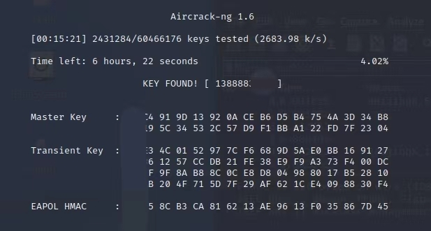

# Kali Linux基础-抓包与WIFI密码暴力破解
&nbsp;&nbsp;这两天大暴雨停课，就趁着这段时间来玩一下Kali Linux，正在想干啥的时候突然想起之前同学问我的，如何破解wifi密码...正好这也是个很简单的东西，就浅浅的写个文章讲讲，使用Kali Linux进行网络数据抓包，再暴力破解wifi密码。

## 开始前的准备
一台跑得动虚拟机的电脑    
USB无线网卡（用于Linux）     
根据自己需求选择一个密码字典（文章包含制作教程）    
充足的时间（安装某些东西需要大量时间）    
<del>智慧的大眼睛</del>

## 开始前应该大概了解的
初中计算机常识    
Linux基础操作    
虚拟机的概念    

## 本文的环境
Windows10    
VMware    
KaliLinux系统内核信息：Linux kali 5.15.0-kali3-amd64 #1 SMP Debian 5.15.15-2kali1 (2022-01-31) x86_64 GNU/Linux    
    
免责声明：本文仅限于学习，若用于不合理用途引发的后果责任自负。请遵守《计算机信息网络国际联网安全保护管理办法》，《中华人民共和国计算机信息系统安全保护条例》等相关法律

## 安装Kali Linux
https://www.vmware.com/products/workstation-pro/workstation-pro-evaluation.html
安装vmware这很简单 直接安装就行
https://www.kali.org/get-kali/#kali-virtual-machines

这些文件相当大！请等待一段时间。    
你会获得一个.7z格式的压缩文件，请解压它到你希望用于存放虚拟机的路径（条件足够下不建议装在C盘，虚拟机会占用很大空间）    
解压完成后，你将会在解压的文件夹内看到一个.vmx文件，请复制它的路径    

启动VMware：files-open-选择.vmx文件-启动Kali Linux    
Kali Linux的默认密码和用户名：    
kali，kali    

打开终端 输入sudo su 再输入一次密码获得权限    

## 更改软件源
如果你是国内用户，可能使用官方的软件源会相当慢，你可以换成国内软件源。    
使用vim编辑：
```
vim /etc/apt/sources.list
``` 
以下国内源自行选择添加
```
#阿里云
deb http://mirrors.aliyun.com/kali kali-rolling main non-free contrib
deb-src http://mirrors.aliyun.com/kali kali-rolling main non-free contrib

#中科大
deb http://mirrors.ustc.edu.cn/kali kali-rolling main non-free contrib
deb-src http://mirrors.ustc.edu.cn/kali kali-rolling main non-free contrib

#清华
deb http://mirrors.tuna.tsinghua.edu.cn/kali kali-rolling main contrib non-free
deb-src http://mirrors.tuna.tsinghua.edu.cn/kali kali-rolling main contrib non-free

#浙大
deb http://mirrors.zju.edu.cn/kali kali-rolling main contrib non-free
deb-src http://mirrors.zju.edu.cn/kali kali-rolling main contrib non-free
``` 
更新（需要一段时间）
```
apt-get update
apt-get upgrade
```

插入你的USB无线网卡，并在Kali Linux桌面右下角右键一个USB图标连接    
Kali Linux自带aircrack-ng套件，简单介绍一下，它是一组用来操纵和破解网络的工具套件，而非单独的工具，它相当出名，几乎所有的“Hacker”都会使用。    
在确认网卡插入并连接后，在终端输入，确定它能识别USB无线网卡    
```
iwconfig
```
若输出结果有”wlan0“则代表你的USB无线网卡可用    
一般情况下，网卡只会接受预定的数据包，使用"airmon-ng"后，它将接收所有无线流量。    
```
airmon-ng start wlan0
```
完成后再次输入”iwconfig“，若wlan0变为wlan0mon，则成功（根据版本不同名称可能略有出入）    

接下来我们需要抓到规范的数据包，通过这个命令来启动它

```
airodump-ng wlan0mon
```
启动后稍等一下，会看到一些数据，类似


有显示MAC地址 功率 信标帧数量 数据包数量 信道 速度 加密方式 密码类型 认证方法 ESSID等，其中，最重要的是MAC地址（BSSID）和信道（CH）    
为了隐私与安全，接下来我将使用BSSID 00:00:00:00:00:00，CH 1来做示例    
在/home/kali下创建一个hack目录储存抓到的东西，开始抓包    
```
airodump-ng -c 1 --bssid 00:00:00:00:00:00  -w /home/kali/hack/ wlan0mon
```
开启后下面会有一条“STATION” 是连接该wifi的客户端MAC地址，这里我们假设它是AA:AA:AA:AA:AA:AA    
如果你很幸运，那顶部就会出现“WPA handshake" 代表你抓包成功     
当然 不少情况我们无法直接捕获到，这时我们需要使用一些手段获得。    
此时，客户端AA:AA:AA:AA:AA:AA正在联网，我们需要攻击它，把它踢下线，当AA:AA:AA:AA:AA:AA断网并重新连接时，我们就可以捕获到"握手验证数据报文"了    
    
不要终止抓包，开启新终端并sudo su
```
aireplay-ng -0 0 -c 00:00:00:00:00:00 -a AA:AA:AA:AA:AA:AA wlan0mon
```
解释一下
```
aireplay-ng -0 攻击次数（0为无数次） -c 客户端MAC -a MAC地址 wlan0mon
```

攻击时大概会输出这样的内容    


攻击的同时关注抓包的地方，等到出现“WPA handshake"时就两边都停止，你已经成功抓到握手包了！

## 密码字典
&nbsp;&nbsp;在破解密码前，我们需要准备一个合适的密码字典，你可以在已知条件下选择更合适的字典（比如有关生日，手机号等），当然，如果对方是弱口令，破解就会显得轻而易举

&nbsp;&nbsp;弱口令(weak password)：没有严格和准确的定义，通常认为容易被别人（他们有可能对你很了解）猜测到或被破解工具破解的口令均为弱口令。
来自百度百科

kali自带一个字典，解压/usr/share/wordlist/rockyou.txt.gz即可使用，如果是常见的密码，什么123456之类的会很容易破解。

### crunch
想要自己制作一个密码字典？没问题，crunch，不过我在这里只提供基本语法，深入研究请自行查找较详细的文章    
生成一个最6-8位，包含0-6的密码字典到/home/kali/dic/pass.txt
```
crunch 6 8  0123456 -o /home/kali/dic/pass.txt
```
6：最小长度    
8：最大长度    
0123456：包含的内容（复杂的表达式本文不讲）     
-o：路径    


### 破解密码
&nbsp;&nbsp;打开抓包的路径，你可以看到以下内容（文件名可能会有出入）     
  
那就当作是上述文件名来举例吧，假设我使用的是rockyou字典
```
aircrack-ng -w /usr/share/wordlists/rockyou.txt /home/kali/hack/-01.cap
```
里面有两条路径，第一条是字典路径，第二条是抓到的包的路径    
接下来就开始漫长的破解了...越难的密码就要越久，这里举个例子吧，长度只能是8位且只包含数字0-9的密码，我的电脑需要破约6个小时。当然，这并不是明智的做法，可以结合现有的信息来缩减范围，比如指定的格式，出现次数等条件。不要在电脑有其他工作时进行，它能够吃掉大半cpu...    
 
顺便一提，破解成功的画面是这样的：



这有些靠运气的成分，有些时候即使整个字典扫完了也没有破出来：（

