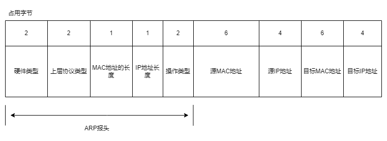
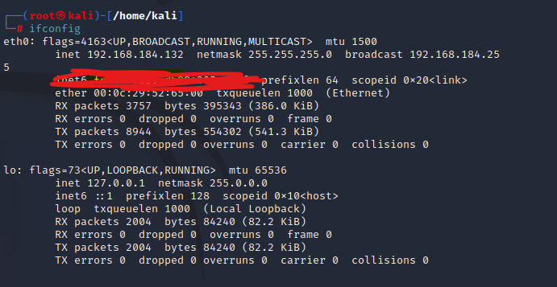
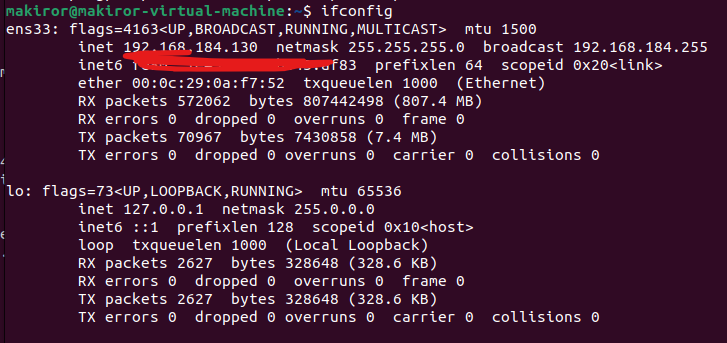
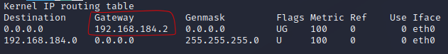
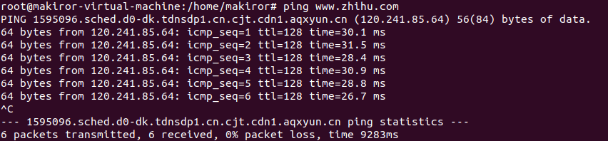
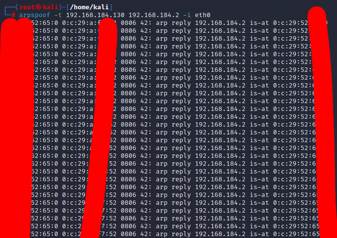

# 【Kali Linux】ARP欺骗断网
## 开篇
&nbsp;&nbsp;还记得半年前的那篇《Kali Linux基础-抓包与WIFI密码暴力破解》吗？这可真有趣呢，我已经好久没有玩Kali Linux了，一时兴起想写一篇要着重于实战的文章...那就这样吧。

>免责声明：本文仅限于学习，若用于不合理用途引发的后果责任自负。请遵守《计算机信息网络国际联网安全保护管理办法》，《中华人民共和国计算机信息系统安全保护条例》或者所在地区的相关法律

### 内容
+ 一些相关的理论知识
+ 攻击环境准备工作
+ 用Kali Linux实战

&nbsp;&nbsp;那在开始之前，你应该拥有一点点Linux常识，安装好Kali Linux虚拟机并运行它，更新好你的软件源。当然这些步骤在上一篇Kali的文章都有写。

## 一些ARP基础概念
&nbsp;&nbsp;仅仅是一些针对后面实战内容的必要知识，关于ARP协议的详细内容请查阅相关书籍和资料
### ARP协议
&nbsp;&nbsp;ARP（Address Resolution Protocol）地址解析协议负责将IP地址解析成对应的MAC地址，是一个链路层的地址解析协议。它被一些人叫做TCP/IP协议栈中“最不安全的协议”之一。这是事实，一些五花八门奇奇怪怪的术语，有很多都与ARP有关，很多安全工具，好比大名鼎鼎的Cain，他们底层实现也都和ARP脱不开关系。

### ARP缓存表
&nbsp;&nbsp;局域网内的任何一台主机都有一个ARP缓存表，它里面的每一个项都是一个IP地址和一个它对应的MAC地址。当局域网中一台主机向另一台主机发送数据的时候，会根据这个表里的对应的项来发送。    
&nbsp;&nbsp;当你在Linux安装了net-tools以后就能通过这个命令查看ARP缓存表：
```
arp -a
```
&nbsp;&nbsp;一般而言，一个ARP缓存表默认的生存时间大约是10分钟，而你也可以自己设置。这个表实际就是记录IP地址到MAC地址的映射关系，ARP协议的主要工作就是管理ARP缓存表，对里面的项进行增删查改，以及负责处理其他主机的相关请求。

###　ARP请求
&nbsp;&nbsp;当一个主机要向局域网的另一个主机发送数据，那就会自动去这个ARP缓存表寻找这个IP地址和MAC地址映射关系的项，如果没有的话这个数据就不能直接发送，而这个主机会向局域网内的所有主机发出一个【广播】ARP请求，以接收主机的视角来看，收到的IP正好能与自己的IP一样就会返回一个应答，告诉请求端它的MAC地址，然后当这个请求的主机收到以后就会将它加入ARP缓存表，并且在TTL（注释）快要过期时及时更新缓存。　　　　
&nbsp;&nbsp;当一个主机要向公网的另一个主机发送数据，但是不存在ARP项的情况下，也是不能直接传输数据的，就会通过网关(gateway)来转发数据。当合法以太帧到网关后，网关将这些数据给IP层，由IP层查询路由表。网关会发送一个ARP请求到博客主机上，网关收到应答后就会建立新的ARP表项并维护它。    
&nbsp;&nbsp;＊&nbsp;TTL字段，用于限制IP数据包在网络存在的时间    

### ARP报文
&nbsp;&nbsp;首先我们来看看ARP报文的格式

&nbsp;&nbsp;ARP协议三层是独立的，它在向数据链路层传输时不用经过IP协议的封装，可以直接生成自己的报文，到达链路层后再被对应的协议封装，例如以太网协议。其实大部分看名字就知道是做什么的了，那就来解释几个比较重要的。
+ 硬件类型：表示这个报文可以在哪种类型的网络上传播。
+ 上层协议类型：硬件地址要映射的协议类型
+ 操作类型：ARP报文的类型，例如1是请求2是应答。

&nbsp;&nbsp;ARP报文会被传输到数据链路层再一次封装，以以太网为例，会被封装成一个以太帧，在原来的那些东西前面加一个以太网帧头。

### 缓存表的老化机制
&nbsp;&nbsp;先要知道，很多主机的IP地址是浮动的，也就是通过动态分配得到的IP地址如果变化了，缓存表是不知道的，原来的项的映射关系就会有问题，它的关系是错误的。因此ARP需要老化机制，在一段时间没和对应的主机通信，这个映射关系就会被从ARP缓存表中删除。这个时间一般在十五二十分钟前后。

### ARP的安全缺陷
&nbsp;&nbsp;局域网内，发送端广播ARP请求，但是有一个问题就是发送端是谁都信任的，如果有一个造假的端应答它，发送端也不会发现，就上当了。ARP是一种无状态协议，它不会判断应答者有没有发送过ARP请求也不会验证应答者的身份，这是一个相当糟糕的安全问题。    
&nbsp;&nbsp;如果这两个端（发送端和目标端）不在同一局域网内，则需要通过路由器网关的IP寻址，攻击端就能伪装成网关，把目标主机上的网关地址缓存改成攻击端需要的MAC地址。

## 攻击实战的准备工作

### 必要的工具安装
&nbsp;&nbsp;如何在Windows安装Kali Linux我已经在上一篇关于Kali Linux的文章很详细的讲过了，包括更换软件源。我们进行攻击很关键的工具是一个叫做arpspoof的工具，在你kali linux的终端输入这个命令，dsniff包含了arpspoof。
```
apt-get install dsniff
```
一般而言Kali Linux已经装好了nmap，如果没有的话在终端输入这个命令：
```
apt-get install nmap  
```
### 安装另外一个虚拟机
&nbsp;&nbsp;如果你是一个Windows用户，你在你的Windows内使用Vmware Workstation安装Kali Linux虚拟机进行这个实验你可以选择将网络连接设为桥接模式（默认情况下虚拟机和主系统NAT连接不在同一网段）
&nbsp;&nbsp;我因为平时开发时就会用ubuntu，也是在Vmware安装的，所以我直接用它当被攻击机就好了。当然这和操作系统无关，你也可以安装其他的虚拟机来做被攻击机，总而言之就是要准备好就行了。
&nbsp;&nbsp;以我的环境为例，可以去这个官网下载相应的.iso文件，然后安装到Vmware上。我的是平时开发用的Ubuntu Desktop，它有图形界面并且相比其他的要大一些，如果你选择安装它的目的仅仅是做这个实验的话我更建议你使用Server    
https://ubuntu.com/download/desktop    
https://ubuntu.com/download/server    
对于被攻击端的要求并不高（或者说能跑就行），引入iso文件后关于网络、内存（我实验是默认4GB）和储存配置（默认20GB）选择默认就行了。

## 开始攻击
### 利用Nmap进行扫描
&nbsp;&nbsp;首先我明确，Kali Linux是攻击端，Ubuntu Desktop是被攻击端。在攻击端的kali linux的终端中输入命令以查看网络设备的信息。
```
ifconfig
```
&nbsp;&nbsp;ifconfig来自network interfaces configuring的缩写，类似Windows的ipconfig命令，可以用来设置或者查看网络设备的信息，虽然我不建议用它来设置，因为你的设置可能不会在重启后仍然有效。




&nbsp;&nbsp;是的，因为攻击端和被攻击端都在我手里，所以我可以通过ifconfig命令轻松的看到它们两个的IP地址，可是现实不会如此，被攻击端不是我的，我能直接看到的就只有自己的主机（攻击端）。可是被攻击端在局域网内，所以我们得去扫描它，得到它的一些信息才能开始攻击。    
&nbsp;&nbsp;Nmap是一个免费的网络扫描工具包，用户可以利用Nmap来进行网络系统安全的评估和扫描网络。我们用它来扫描主机：
```
nmap -sP -PI -PT 192.168.184.0/24
```
这是我的扫描结果，在局域网内的主机


来解释一下这个命令的参数：
+ -sP：探测目标是否存活
+ -PI：使nmap使用真正的Ping来扫描，即ICMP echo请求。
+ -PT：TCP ping
另外，后面的“/24”意思是扫描IP地址192.168.184.0-192.168.184.255

### 使用Arpspoof攻击
&nbsp;&nbsp;首先要查看网关的IP，在攻击端输入这样的命令：
```
route -n
```
然后你会得到一个类似这样的输出，圈住的部分就是网关。

&nbsp;&nbsp;接下来就是开始攻击了，但是在那之前为了保证正常，我先在我的Ubuntu（被攻击端）测试一下是否能上网，下图可见在攻击前的Ubuntu是可以正常上网的。



现在，在攻击端输入这个命令：
```
arpspoof -t 192.168.184.130 192.168.184.2 -i eth0
```
第一个是目标IP地址，第二个是网关。下图是攻击端显示的内容和被攻击端在这个期间尝试ping。可见被攻击端在这个期间已经无法联网了。实验成功力！（喜）    




## 最后
### 如何预防ARP欺骗？
&nbsp;&nbsp;实验本身很简单，但我觉得这更大的价值在于理解，我们应该反思该如何防止被攻击。首先有几种思路。

#### 在主机上静态绑定MAC地址
&nbsp;&nbsp;前面用到的Arpspoof它的运作方式很好理解。
+ 截获交换局域网中的数据包
+ 伪造ARP响应包，改变一个或者多个目标主机的数据包转发路径。

所以把网络安全的信任关系建立在IP+MAC的基础上，设置静态的MAC地址与IP的对应表.

#### 选择一个优秀的防火墙
&nbsp;&nbsp;主流的，优秀的安全软件一般都有防止ARP欺骗的功能，这能减少被攻击的几率。或者如果是Linux系统可以搞个类似Arptables这样的软件。    
    
&nbsp;&nbsp;现在我们可以很简单的使用工具来做攻击，这些工具大大降低了攻击的门槛，至于我们自己...就应该学会不要滥用这些东西，对于别人，就要保护好自己，别让自己的隐私和安全受到侵害。    


