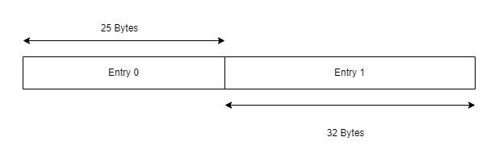
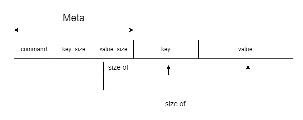
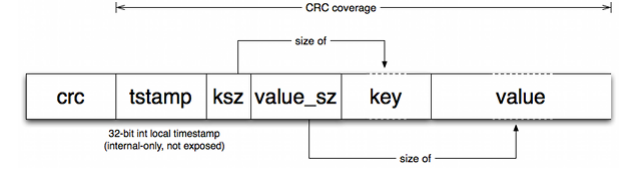

# 用Rust写一个极简的KV数据库【1】


## 开篇
&nbsp;&nbsp;这是一篇理论知识和简单实战的文章，上了初中以后就沉迷于Rust无法自拔（其实是初二才开始常用的x）。但是干做项目一点也不过瘾，于是我决定来造个轮子并写博客，当然，更多还是让你学数据库相关的知识，实战内容只是一个体现。“极简”指功能和难度。
> 造轮子：圆形的车轮是公认最好的形状，而在编程中造轮子是指，一个东西已经有公认的软件/库可以使用了，而你要再做一遍，也就是重复造轮子（Reinventing the wheel）。但这是一种学习方法，很多事情你要实际去做才知道其中的难度，然后进步。

&nbsp;&nbsp;因为内容比较多，而我应该保持一定的更新频率，这个KV数据库未来可能我会继续写文章，而本篇的内容仅仅是储存的部分（这个项目还没完成），可能下篇是网络模块。在实战内容中，可能有一些东西你会觉得有些多余，或者不够"Rustly"，不够优雅。你可以留言提出，我会回复的。    
&nbsp;&nbsp;其实，我们现在做的数据库一点都不难，因为很多比较细节的操作都被一些库抽象了，我们需要的只是一个清晰的思路和耐心，但是，尽管某些操作细节我们不知道也没关系，我觉得，毕竟是以学习为目的来做的话，还是多探索原理会比较好，当然，部分内容我参考了其他类似项目的源代码，如果你能做到参考并正确理解的话，那学习的目的就达到了，而不是一昧的抄。
&nbsp;&nbsp;因为那个叫MAKIROR的超级大笨蛋想出了一堆很白痴的做法，我写了好几次都是不满意重写，也换了很多种实现思路。所以就搞了那么久才开始写博客（半个月）。（x    
&nbsp;&nbsp;首先概括一下这篇文章的内容：
+ 关于计算机存储，数据库，相关数据结构的基础知识，以及本文实现内容的理论基础
+ 对于如何实现的构思
+ 开始写代码，实现一个我们目标的储存引擎

话是这么说，但是本篇理论内容还是较多，有些甚至和<b>实战内容没有直接关系</b>，如果你只是冲着做出这个数据库来的，可以直接跳到后面。

&nbsp;&nbsp;在那之前，你最好是掌握这些东西：
+ Rust编程语言基础
+ 计算机基础知识
  
</br>

## 数据存储？数据库？
### 计算机储存数据的方式
&nbsp;&nbsp;首先唤醒你的初一计算机知识。强调一下，接下来一切内容以冯·诺依曼架构的计算机为基础。    
&nbsp;&nbsp;计算机存储器分为主存储器和辅助存储器，主存储器就是我们口中的“内存”，存取速度较快，一般用于存放计算机<b>当前</b>工作需要的数据。辅助存储器就是外存储器，它的速度相对较慢，但是容量很大成本较低，一般用于存放长期保存的数据。注意，在冯·诺依曼架构下，程序指令也是作为数据储存在计算机的存储器的，这个概念早在1946年就被提出了。    
&nbsp;&nbsp;计算机系统数据只有0和1两种，一个占一位，8位为一个字节（Byte）。一个存储器中容量的基本单位是字节。通过编码，把我们平时所见的字符转成字节。    
&nbsp;&nbsp;记忆唤醒的差不多了，接下来我们以存取方式将存储器分类：
+ ROM（Read Only Memory）：只读存储器，只能读取而无法写入，信息写入后即使切断电源也不会丢失，存储的数据稳定且结构较为简单，一般存放计算机硬件最基本的IO控制程序等。
+ RAM（Random Access Memory）：随机存取存储器，与CPU直接交互数据的存储器，它可以以很快的速度读写，切断电源数据会丢失，如果你需要保存数据，必须将它们写入一个长期的存储设备中。一般是操作系统和运行的程序的临时数据储存的地方。这里的“随机”指当存储器的信息被读写时，需要的时间与信息的位置无关。
+ SAM（Sequential Access Memory）：顺序存储器，顺序存储是把逻辑上相邻的数据元素存储在物理位置上相邻的存储单元中，容量大，速度较慢，成本较低。这种方式比较节省存储空间，因为顺序储存时在计算机中用一组地址连续的存储单元存储各个数据的元素，使用的是一种叫做“顺序存储结构”的存储结构。而这种方式，节点之间的关系不会占用额外的空间。
+ DAM（Direct Access Memory）：直接存取存储器，即用一组任意的存储单元存储线性表的数据元素，通过数据存储地址的指针来表示元素之间的对应关系。速度较快，介于RAM和SAM之间。
</br>

#### 顺序存储结构
&nbsp;&nbsp;如前面所述，顺序存储就是把相邻的数据存储在相邻的存储单元中，这个“相邻”即是逻辑上相邻，也是物理上的相邻。我们在程序设计语言中时常用数组来描述这样的结构，数组就是这种储存结构的典型，数组中的元素储存在一个连续的内存中，由一个数组的首地址和N个元素组成。数组不同于链表的是，它不需要在每个节点储存下一个节点的物理地址，在储存一样的一些数据时，数组会比链表更省空间。
&nbsp;&nbsp;既然如此，它最大的问题是显然的：不方便修改数据。例如从中间插入数据，可能要连带移动一系列的元素。还有，顺序储存只能使用相邻的内存，还有更多导产生文件系统碎片的可能性，文件系统碎片会增加寻道时间。
</br>

#### 随机存储结构
&nbsp;&nbsp;在这种存储结构下，逻辑相邻的数据未必要在物理位置上相邻，它会在计算机用一组任意的存储单元存储线性表的数据。线性表的链式存储是它的代表，储存空间可以不连续，因为在链表中有节点的指针域这个东西，对于头节点而言只需要知道后置节点就行了，而其他节点就只需要它的前置节点和后置节点，不要求物理位置相邻。当然，它就会需要比数组多用点空间，但是存取速度会更快。
（图源：Wiki）
</br>

</br>

### 数据库和数据库管理系统
&nbsp;&nbsp;数据库（Database）本质就是存储数据的地方，有组织地储存数据。现代计算机应用范围扩大，数据量也越来越大，简单的存储数据的形式已经满足不了需求了（例如用单纯的文件来存储）。假设一个规模大的服务器，它需要应对巨大的数据量，同时要顾及它们的效率，完整性，安全性等问题，难道还能用那种一个文件直接读读写写的做法吗？专门为此开发一个软件更好吧，比起这个，所以数据库就诞生了。当然，如果只是一个简单的小项目，你就不需要考虑那么多了。    
&nbsp;&nbsp;数据库管理系统（Database Management System）就是管理数据库的软件，可以用于维护和使用数据库，支持多个应用程序/用户同时操作它。一个最基本的DBMS应该有增删查改，数据库建立和管理等功能。

</br>

### ACID规则和CAP理论
&nbsp;&nbsp;ACID指一种事务规则，它四个字母代表四个特性的开头字母，分别是：
A：原子性（Atomicity），指事务的一系列操作要么全部完成，要么就都不完成，如果中途的某个操作失败就会整个事务都失败，然后回滚。    
C：一致性（Consistency），数据库一直处于一致状态，事务运行不会改变数据库原有的一致性约束。例如，写入的资料必须完全符合所有预设规则。    
I：隔离性（Isolation），数据库运行多并发事务同时对数据增删查改，隔离性防止它们之间不能互相影响。    
D：持久性（Durable），一个事务被提交，它会持久保存，是永久的。    
</br>
&nbsp;&nbsp;ACID规则解决了很多问题，但是它仍然需要和性能做平衡，效率和可靠性时常会矛盾。而在2000年Eric Brewer提出了CAP理论，它是指在分布式系统中进行平衡：    
C：一致性（Consistency），所有节点中同一时间内数据完全一致。问题就在于在多并发访问数据库时如何更新数据？如何将更新分布到整个系统保证数据完全一致？    
A：可用性（Availability），服务器在正常响应时间内一直可用，不会出现连接超时等问题。    
P：分区容错性（Partition tolerance），如果发生了某个网络分区或节点故障等问题时，有一套设计能保证它仍然能提供正常的服务。    
&nbsp;&nbsp;当然，它们并不是绝对的，关于CAP理论细解起来可能可以另外写一篇文章（这篇文章的实战内容不会考虑分布式），但有一个最后的结论就是，在上述三个特性中，我们只能满足其中两个，不能三个都满足。    
&nbsp;&nbsp;顺便在这里挖个坑，如果这个项目以后会继续更新我就会结合实例讲分布式，如果不更新了我有空就专门写篇文章讲（
</br>

### 数据库的种类
#### 关系型数据库
&nbsp;&nbsp;关系数据库是指在表、行、列中储存信息的一种数据库，通过表来表示数据之间的关联，就像一个电子表格文件的集合一样。另外，关系型数据库很强调ACID规则，可以满足数据库稳定性的要求。    
&nbsp;&nbsp;首先，在关系型数据库中每个表都有一个“主键”，它是每行的唯一标识符。每个列有一个指定的数据类型。其次，关系型数据库使用SQL（Structured Query Lanuage，结构化查询语言）来对数据库进行增删查改。关系型数据库强调数据的一致性，可是它这个做法要为巨量的数据处理效率付出代价，尤其是，在高并发读写时性能下降会很严重。
</br>
#### 非关系型数据库
&nbsp;&nbsp;非关系型数据库（NoSQL，Not Only SQL）在于分布式和非关系型，它不使用表格的结构，它的结构大致可以分为四类：
+ 键值（Key-Value）：本篇要实现的内容，主要就是一个哈希表，每个键指向一个对应的值，很简单的一种结构。数据无结构化，一般作为字符或者二进制数据储存。
+ 列存储：键指向多个列，以列簇形式将同一列数据存在一起。
+ 文档：Key-Value对应的键值对，Value是结构化的，结构可变，对于数据结构要求不严格。
+ 图形（graph）：使用图结构进行语义查询，使用节点、边和属性表示数据。

&nbsp;&nbsp;我个人平时更多用文档数据库MongoDB，因为在实际使用场景中，我的数据关联并不复杂，只是简单的查询，NoSQL可以更好的提高效率。但是！文档数据库不支持事务操作，这个要记住，你在选择数据库时应该考虑实际需求。

</br>

## NoSQL和性能
&nbsp;&nbsp;看完上节，你应该能对数据库有个初步的了解，接下来我们就着NoSQL数据库来谈谈性能的问题和使用场景。    
&nbsp;&nbsp;现在越来越多系统需要支撑巨量的数据，在一个这样的系统中高并发就成为了首要考虑的问题，在高并发场景下如何保证可用性，低延迟和可扩展性。
</br>

### 随机IO造成的性能损失
&nbsp;&nbsp;要说性能肯定是先扯IO。顺序IO和随机IO，概念就是上面提到的顺序存储和随机存储（这里所讲的性能与前面链表的例子无关，不要搞混了），但是，反直觉的是，顺序IO是比随机IO快的，而且是快很多。    
&nbsp;&nbsp;顺序IO比随机IO快在于寻址时间，顺序IO寻址一次就可以读写了，但是随机IO每次都要寻址。现在机械磁盘使用还是占多数，而随机IO需要很多时间来做磁盘寻道。硬件在这个性能上的影响是很明显的，机械硬盘等存储设备，随机存取主要和寻址时间有关；而固态硬盘等则是和存储设备内部的控制权和记忆体接口速度有关。而顺序IO的IOPS主要和存储设备的带宽有关。     
&nbsp;&nbsp;其实我本来想在这里测试一下随机IO和顺序IO的性能的，很可惜我的主力电脑是固态硬盘，这个问题不会很明显。    
</br>

### 常见的NoSQL写入性能优化方案
&nbsp;&nbsp;对于上述问题，NoSQL有很多种优化方案，我们来了解两个在NoSQL常见的。
</br>
#### 基于LSM树的存储引擎
&nbsp;&nbsp;LSM树（Log-Structured Merge Tree）是一种存储结构，不同于其他严格的树状数据结构（例如红黑树）。一个LSM树组成有这几个部分：
+ MemTable：在内存中的数据结构，短期保存更新的数据。因为内存只是暂时的，它断电后就会丢失数据，所以要通过预写式日志WAL（Write-ahead logging）来保证数据的可靠性，保证了ACID中的原子性和持久性。假设程序断电了，它可以将log文件（实际操作内容）和计划操作内容进行对比，程序就能决定是否撤销操作了。
+ Immutable MemTable：MemTable到达一定的大小后会被转化成Immutable MemTable，它像一个转化的中间层，到达大小的MemTable被转化的Immutable MemTable不会再允许被写入数据。
+ SSTable：即LSM树状磁盘中的数据结构-有序键值对集合，它被写入磁盘储存。
  
&nbsp;&nbsp;我们在读取LSM树的数据，会先从MemTable查找，如果没有再去SStable，查找的效率会很高，但是数据被拆分成多个SSTable结构，所以会稍微牺牲一些读性能。但是这种方式可以减少随机IO的操作，很大程度上提升了写性能。
</br>
#### 基于Hash索引的存储引擎
&nbsp;&nbsp;Hash索引就是通过建立一个哈希表，可以使程序快速定位到数据的位置，而非扫描数据。在接下来的实战，我们会将数据的位置存进哈希表。而不是直接把原始数据存进内存————这是一个非常愚蠢和不现实的做法。先不扯那么多，就算你现在不理解也没关系，具体实现在下节详细谈。
</br>
&nbsp;&nbsp;还有很多其他的解决方式，例如分形树索引（Fractal tree index）这种将随机IO转换成顺序IO的。
</br>

### 更好的性能和可拓展性

&nbsp;&nbsp;首先我们关注到NoSQL的名字，是指<b>N</b>ot <b>O</b>nly <b>SQL</b>，而不是No&nbsp;SQL（我在初一第一次听说这个词的时候，是这么误解的），它与SQL不是一个冲突关系，而是一个改进，拓展。
&nbsp;&nbsp;前面提到关系型数据库非常强调ACID规则，而其中一项就是一致性（Consistency）。这导致了在高并发场景下，仍然坚持保证高一致性的SQL读写性能会变慢。而NoSQL并不是一定完全遵守ACID规则的，整体可能一致性的支持<b>较弱</b>，但是换来的是更多可用性。    
> 上帝给NoSQL关上了半扇门（一致性），打开了两扇窗（更好的性能和可拓展性）

&nbsp;&nbsp;从性能上说，关系型数据库的结构是一张表，这导致了某些本来只需统计某列的场景，也不得不把整行读入，这个结构在高并发下会导致更高的IO。而关系型数据库的结构决定了它的全文搜索功能弱，若在巨量数据下使用模糊搜索匹配关键字等功能会容易造成慢查询。    
&nbsp;&nbsp;从可拓展性上说。首先是，列，在关系型数据库你必须事先为要储存的数据建立一个列，要是你要在关系型数据库修改列可是十分甚至九分的痛苦，在数据量大而复杂的情况下会更明显；其次，是显式的，各种各样的join，它可能是关系型数据库最麻烦的地方之一，你得建立错综复杂的数据，然后现在要你去拓展/修改一个表？好吧，这简直生不如死。    
&nbsp;&nbsp;NoSQL摒弃了关系型数据库的那套关系特性，数据之间没有这种关联，这也就大大降低了数据扩展的难度。况且，很多主流NoSQL貌似在设计之初就已经考虑到了大量数据拓展的情况，并提供了相应的机制。
</br>

### 考虑到实际的选择
&nbsp;&nbsp;好吧，就算NoSQL在某些方面明显优于关系型数据库，你选择也是得看实际情况的。它们两个为了各自的目标都必须有所取舍，那我们应该把这个『取』更大程度的发挥才行。用简单几句话概括一下它们两个主要的取舍好了：
</br>
关系型数据库：
+ 遵守ACID规则，牺牲了一定读写性能，在高并发场景会更明显。
+ 表结构使得数据更容易让人类理解，但是使得其可扩展性降低。

NoSQL（因为分很多类所以不考虑某些结构特有的取舍）：
+ 不严格遵守ACID规则，对于一致性的支持较弱，换来了更强的读写性能。
+ 不支持Join，不支持事务。
</br>

&nbsp;&nbsp;如果你的项目需要储存结构化的数据，需要事务，那你就应该选择关系型数据库，大部分NoSQL是不提供事务的。如果你的数据是半结构化的，并需要储存时间序列数据，那你可以选择列数据库。如果你需要单键查找就可以使用Kv数据库（数据量大，结构简单）。如果你需要多键查找，有很多相互关系且实体独立的情况下，可以选择图形数据库，如果关系没有很复杂就可以选文档型的。
&nbsp;&nbsp;我个人只是以学习为目的，最早接触的是Mariadb（MySQL的一个分支），用它写了个博客。后来无意间听说了Mongodb，因为和Nodejs实在太配了，于是我就用它当作我博客的数据库了（当时是整个博客都重写，因为我小学时写的网页实在是惨不忍睹）。虽然，我在写博客时已经对这些数据库类型有些概念了，但是我并没有过多考虑这些问题，毕竟数据量很小，也没有其他复杂的需求。
</br>

## KV数据库实现的思考
&nbsp;&nbsp;好像扯太多了，别忘了标题，正文开始。
</br>

### 日志结构的存储引擎
&nbsp;&nbsp;在开始之前我看了一篇论文，它提供了一个<b>大致的</b>思路，而我做的只是一个最简单的实现。接下来我会介绍实现方式（文末有Link），如果你想知道更多可以直接看论文（并不长，很快就能看完的w）：

> Bitcask- A Log-Structured Hash Table for Fast Key/Value Data
> https://riak.com/assets/bitcask-intro.pdf

当然，也有许多值得学习的东西，Riak、beansdb等都是基于Bitcask模型实现的存储系统。
</br>
&nbsp;&nbsp;Bitcask模型使用日志追加的方式，无论是删除还是更新等操作都是追加，保证文件是顺序写入的，以提高IO性能。它相比LSM什么的都算是最简单，最好理解的。    
假设启动了一个已经完成的，这样的数据库，我们输入几个命令：
```
> add name Aaron string
> add name Makiror string
> add age 24 int
> delete age
```
&nbsp;&nbsp;那么被写进文件的数据就长这样：
| DataFile |
| :----: | :----: |
| add("name","Aaron") |
| add("name","Makiror") |
| add("age",24) |
| delete("age") |

&nbsp;&nbsp;两次add同一个键name，那后者就会覆盖前者。add了age后又delete，所以这个数据库虽然存着四条命令，但实际上只有一条有效的（name：Makiror）。也就是四个命令在文件，但是有三个是已经没有意义的。下表Invalid代表这个数据是否有意义（在实际实现中我们不是用布尔值，现在用只是为了表达清楚）。所以我们需要一个操作Compact能让数据文件只剩下有效的数据。
| DataFile | Invalid  |
| :----: | :----: |
| add("name","Aaron") | true |
| add("name","Makiror") | false |
| add("age", 24) | true |
| delete("age") | true |

&nbsp;&nbsp;在压缩后，图中所有Invalid为true的项都会被删掉，就剩下有用的数据，所以Compact后会变成：
| DataFile |
| :----: |
| add("name","Makiror") |
&nbsp;&nbsp;所以，我们需要的功能并不复杂，基本的增删查改，以及这个去掉冗余数据的Compact。
</br>

### 使用哈希索引
&nbsp;&nbsp;在前面有提到，直接将数据存在内存是愚蠢且不现实的，于是我们要建立这样一张HashMap，存放Key对应Value在文件的位置，这个位置被叫做偏移量（Offset），然后根据偏移量查询对应的值。    
&nbsp;&nbsp;我们将数据编码成binary并写入文件，我们存储在一个数据文件的内容是以项（Entry）为单位的，假设两条项存储在里面：
</br>

</br>
&nbsp;&nbsp;它们两个的长度不同，我们在存储时是以Bytes为单位的，所以Entry 0和Entry 1的长度分别是25和32。然后，我们假设它们两个项的Key分别是"name"和"age"，那在HashMap就是这样的：
| Key | Offset  |
| :----: | :----: |
| name | 0 |
| age | 25 |

&nbsp;&nbsp;Offset就是这条Entry在<b>文件的</b>（即绝对意义上的）起始位置，所以如果我们又加入一条长度为30的Entry，那它的Offset应该是25+32=57。    
&nbsp;&nbsp;这个方法很容易理解，也很简单，但是缺点还是有不少的：
+ Key被存在内存中，这还是有些浪费
+ 每次开启数据文件都得扫一遍生成这样的HashMap才行。

&nbsp;&nbsp;针对第二个问题，在论文中有提到一种Hint File存储这个哈希索引，若带有这样提示文件的数据文件能够不用再将数据文件扫一次。但是这个在本篇不会写实现方法，<b>有可能</b>在下一篇会写实现方法。（我只是不想再对这个版本做更改了）

</br>

## 做一个简单的KV数据库
### 命名规范
&nbsp;&nbsp;请在写代码时遵守Rust命名规范，虽然常用其他编程语言可能会导致你不习惯，但是这真的很重要。   
参考Rust语言圣经(Rust Course)： 
https://course.rs/practice/naming.html
</br>

### 错误处理
&nbsp;&nbsp;Rust的错误处理，经常使用Result枚举类来代表正确/错误的结果，这十分优雅。Error有很多种类型，所以我们需要一个能将各种各样的错误类型们封装起来的枚举类，并为它们实现Display、Debug、Error、From\<T>等trait。    
&nbsp;&nbsp;不过我们已经不需要手写那么多东西了，因为Rust有很多不错的错误处理库，例如failure、quickerror等，还有dtolnay大佬开发的thiserror和anyhow。在这个项目我使用了thiserror。    
&nbsp;&nbsp;首先我们定义一个KvError枚举类，包括了三个最常见的错误类型。我们只需要为每个成员提供 #[error()] 即可自动实现Display，通过 #[from] 自动生成一个From impl。然后我们为带有KvError类型的Result定义一个泛型别名，接下来我们可以在其他地方调用它了。十分简单且优雅（喜
```
// Cargo.toml

[dependencies]
thiserror = "1.0.24"
```

```
// src/error.rs

use thiserror::Error;

#[derive(Error, Debug)]
pub enum KvError {
    #[error("IO error: {0}")]
    IOError(#[from] std::io::Error),
    #[error("End Of File")]
    EOF,
    #[error("Unknown error")]
    Unknown,
}

pub type Result<T> = std::result::Result<T, KvError>;
```
</br>

### Data结构与编码
&nbsp;&nbsp;在数据编码和解码的部分有参考一些其他博客，选了一个比较清晰的。
&nbsp;&nbsp;前面提到我们存储数据是以Entry为单位的，一条Entry数据代表一个数据的操作（add、delete等）。因为key和value的长度是不一定的，但是枚举类和整数类型的大小是一定的，所以我们在程序中可以考虑这样实现，首先定义一种长度固定的结构体，就叫它Meta吧。一个Meta包含命令的类型，Key和Value的长度。然后一个Entry就包含一个Meta和长度不一定的部分。
</br>

</br>

&nbsp;&nbsp;于是，我们在代码文件定义这几个结构体：
```
// src/kv.rs

pub enum Value {
    Null,
    Bool(bool),
    Int32(i32),
    Int64(i64),
    Float32(f32),
    Float64(f64),
    String(String),
    Char(Vec<char>),
}

pub enum Command {
    Add,
    Delete,
}

pub struct Entry {
    meta: Meta, 
    key: String, 
    value: Value,
}

pub struct Meta {
    command: Command,
    key_size: u64,
    value_size: u64,
}
```
&nbsp;&nbsp;枚举类Value所包含的成员就是这个数据库所支持的数据类型，以后更新可能会支持更多。枚举类Command包含的只是会被储存的命令类型，所以就两个。
&nbsp;&nbsp;在Bitcask那篇论文中，还会包括CRC校验码和时间戳。关于CRC校验的部分该版本没有写，可能下次会连同网络模块一起补上。
</br>

</br>

&nbsp;&nbsp;因为Meta的大小是固定的，而我们用usize表示key和value的长度，所以我们应该定义两个常量：
```
// src/kv.rs

const USIZE_SIZE: usize = std::mem::size_of::<usize>();
const ENTRY_META_SIZE: usize = USIZE_SIZE * 2 + 4;
```
&nbsp;&nbsp;usize的大小是取决于运行程序的计算机架构，所以我们需要使用【std::mem::size_of::<>()】来获取它的长度才行。整个Meta是由两个usize和一个Command枚举类组成的，而一个Command枚举类的成员占4 Bytes，所以这两个常量在计算完成后就不会再变动了，任何一个Entry的Meta的长度都会是ENTRY_META_SIZE。
</br>
&nbsp;&nbsp;固定的Meta长度使得整个Entry的长度变得非常简单，我们就写一个很简单的函数就行了，它会返回一个Entry的长度：
```
// src/kv.rs

impl Entry { 
    pub fn size(&self) -> usize {
        ENTRY_META_SIZE + self.meta.key_size + self.meta.value_size
    }
}
```
&nbsp;&nbsp;接下来我们要写两个按照流程将一个Entry编码/解码成Bytes的函数。在那之前，我们要使用Bincode库来对数据做编码/解码，同时加上Serde，因为我们需要为结构体实现serde的trait。（需要使用features指定该特性）
```
// Cargo.toml

...
[dependencies]
...
bincode = "1.2.1"
serde = { version = "1.0.151", features = ["derive"] }
```
然后为那几个结构体实现trait，因为后面Value和Command需要使用相等性比较，所以需要实现PartialEq。
```
// src/kv.rs

use bincode;
use serde::{Serialize,Deserialize};

...

#[derive(Serialize, Deserialize, PartialEq)]
pub enum Value {
...
}

#[derive(Serialize, Deserialize, PartialEq)]
pub enum Command {
...
}

#[derive(Serialize, Deserialize)]
pub struct Entry {
...
}

#[derive(Serialize, Deserialize)]
pub struct Meta {
...
}
```
&nbsp;&nbsp;因为编码/解码是有可能出错的，所以我们需要定义一种错误类型，专门放Bincode的错误类型和操作切片的错误类型：
```
// src/error.rs
use std::array::TryFromSliceError;
#[derive(Error, Debug)]
pub enum KvError {
    ...
    #[error("{0}")]
    BincodeError(#[from] Box<bincode::ErrorKind>),
    #[error("Slice Decode Error: {0}")]
    SliceDecodeError(#[from] TryFromSliceError),
}
```

&nbsp;&nbsp;先看encode部分，我们需要一个Vec<u8>类型存储我们的Bytes，它就是一个字节数组。然后使用copy_from_slice()将Entry的数据一段一段地复制进这个字节数组，这样可以保证它的长度不会出现一些很奇怪的错误，因为这个函数在两个切片长度不同时会崩溃。它会返回一个我们之前在error定义的Result结果。    
```
// src/kv.rs
use super::error::{KvError,Result};

impl Entry {
    ...
    pub fn encode(&self) -> Result<Vec<u8>> {
        let mut buf = vec![0; self.size()];
        buf[0..ENTRY_META_SIZE - USIZE_SIZE * 2].copy_from_slice(bincode::serialize(&self.meta.command)?.as_slice());
        buf[ENTRY_META_SIZE - USIZE_SIZE * 2..ENTRY_META_SIZE - USIZE_SIZE].copy_from_slice(&self.meta.key_size.to_be_bytes());
        buf[ENTRY_META_SIZE - USIZE_SIZE..ENTRY_META_SIZE].copy_from_slice(&self.meta.value_size.to_be_bytes());
        buf[ENTRY_META_SIZE..ENTRY_META_SIZE + self.meta.key_size].copy_from_slice(self.key.as_bytes());
        buf[ENTRY_META_SIZE + self.meta.key_size..].copy_from_slice(bincode::serialize(&self.value)?.as_slice());
        Ok(buf)
    }
}
```
&nbsp;&nbsp;看，我们就能很轻松地将这一坨Entry很简单地变成字节数组，最后刚好把buf填满。别看这堆代码很密，虽然看着是不那么优雅，但是它只是将数据一段一段地copy到buf对应的位置。所以最后加密完成后，0...ENTRY_META_SIZE部分就是Meta，后面的就是长度不一定的key和value。
&nbsp;&nbsp;这样的话Decode就很容易了，其实就是反过来，但是我们不会在Decode把整个Entry都解出来，而是把Meta解码然后返回，后面会有其他函数根据Meta把整个Entry都解出来。
```
// src/kv.rs

impl Entry {
    ...
    pub fn decode(buf: &[u8; ENTRY_META_SIZE]) -> Result<Meta> {
        let command: Command = bincode::deserialize(&buf[0..ENTRY_META_SIZE - USIZE_SIZE * 2])?;
        let key_size = usize::from_be_bytes(buf[ENTRY_META_SIZE - USIZE_SIZE * 2..ENTRY_META_SIZE - USIZE_SIZE].try_into()?);
        let value_size = usize::from_be_bytes(buf[ENTRY_META_SIZE - USIZE_SIZE..ENTRY_META_SIZE].try_into()?);
        Ok(Meta{
            command,
            key_size,
            value_size,
        })
    }
}
```
&nbsp;&nbsp;我们读取在字节数组中对应的段，使用usize::from_be_bytes()，根据其表示形式创建一个本地字节序整数值。两个usize的段应该在那之前先进行类型转换。（见代码）
&nbsp;&nbsp;编码和解码的部分就完成了，让我们写两个简单的函数以便后面的程序可以快速地构建一个add/delete命令。这里有一个问题就是，Delete是没有value的，但是Entry的格式是固定的，所以在Delete就用Value::Null作为值。这样它还是会占4Bytes的长度，虽然在Compact机制下Delete通常不会大量存在于数据文件，但是这多少还是一种浪费，可能在以后的版本会改变这个的做法，以Github仓库为准（而不是文章的Example目录）
```
// src/kv.rs

impl Entry {
    ...
    pub fn add(key: String, value: Value, value_size: usize) -> Entry {
        Entry {
            meta: Meta {
                command: Command::Add,
                key_size: key.as_bytes().len(),
                value_size: value_size
            },
            key,
            value: value
        }
    }   
    pub fn delete(key: String) -> Entry {
        Entry {
            meta: Meta {
                command: Command::Delete,
                key_size: key.as_bytes().len(),
                value_size: 4,
            },
            key,
            value: Value::Null,
        }
    }
}
```
</br>

### HashMap索引与读写
&nbsp;&nbsp;在前面我们已经把编码/解码的内容完成了，现在我们开始做对于一个数据文件的操作内容。    
&nbsp;&nbsp;首先定义一个DataStore结构体（引用部分包括本段会用到的所有std下的引用）：
```
// src/kv.rs

use std::{
    io::{BufWriter,BufReader,Write,Read,Seek,SeekFrom},
    string::String,
    path::Path,
    collections::HashMap,
    fs::{File,OpenOptions},
};

pub struct DataStore {
    pub path: String,
    file_reader: BufReader<File>,
    file_writer: BufWriter<File>,
    index: HashMap<String, u64>,
    position: u64,
    uncompacted: 0,
}
```
&nbsp;&nbsp;在我们做操作时会用到path，所以它是公开的。关注到BufReader和BufWriter，我们将文件描述符存进结构体以避免反复打开文件，如果我们直接使用文件操作读写会很低效，我们的读写操作一般是数据量小且频繁的，而这两个类型可以在这种情况下提高速度，其实就是分别包装一个文件描述符并缓冲其IO操作。index则是key和偏移量的索引，position是writer在文件写的位置，uncompacted是无效数据的大小。    
&nbsp;&nbsp;然后定义一个open函数，构建一个新的数据文件（load_hashmap()在后面会编写），并加载一次数据：
```
// src/kv.rs

impl DataStore {
    pub fn open(path: String) -> Result<DataStore> {
        ...
        let file_writer = BufWriter::new(OpenOptions::new().write(true).create(true).append(true).open(&path)?);
        let file_reader = BufReader::new(File::open(&path)?);
        let mut result = DataStore {
            path: path,
            file_reader,
            file_writer,
            index: HashMap::new(),
            position: 0,
            uncompacted: 0,
        };
        (result.index, result.uncompacted) = result.load_hashmap()?;
        Ok(result)
    }
}
```
&nbsp;&nbsp;我们需要一个函数，使得可以通过偏移量读取到Meta，进而获取完整的Entry并返回。首先，我们使用seek，在基础的reader中定位到这个以字节为单位的偏移量，然后开始读取字节。读完后正常情况下是正好一个Meta的大小，如果不是，就代表文件已经结束了。

```
// src/kv.rs

impl DataStore {
    ...
    fn read_with_offset(&mut self, offset: u64) -> Result<Entry> {
        self.file_reader.seek(SeekFrom::Start(offset))?;
        let mut entry_buf: [u8; ENTRY_META_SIZE] = [0; ENTRY_META_SIZE];
        let len = self.file_reader.read(&mut entry_buf)?;
        if len == 0 {
            return Err(KvError::EOF);
        }
    }
}
```
&nbsp;&nbsp;然后对这个Meta进行解码，如果能正确地解码成一个Meta就继续，如果有错误（偏移量不正好是一个Meta的开始就会无法解码）就直接返回。正常的情况下会先获取Meta的信息，先根据key_size继续向后读取key的字节，并尝试将它根据Utf-8编码解成人类能看懂的key，成功后继续根据value_size继续读value，并尝试解码成一个Value。然后根据类型返回对应的Entry。考虑到不用再计算一次key和value的大小，所以就直接返回一个Entry结构体，而不是通过那两个函数构造一个再返回，虽然这样会让代码长一点。
```
// src/kv.rs

impl DataStore {
    fn read_with_offset(&mut self, offset: u64) -> Result<Entry> {
        ...
        return match Entry::decode(&entry_buf) {
            Ok(entry_meta) => {
                let mut key_buf = vec![0; entry_meta.key_size];
                self.file_reader.read_exact(key_buf.as_mut_slice())?;
                let key = String::from_utf8(key_buf)?;
                let mut value_buf = vec![0; entry_meta.value_size];
                self.file_reader.read_exact(value_buf.as_mut_slice())?;
                let value: Value = bincode::deserialize(&value_buf.as_mut_slice())?;
                let result: Entry = match entry_meta.command {
                    Command::Add => {
                        Entry {
                            meta: Meta {
                                command: Command::Add,
                                key_size: entry_meta.key_size,
                                value_size: entry_meta.value_size,
                            },
                            key: key,
                            value: value,
                        }
                    }
                    Command::Delete => {
                        Entry {
                            meta: Meta {
                                command: Command::Delete,
                                key_size: entry_meta.key_size,
                                value_size: entry_meta.value_size,
                            },
                            key: key,
                            value: Value::Null,
                        }
                    }
                };
                Ok(result)
            },
            Err(e) => Err(e),
        };
    }
}
```
&nbsp;&nbsp;因为Utf-8解码是有可能出错的，以及我们后面进行查找操作也可能会出现Key Not Found等错误，所以我们就一起定义它们：

```
// src/error.rs

use std::{
    string::FromUtf8Error,
    array::TryFromSliceError,
};

...
pub enum KvError {
    ...
    #[error("FromUtf8 Error: {0}")]
    DecodeUtf8Error(#[from] FromUtf8Error),
    #[error("Key not found: \"{0}\"")]
    KeyNotFound(String),
}
```

&nbsp;&nbsp;这样的话，read函数就很简单了，只需要提供一个key即可得到一个Entry返回值，如果key不存在就返回KeyNotFound错误。
```
// src/kv.rs

impl DataStore {
    ...
    fn read(&mut self, key: &String) -> Result<Entry> {
        if let Some(offset) = self.index.get(key) {
            return self.read_with_offset(*offset);
        }
        Err(KvError::KeyNotFound(key.to_string()))
    }
}
```
&nbsp;&nbsp;然后定义一个函数，将Entry编码成Bytes写入文件，并返回它的长度。
```
// src/kv.rs

impl DataStore {
    ...
    fn write(&mut self, entry: &Entry) -> Result<u64> {
        let buf = entry.encode()?; 
        let size = buf.len() as u64;
        self.position += size;
        self.file_writer.write(&buf)?;
        Ok(size)
    }
}
```
&nbsp;&nbsp;然后写一个函数，它会从头到尾把文件扫描一遍，然后构建一个新的HashMap并返回。这个逻辑很简单，因为我们已经写好了可以根据offset来读取完整Entry的函数，所以就从offset=0开始往后读就行了。Rust的HashMap做insert操作，遇到重复键会自动覆盖。这个函数在open()时会被调用，当然你也可以在其他必要的地方调用它，它就是扫一遍文件生成一次HashMap，并计算冗余数据量。最后返回具有两个值的元组。
```
// src/kv.rs

impl DataStore {
    ...
    fn load_hashmap(&mut self) -> Result<(HashMap<String, u64>, u64)> {
        let mut offset = 0;
        let mut new_hashmap: HashMap<String, u64> = HashMap::new();
        let mut uncompacted: u64 = 0;
        loop {
            match self.read_with_offset(offset) {
                Ok(entry) => {
                    let size = entry.size() as u64;
                    if let Some(pos) = new_hashmap.get(&entry.key) {
                        let last_invalid_entry = self.read_with_offset(*pos)?;
                        uncompacted += last_invalid_entry.size() as u64;
                    }
                    match entry.meta.command {
                        Command::Add => {new_hashmap.insert((*entry.key).to_string(), offset);}
                        Command::Delete => {
                            uncompacted += size;
                            new_hashmap.remove(&entry.key);
                        }
                    }
                    offset += size;
                },
                Err(KvError::EOF) => {break;}
                Err(e) => return Err(e),
            }
        }
        Ok((new_hashmap,uncompacted))
    }
}
```
&nbsp;&nbsp;关于计算冗余数据部分的逻辑是这样的，在匹配命令类型之前，如果能在HashMap中找到相同的key，那就说明找到的那条key对应的Entry肯定是无效数据了。然后匹配命令类型，如果是Delete的话，Delete命令本身如果成立，也会与它对应的数据抵消掉。

</br>

### 删除无效数据

&nbsp;&nbsp;接下来写compact函数。其实一般情况下作为索引的HashMap是不会有冗余数据的，在我最开始Push到Github的版本会在compact前执行一次load_hashmap，后来我想想这并不是很有必要就把它删了。    
&nbsp;&nbsp;我最开始在compact上有一个很愚蠢的做法，就是先扫一遍数据文件，用Vec<Entry>把所有有效数据给存起来，然后再一整坨遍历这个Vec，依次写进去，这只会浪费很多内存，在数据量大的时候会更明显，哪怕只是短时间的存储，也是很笨蛋的做法。    
&nbsp;&nbsp;考虑到compact操作是要时间的，虽然数据量不是很多的情况下，耗费的时间可能是眨眼就过的，但是我们还是不能排除在操作时突然出现断电、死机、程序意外终止等情况，所以我们先新建一个文件名多一个.compact后缀的文件，往这个文件里写入compact后的数据，等读写全部完成后再rename成原本的名字（在原本文件名存在的情况下，rename会自动覆盖），这样就算这个过程中出现问题也不会影响到原本的数据文件。类似的概念在Bitcask的论文里面也有提过（分段处理日志文件），虽然这里我并没有按照论文的做法。
```
// src/kv.rs

impl DataStore {
    pub fn compact(&mut self) -> Result<()> {
        let new_filename = self.path.clone() + ".compact";
        let mut new_file_writer = BufWriter::new(OpenOptions::new().write(true).create(true).open(new_filename.clone())?);
        let mut new_position = 0;
        let mut offset = 0;
        loop {
            match self.read_with_offset(offset) {
                Ok(entry) => {
                    let size = entry.size() as u64;
                    if let Some(pos) = self.index.get(&entry.key){
                        if entry.meta.command == Command::Add && *pos == offset {
                            let buf = entry.encode()?; 
                            new_file_writer.write(&buf)?;
                            new_position += size;
                        }
                    }
                    offset += size;
                },
                Err(KvError::EOF) => break,
                Err(e) => return Err(e),
            }
        }
        new_file_writer.flush()?;
        fs::rename(&new_filename, &self.path)?;
        self.file_writer = new_file_writer;
        self.file_reader = BufReader::new(File::open(&self.path)?);
        self.position = new_position;
        self.uncompacted = 0;
        Ok(())
    }
}
```
&nbsp;&nbsp;除了可以手动调用compact，我们还可以设一个uncompacted的最大值，当超过这个最大值的时候进行写操作，自动compact。这很简单，只需要做一点小改动。定义一个常量，即uncompacted的最大值，当数据文件的uncompacted的数据超过1KB时，执行write时自动compact。
```
// src/kv.rs

const COMPACTION_THRESHOLD: u64 = 1024 * 1024;
...
impl DataStore {
    ...
    fn write(&mut self, entry: &Entry) -> Result<u64> {
        if self.uncompacted >= COMPACTION_THRESHOLD {
            self.compact()?;
        }
        ...
    }
    ...
}
```
</br>

### 增删查改
&nbsp;&nbsp;有了前面的基础，这些操作就非常简单了，实际上我们只需要写三个函数：增、删、查，因为add命令会自动覆盖旧数据。
```
// src/kv.rs

impl DataStore {
    pub fn get(&mut self, key: String) -> Result<Value> {
        match self.read(&key) {
            Ok(entry) => return Ok(entry.value),
            Err(KvError::KeyNotFound(key)) => Err(KvError::KeyNotFound(key)),
            Err(e) => return Err(e),
        }
    }
    ...
}
```
&nbsp;&nbsp;Add要稍微注意一下，在Entry里构造add的函数要填value_size这个参数，只是因为我不想在那个函数使用Result作为返回值，因为将这个枚举类编码成bytes是有可能出错的。还有，key在构造完Entry后还会用到，所以要注意所有权的问题。在进行写操作完后要记得调用flush()刷新缓冲区。（在前面的write函数我们并没有写自动flush()，因为考虑到连续write）
```
// src/kv.rs

impl DataStore {
    pub fn add(&mut self, key: String, value: Value) -> Result<()> {
        let value_size: usize = bincode::serialize(&value)?.len();
        let entry = Entry::add(key.clone(), value, value_size);
        let size = self.write(&entry)? as u64;
        self.file_writer.flush()?;
        if let Some(pos) = self.index.get(&key) {
            let last_invalid_entry = self.read_with_offset(*pos)?;
            self.uncompacted += last_invalid_entry.size() as u64;
        }
        self.index.insert(key, self.position - size);
        Ok(())
    }
    ...
}
```
&nbsp;&nbsp;Delete函数就很简单了，但是它操作成功前提是有效数据里有这个key。这个绝对不能搞乱，不然整个无效数据的计算都会乱掉。我们在确保真的存在这个key后，计算这个key对应的Entry的大小，将它和这个Delete命令本身计入无效数据（互相抵消）。一样，不要忘记flush()。
```
// src/kv.rs

impl DataStore {
    pub fn delete(&mut self, key: String) -> Result<()> {
        if let Some(pos) = self.index.get(&key) {
            let invalid_add_entry = self.read_with_offset(*pos)?;
            self.index.remove(&key);
            let entry = Entry::delete(key);
            let size = self.write(&entry)?;
            self.file_writer.flush()?;
            self.uncompacted += size;
            self.uncompacted += invalid_add_entry.size() as u64;
            return Ok(());
        }
        Err(KvError::KeyNotFound(key))
    }
    ...
}
```
</br>

### 创建库Crate
&nbsp;&nbsp;最后，创建属于这个项目的唯一库包：
```
// src/lib.rs

pub use kv::{DataStore,Value,Command};
pub use error::{KvError, Result};

mod kv;
mod error;
```
</br>

## Next？
&nbsp;&nbsp;数据库基本存储操作的内容到这里就完成了，接下来你可以写一个很简单的命令解析，让它可以启动并输入操作数据库的命令。在我的Github仓库有一个可以启动的这样的数据库，因为命令很简单，我没有使用Clap等库，直接简单的匹配命令就行了。（在未来的版本可能会加入）    
&nbsp;&nbsp;下一篇我将会小小对数据库的结构做点改变和优化，以及做网络模块。这篇可能只是算铺垫，毕竟真的只是很简单的实现，在那之后涉及到网络可能会开始变得复杂。
</br>

## 你可能需要的链接
ROR-KvDB Github：
https://github.com/MAKIROR/ROR-KvDB
</br>
Make a simple KV database with Rust-Part1-Example（内容与本文同步）：
https://github.com/MAKIROR/Makiror_Articles/tree/main/resource/example/Make_a_simple_KV_database_with_Rust/part1
</br>
Bitcask- A Log-Structured Hash Table for Fast Key/Value Data：
https://riak.com/assets/bitcask-intro.pdf
</br>
Rust Course：
https://course.rs/about-book.html

</br>
（完）
2023/01/12 23:49