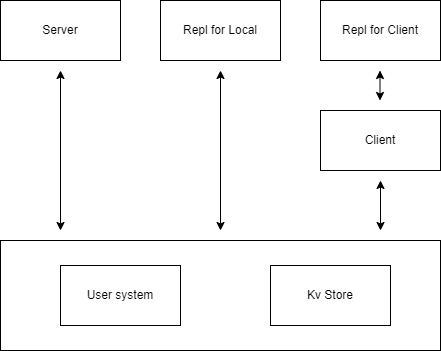

# 用Rust写一个极简的KV数据库【2-3】
### 用户系统和网络通信
<br>

## 开篇
&nbsp;&nbsp;我在写这篇文章时已经把这个数据库的内容都完成了，但是因为内容太长了，我只能再分成两部分来写。我原初将Part2和Part3分开写，但是我最后还是决定将它们连接起来变成一篇文章。
+ Part2-3：简单的用户系统 和 网络通信及远程数据库
+ Part4：REPL实现

&nbsp;&nbsp;首先，我检讨一下，我在写代码的过程中犯过很多很愚蠢的错误，基本上你去看我在github的commit记录都能看到。很多地方是反复的改来改去，而到后面这个项目开始变得复杂，可能会有一些地方仍有很愚蠢的做法（错误）没有被我发现，如果你有发现，非常欢迎直接提出。    
&nbsp;&nbsp;你当然可以去看ROR Key-Value Database的原项目仓库（文末），但是由于针对使用场景等原因，它的内容与example内的会有出入，例如某些地方有简化，某些地方有更改，甚至删除，这可能是在本文发布后我才做的。我会尽可能想象不同的使用情况，以及提出你可以如何针对使用场景改进；）至少你可以清楚你在做什么，以及思考如何改进你的数据库。  

&nbsp;&nbsp;开始前请掌握：
+ 基础的计算机知识
+ Rust编程语言基础

&nbsp;&nbsp;开始之前你还应该对网络编程有基本的了解，我不想在一些繁琐的，连初中生都知道的网络编程原理扯半天，所以在这之前，如果你是一个对计算机完全0基础的人，应该先看看这篇文章（三个链接都一样）：    

[MAKIROR：TCP原理，Socket与网络编程入门（Blog）](http://www.makiror.xyz/article_view?id=WYS0LQ9U78X)    
[MAKIROR：TCP原理，Socket与网络编程入门（Wechat）](https://mp.weixin.qq.com/s?__biz=MzI1MzA4MjQyMg==&mid=2247483915&idx=1&sn=72a8b5af38b19ac4e903f43ef5b8c511&chksm=e9d8ac52deaf2544a3c053b1d673d6e63786b10ccf0ba530a52698251256de21e517e1e3f066&token=51229094&lang=zh_CN#rd)  

&nbsp;&nbsp;尽管这是Part2，你也可以在完全对数据库不了解，完全没有看过Part1的情况下完成（只需要从Github下载Part1的进度就好了）因为我们已经在上一篇完成了数据存储的模块，关于数据存储的细节已经不需要了解了，我们本篇只需要考虑Part2的内容。
<br>

## 漏洞和一些改变

### compact漏洞
&nbsp;&nbsp;首先，我在写代码时发现在Part1的compact有一个很严重的漏洞，我已经将它修改了。    
&nbsp;&nbsp;当冗余数据被compact后，索引哈希表的偏移量并不会因此更新，例如在这种情况下（size是我瞎编的）：
| DataFile | Invalid  | size（Bytes） |
| :----: | :----: | :----: |
| add("name","Aaron") | true | 24 |
| add("name","Makiror") | false | 30 |

&nbsp;&nbsp;在哈希表中，key【name】所对应的偏移量是24，但执行compact后这个表会变成：

| DataFile | Invalid  | size（Bytes） |
| :----: | :----: | :----: |
| add("name","Makiror") | false | 30 |

&nbsp;&nbsp;在这个时候，索引哈希表中key【name】所对应的偏移量仍然是24，但实际上应该是0，这就导致了，如果再进行一次compact操作，因为程序会根据偏移量检查“一个Add命令是否是最新的”，就导致这个数据被当成旧的add命令被清除。所以我们需要在compact时重新建立一个索引哈希表，以下是更改内容：
```
    pub fn compact(&mut self) -> Result<()> {
        ...
        let mut new_hashmap: HashMap<String, u64> = HashMap::new();
        loop {
            ...
                    if let Some(pos) = self.index.get(&entry.key) {
                        if entry.meta.command == Command::Add && *pos == offset {
                            new_hashmap.insert(entry.key.clone(),new_position);
                            ...
                        }
                    }
            ...
        }
        ...
        self.index = new_hashmap;
        Ok(())
    }
```
<br>

### 模块式
&nbsp;&nbsp;我们在Part2将改变项目的结构，彻底的改变，在Part1中的KV会变成其中一个模块。在改变后我们的项目将有两个基础的模块，以及服务器模块和REPL模块（后面会详细介绍）    
&nbsp;&nbsp;作为最基础的存储模块（Store）和用户模块（User），它们没有对本项目其他模块的依赖，是完全可以被单独抽离出来使用的，而不是仅仅在这个项目的这个程序。我一开始就希望如此的，而你完全可以将存储模块/用户模块抽出来，用在自己的项目。    
&nbsp;&nbsp;既然如此，我就除了修Bug之外，没有再为了其他模块而改变存储模块的功能。但是我将部分函数的参数从String改为了&str，这个改动可能在Server模块等地方会带来更多麻烦，例如多次不必要的类型转换，请理解我这个行为，因为我希望的是存储部分可以被更方便地单独抽离出来用于开发，我考虑的不仅是这个小项目。我相信你不希望看到这样的代码，更不希望使用它：
```
kv.add("name".to_string(),"makiror".to_string())?;
```
&nbsp;&nbsp;相比这个，我无非是在其他模块多写几个&*.as_str()，又算什么呢？当然，我还是尽可能在这基础上避免不必要的转换。
<br>


## 我们要做什么？
&nbsp;&nbsp;让我们先来简略的思考一下接下来我们要做什么。   
<br>

### 项目结构 
&nbsp;&nbsp;我们要完成一个既可以作为数据库服务端/客户端，也能在本地进行数据操作的程序，所以我们将这三种情况分为三个模式，它们都需要使用最底层的用户系统和存储模块，然后画一个简单的结构图：
    
&nbsp;&nbsp;Server模式下，程序只需要处理请求并输出日志，而在Local模式和Client模式则需要获取用户输入来进行对应的操作，我选择的方式是REPL（Read Eval Print Loop）的方式来接受用户操作，而Local只需要直接操作本地文件，而Client只需要向服务端发送操作请求，并且通过服务端的回应判断操作是否成功。所以我们分别为Local和Client写一个REPL模块，进一步抽象命令处理的过程。经更改后这个结构图变成了这样：
<br>
    
<br>
&nbsp;&nbsp;画出了这个简略的结构图，至少知道我们要做什么了。
<br>

### 需要考虑的问题

&nbsp;&nbsp;用户系统？这个词会让你想到什么，数据库吗？但是我们正在写数据库啊喂。所以我们只需要用最原始的方式做一个用户系统。    
&nbsp;&nbsp;首先，我就着KISS（Keep It Simple, Stupid ）。因为我使用的方法是最简单的json文件，单纯的把用户信息写进去取出来。

<br>

## 用户模块
### 修改目录结构
&nbsp;&nbsp;在src下创建一个目录"store"，并将这些文件改名并放进去：
```
src/kv.rs => src/store/kv.rs
src/error.rs => src/store/kv_error.rs
```
&nbsp;&nbsp;创建一个mod文件。
```
// src/store/mod.rs

pub mod kv_error;
pub mod kv;
```
&nbsp;&nbsp;这就是我们的存储模块了，然后我们就能在lib文件引用它了。
```
src/lib.rs

...
mod store;
```
&nbsp;&nbsp;另外，我们只有一个启动的rs文件就是main，所以可以把它直接移动到src下，而不是src/bin目录里面，然后这个目录就可以不要了。
<br>

### 用户信息及存储方式
&nbsp;&nbsp;一个简单的数据库并不需要一个复杂的用户系统，所以我们不用考虑的太复杂。首先，用户名必须是唯一的，因为用户在登陆时输入的是用户名和密码，其次，每个用户都有一个等级，这个等级决定了，它登陆后能做什么操作（详细见原项目README）。我这里写的只是一个例子，你可以根据自己的喜好修改。然后我们就会中本节完成一个可以独立存在的用户系统，它不仅仅可以用于数据库。    
&nbsp;&nbsp;明文存储用户的密码是不安全的，所以我们要选择一个方式将密码加密存储，这里我选的是最简单的Base64。
&nbsp;&nbsp;然后为用户结构体实现Deserialize和Serialize。因为我决定让用户数据被序列化成json存储在某个文件，然后需要的时候再对它进行反序列化并处理。虽然用json并不是很高效，但是用户的操作并不是非常频繁的，所以相比高效，这里尽可能简单会更好。不要忘记实现Clone，因为有些时候我们要复制用户信息到别的地方。
```
// src/user/user.rs

use serde::{Serialize,Deserialize};

#[derive(Deserialize,Serialize,Clone)]
pub struct User {
    name: String,
    password: String,
    level: String,
}
```
<br>

### 用户配置与TOML
&nbsp;&nbsp;在这之前我有为这个数据库做过一个uid生成机制（雪花算法），但发现它并没有存在的必要就删掉了。但是不要紧，我会将它作为单独的短文发布，所以让我们开始轻松地编写用户模块。
<br>

#### 处理配置文件
&nbsp;&nbsp;我希望用户可以自己决定数据库的用户存在哪里、用户量的上限等。我喜欢TOML干净简单的语法，仅此而已，所以我选择toml文件来作为数据库的配置文件。
&nbsp;&nbsp;首先在项目根目录建立一个文件作为用户配置文件，它的相对路径被直接写在源代码。
```
# config/user.toml

users_path = "users.json"
user_max = 50
```
&nbsp;&nbsp;这个路径是相对于项目根目录的。并且这里有个小细节：注释路径的第一行变成了#，这是toml文件的路径。所以该代码块的内容完全复制过去也是合法的。    
&nbsp;&nbsp;我们使用库toml来解析toml文件，因为它会用到serde的特征，我们使用json文件存储用户会用到serde-json，serde已经在Part1用过了，所以我们只需要加入这两个：
```
# Cargo.toml

[dependencies]
serde_json = "1.0.91"
toml = "0.5.10"
```
&nbsp;&nbsp;我们直接在用户系统的代码文件定义私有结构体Config，并且编写一个获取配置的函数。它的逻辑很简单，读取文件，转换成String，解析toml成Config结构体。很多解析的细节已经被toml库抽象了，我们只管用就好了：
```
// src/user/user.rs

#[derive(Deserialize)]
struct Config {
    path: String,
    user_max: u16,
}

impl Config {
    fn get_config() -> Result<Self> {
        let mut file = match File::open("config/users.toml")?;
        let mut c = String::new();
        file.read_to_string(&mut c)?;
        let config: Config = toml::from_str(c.as_str())?;
        Ok(config)
    }
}
```
&nbsp;&nbsp;我们需要为Config实现Deserialize，因为它需要被库解析。    
&nbsp;&nbsp;如果读取不到配置文件就返回错误，我不希望得到这样的结果，所以，在无法正确的到配置文件的内容时，它会返回默认的配置：
```
// src/user/user.rs

impl Config {
    fn default() -> Self {
        Config {
            path: "users.json".to_string(),
            user_max: 50,
        }
    }
    fn get_config() -> Result<Self> {
        let mut file = match File::open("config/users.toml") {
            Ok(f) => f,
            Err(_) => return Ok(Self::default()),
        };
        ...
    }
}
```
&nbsp;&nbsp;另外，我们要在错误处理的文件定义这期间可能会出现的错误（读取文件发生的错误和解析TOML发生的错误）：
```
// src/user/user_error.rs

#[derive(Error, Debug)]
pub enum UserError {
    #[error("IO error: {0}")]
    IOError(#[from] std::io::Error),
    #[error("{0}")]
    TomlDeError(#[from] toml::de::Error),
}
```
<br>

#### 懒加载与静态变量
&nbsp;&nbsp;我们写完上面的函数，其实就可以直接在操作时获取配置参数了。但是我并不乐意这样：每次进行任何会涉及到读取/验证的操作都要调用一次get_config()，也就是将配置文件读一遍并解析，虽然这样做的话，你可以在不重启程序的情况下更改配置文件并生效，但是如果每次都这样扫的话简直太浪费了，所以我换了一种做法。    
&nbsp;&nbsp;我们需要一个全局变量，它获取值后从头到尾都不会改变，调用一次就够了。这种时候你应该会想到常量/静态变量，但是很可惜！它们必须是在编译期就能计算的值，也就是它只能是常量表达式/数学表达式，所以我们不能通过调用函数定义它。我们需要在程序运行期获取这个值，而不是编译期。    
&nbsp;&nbsp;于是我们就需要用到lazy_static了，它是一个非常强大的宏，我们可以用它来惰性地初始化静态变量。虽然它在我们访问这个静态变量时会带来极小的性能损失，但是相比使用上面的那种方法，这个损失又算得上什么？于是我们添加这样的代码：
```
# Cargo.toml

[dependencies]
lazy_static = "1.4.0"
```
```
// src/user/user.rs

use lazy_static::lazy_static;

lazy_static! {
    static ref USER_PATH: String = Config::get_config().path;
    static ref USER_MAX: u16 = Config::get_config().user_max;
}
```
&nbsp;&nbsp;因为它是惰性的，所以，程序在你第一次使用到这个变量才会对其进行初始化。
<br>

#### 如何改进？
&nbsp;&nbsp;你可能不希望读取配置会在出现错误时，毫无提示的使用default，所以你可以改成这两种做法：
+ 定义一个读取错误的错误类型，在这种情况下，默认的Config会被包在这个错误类型被返回，这样更高级的程序就能得知，程序在读取配置时出现错误，然后返回了默认配置。（当然你也可以再写，携带错误信息一起返回）
+ 在无法获取配置时直接返回错误。这种做法很粗暴，但是至少用户能知道【我的程序无法获取配置文件】，其实就是不经过第二个代码块修改的做法。

<br>

### 注册
&nbsp;&nbsp;因为json文件的语法，我们无法在注册用户时直接将内容追加到文件末尾，而是必须读取一次json文件并解析，追加内容后再序列化成json文件。（我已经STFW了，原谅我真的Google不出更好的办法）所以我们面临两个选择：
+ 保持一个全局可更改的json字符串变量，在追加内容的同时基于它的内容而不是读取一次文件，这个做法避免了每次操作时都要读取一次文件并反序列化，但是它会面临一问题，就是从初始化开始，这坨有可能很巨大的json就霸着内存，并且直到程序结束才会释放，这简直太糟糕了！
+ 每次注册时读取文件-反序列化-追加内容-序列化-写入。这是我选择的做法。虽然它会拖慢进行注册的效率，但是读取的东西可以在该操作结束后及时释放，只有在调用的极短的时间会占用内存。我相信一般情况注册操作不会很频繁，所以这种做法在这种情况会更好。

&nbsp;&nbsp;注册前我们应该检查内容的合法性，所以我对用户信息做了这些限制：
+ 密码的长度应该介于4-16之间，且只能包含大小写字母和数字，其他会被视为非法字符。
+ 用户名长度应该介于2-20之间（不含2和20），虽然理论上它兼容中文字符，但是仍然不建议用大小写字母和数字以外的字符作为用户名。
+ 用户权限等级为0-3。

&nbsp;&nbsp;当用户信息不符合上述条件时会返回错误，所以我们就直接定义错误类型，分别是未知的用户等级、密码格式错误、名字长度不正确以及用户数量超出限制。另外我们一起把解析json会遇到的错误一起定义了。
```
// src/user/user_error.rs

#[derive(Error, Debug)]
pub enum UserError {
    #[error("Unknown user level '{0}'")]
    UnknownLevel(String),
    #[error("incorrect password format '{0}'")]
    PassWordFormatError(String),
    #[error("User name length is {0}, the length of the name should be between 2-20")]
    NameLengthError(usize),
    #[error("The number of users exceeds the limit")]
    UserLimit,
    #[error("{0}")]
    SerdeJsonError(#[from] serde_json::Error),
}
```
  
&nbsp;&nbsp;验证名字的长度很简单，重点在于密码。我们需要用正则表达式匹配合法的密码，不过这很简单，因为Rust已经有一个名为regex的正则表达式库了。加入regex依赖，我们只需要用到std功能。
```
# Cargo.toml

[dependencies]
regex = { version = "1.3.1", default-features = false, features = ["std"] }
```
&nbsp;&nbsp;然后开始写注册函数，验证部分的代码，此处包含密码的正则表达式验证以及名字长度验证。
```
// src/user/user.rs

use regex::Regex;

impl User {
    pub fn register( name: &str, password: &str, level: &str ) -> Result<()> {
        let password_regex = Regex::new(r"^[a-zA-Z0-9_-]{4,16}$")?;
        if !password_regex.is_match(&password) {
            return Err(UserError::PassWordFormatError(password.to_string()));
        }
        let name_len = name.chars().count();
        if name_len < 2 || name_len > 20 {
            return Err(UserError::NameLengthError(name_len));
        }
    }
}
```
&nbsp;&nbsp;关注到正则表达式，即只能包含大小写字母和数字，长度4-16。

```
^[a-zA-Z0-9_-]{4,16}$
```
&nbsp;&nbsp;然后再检查用户等级是否正确：
```
// src/user/user.rs

        let mut user = match level {
            "0" | "1" | "2" | "3" => User {
                name: name.to_string(),
                password: password.to_string(),
                level: level.to_string(),
            },
            _ => return Err(UserError::UnknownLevel(level.to_string())),
        };
```
&nbsp;&nbsp;如果你输入的用户信息是合法的，那就继续，首先我们分别clone一份用户配置的路径和用户最大值。然后读取用户文件内容并解析。完成上述操作后，再检查用户数是否超过限制，但是，如果用户设置的数为0则代表没有用户数量限制。如果用户数量已经超出限制则返回错误：
```
// src/user/user.rs

        let config_path = USER_PATH.clone();
        let config_max = *USER_MAX;
        let original = fs::read_to_string(&config_path)?;
        let mut data: Vec<User> = serde_json::from_str(&original)?;
        if data.len() > config_max.into() && config_max != 0 {
            return Err(UserError::UserLimit);
        }
```
&nbsp;&nbsp;你可能注意到了，我没有写“如果文件不存在则自动创建”的代码，而是直接读取文件，如果出错就直接返回。这是我在写文章时才注意到修改的，因为如果在程序运行时用户文件被删或者出各种问题，直接创建总感觉不太好，而且如果不是故意操作令文件出错的，那用户可能无法得知该问题。但是，我们还可以写一个函数，即检查用户文件是否存在，如果不存在就创建。该函数可以在程序启动时调用一次，这样保证了在一般情况单纯的文件不存在，就能直接创建，如果因为其他原因创建不了，在程序开始时就能得知。    
&nbsp;&nbsp;这个函数可以被服务端模块调用，如果文件存在就直接返回Ok(())，如果文件不存在就尝试创建，创建成功了仍然是返回Ok(())，失败则返回错误。另外，在创建文件时写入[]，这是因为json语法，不然会解析失败。
```
// src/user/user.rs

impl User {
    ...
    pub fn test_file() -> Result<()> {
        let config_path = USER_PATH.clone();
        let path_slice = Path::new(&config_path);
        if !path_slice.exists() {
            let mut f = File::create(&config_path)?;
            write!(f, "{}", "[]")?;
            return Ok(());
        }
        Ok(())
    }
}
```
&nbsp;&nbsp;然后就检查是否已经有相同名称的用户，这个搜索用户的动作在login功能也会用到，所以我们为它专门写一个函数。在改进前，该函数我写的是直接读取文件-解析-遍历，但是因为前面我们已经读取解析了一次文件，还不如直接把已经处理好的数据作为参数，它只负责遍历并返回结果。（该函数主要是为login写的，但是为了迁就register就变成了要原有数据作为参数）
```
// src/user/user.rs

    fn search(data: &Vec<User>, name: String) -> Result<Self> {
        for u in data {
            if u.name == name {
                let mut user = u.clone();
                user.decode()?; //functions not yet written
                return Ok(user);
            }
        }
        Err(UserError::UserNotFound(name))
    }
```
&nbsp;&nbsp;如果搜索到同名用户则返回错误：
```
// src/user/user.rs

        if let Ok(_) = Self::search(&data,user.name.clone()) {
            return Err(UserError::UserNameExists(user.name));
        }
```
&nbsp;&nbsp;直接将用户的密码明文存储在文件是很危险的，所以我们用一个简单的算法加密一下再写进去，自然，我们分别需要一个将用户密码加密和解密的函数。这里我选择使用base64，这里不讲算法细节了，直接调用一个简单的库就好了。我直接将user作为参数（它是可变的），然后进行加密/解密即可。
```
# Cargo.toml

[dependencies]
base64 = "0.21.0"
```
&nbsp;&nbsp;定义加密/解密时会出现的错误类型，并编写加密解密的函数
```
// src/user/user_error.rs

use std::str::Utf8Error;
...
    #[error("{0}")]
    Base64Error(#[from] base64::DecodeError),
    #[error("{0}")]
    DecodeUtf8Error(#[from] Utf8Error),
```
```
// src/user/user.rs

use base64::{Engine as _, engine::general_purpose};

impl User {
    ...
    fn encode(&mut self) {
        self.password = general_purpose::STANDARD_NO_PAD.encode(self.password.clone());
    }
    fn decode(&mut self) -> Result<()> {
        let bytes = general_purpose::STANDARD_NO_PAD.decode(self.password.clone())?;
        self.password = std::str::from_utf8(&bytes)?.to_string();
        Ok(())
    }
}
```
&nbsp;&nbsp;在注册时将加密过的user加入数组，一起序列化，覆盖写入文件。虽然这里使用create看似会【自动创建文件】，但是因为前面已经读取过文件了，所以如果程序能走到这一步且没有返回错误，那你不用担心它，它不存在的话早就报错了。完成后返回Ok(())，注册功能就完成了。
```
// src/user/user.rs

        user.encode();
        data.push(user);
        let json = serde_json::to_string(&data)?;
        let mut file = File::create(&config_path)?;
        write!(file, "{}", json)?;
        Ok(())
```
<br>

### 登录
&nbsp;&nbsp;我们前面已经完成了用户系统的大部分代码，所以登录功能很简单。    
&nbsp;&nbsp;登录无非是这几种结果：成功/密码错误/用户不存在/程序出错，我选择把后三者都定义为“错误”，而在成功的情况，登录函数会返回一个User结构体。
```
// src/user/user_error.rs

#[derive(Error, Debug)]
pub enum UserError {
    #[error("User '{0}' not found")]
    UserNotFound(String),
    #[error("Wrong user password")]
    WrongPassWord,
}
```
&nbsp;&nbsp;我们只需要在错误类型中定义密码错误和用户不存在的情况，在其他程序出错时函数会直接返回对应的错误，而在网络模块我们会对该错误进行统一处理。    
&nbsp;&nbsp;然后直接编写登录函数，我们只需要读取文件并解析，然后调用search函数获取结果并验证密码即可：
```
// src/user/user.rs

    pub fn login( name: String, password: String ) -> Result<Self> {
        let config_path = USER_PATH.clone();
        let str_data = fs::read_to_string(&config_path)?;
        let data: Vec<User> = serde_json::from_str(&str_data)?;
        let user = match Self::search(&data,name) {
            Ok(user) => user,
            Err(e) => return Err(e),
        };
        if password == user.password {
            return Ok(user);
        } else {
            return Err(UserError::WrongPassWord);
        }
    }
```
<br>

#### 如何改进？
&nbsp;&nbsp;在登录功能中我们将用户不存在和密码错误的情况归类为“错误”，但是你可以换一种思路，例如定义一个枚举类表示验证结果，而错误仅包含程序意外出错的情况。
<br>

### mod
&nbsp;&nbsp;创建mod.rs文件，注意snowflake是不公开的。
```
// src/user/mod.rs

pub mod user_error;
pub mod user;
mod snowflake;
```

<br>

## 为网络模块做准备
### 错误类型
&nbsp;&nbsp;不出乎意料的话，现在你的目录结构应该长这样：
```
./
├── Cargo.lock
├── Cargo.toml
├── config
│   └── user.toml
└── src
    ├── main.rs
    ├── store
    │   ├── kv_error.rs
    │   ├── kv.rs
    │   └── mod.rs
    └── user
        ├── mod.rs
        ├── snowflake.rs
        ├── user_error.rs
        └── user.rs
```
&nbsp;&nbsp;而main是空空如也的，直到REPL我们才会用到。两个模块下分别有两个错误枚举类，我们将在error.rs中把它们分别定义成两个错误类型，首先在lib.rs中引入它们：
```
// src/lib.rs

mod store;
mod user;
mod error;
```
&nbsp;&nbsp;然后在error中定义它们两个：
```
// src/error.rs

use thiserror::Error;
use super::{
    store::kv_error::KvError,
    user::user_error::UserError,
};

#[derive(Error, Debug)]
pub enum RorError {
    #[error("Error from storage module :{0}")]
    KvError(#[from] KvError),
    #[error("Error from user module :{0}")]
    UserError(#[from] UserError),
}

pub type Result<T> = std::result::Result<T, RorError>;
```
&nbsp;&nbsp;这样做是因为，接下来的部分（server和client）会直接用到这两个模块的功能，这两个模块有各自的错误类型，所以在进行错误处理时需要把它们都归于RorError下进行统一处理。
<br>

### Next？
&nbsp;&nbsp;我们下一Part将把网络模块完成。
&nbsp;&nbsp;首先，最终这个程序，你可以把它当成服务器/客户端/本地数据库启动：
+ 服务器是没有接受输入的，直接创建一个循环，处理请求且直接操作两个基础模块。
+ 客户端模式下，会有一个RemoteRepl循环处理用户的操作，并且有一个负责与服务端通信的Client部分与其进行交互。
+ 本地数据库模式下，Repl模块循环处理用户操作并直接对数据库模块进行操作。

&nbsp;&nbsp;最终我们将会完成一个能直接选择子命令并处理参数，然后启动的数据库。
<br>

## 需要考虑的问题
&nbsp;&nbsp;让我们整理一下头绪，接下来会面临什么问题。    
&nbsp;&nbsp;作为一个在服务器，无脑的接受各种连接请求无疑是致命的。所以我们需要一个用户系统，客户端必须经过验证才能与服务器建立连接，而这个用户系统至少拥有最基础的注册、验证功能。    
&nbsp;&nbsp;数据以字节的形式传输，所以我们要将一个数据（它可能是请求，可能是其他内容）编码成Bytes才能在客户端与服务端之间传输，并且保证对方能将一个正确的数据正确地解码成原本的样子。    
&nbsp;&nbsp;服务器需要有同时处理多个客户端连接的能力，也就是所谓的“并发”。多个客户端可能操作不同的数据文件，也可能操作同一个，我们要往最坏处想，我们如何在好几个客户端都在指向同一个数据文件的情况下，保证它的安全，并同时尽可能地兼顾效率？    
&nbsp;&nbsp;服务端不能因为某个客户端的异常操作而整个崩溃，我们需要一个干净的错误处理机制，能尽可能优雅地解决针对某个客户端的问题，而不是进而影响到整个服务端的可靠性。在任何时候，程序都应该以维持服务端的稳定为最大，因为客户端是不可靠的。
<br>
&nbsp;&nbsp;好，我们已经有了一个大致的方向，以及了解到了我们将会面对什么比较重要的问题，接下来就能将它们细分并逐个解决了。
<br>

## 处理连接请求
&nbsp;&nbsp;让我们从服务端与客户端建立完整的连接开始，首先我们模拟一下，在完美的情况，服务端与客户端建立一个完整的连接到断开的全程（我们编写的内容，而不是网络通信细节）。
+ 服务端监听
+ 客户端发送连接请求
+ 服务端接受连接，等待接收包含用户信息和数据文件信息的连接请求
+ 客户端发送包含用户信息和数据文件信息的连接请求
+ 服务端用户验证成功并且正常打开数据文件，向客户端发送连接结果，进入循环控制状态
+ 客户端执行n次操作
+ 客户端发送断开连接请求
+ 服务端关闭连接并根据情况释放数据文件
<br>

### 数据编码
&nbsp;&nbsp;我们需要把消息编码成字节数组来传输，并且另一端能接受它并解码。所以，我决定让服务端和客户端共享同一种结构体作为传递的消息。
```
// src/request.rs

use serde::{Serialize,Deserialize};

#[derive(Serialize, Deserialize)]
pub struct ConnectRequest {
    pub db_path: String,
    pub user_name: String,
    pub password: String,
}
```
&nbsp;&nbsp;按理来说我们可以直接在接收数据时read就好了，但是看到Rust文档的Read for TcpStream部分：
> This function does not provide any guarantees about whether it blocks waiting for data, but if an object needs to block for a read and cannot, it will typically signal this via an Err return value.
>
> https://doc.rust-lang.org

&nbsp;&nbsp;而请求数据的长度是不固定的，该如何保证数据完整读取？其实很简单，就像我们写存储功能时的那样的思路，usize类型的大小是一定的（注：取决于程序运行的电脑架构），所以我们可以把数据编码成字节数组后获取其长度（usize类型），并将它也编码，连成一条数据发送。将它们分别编码成Vec\<u8>类型，然后拼接成这样并发送。

&nbsp;&nbsp;因为我们后面，服务端和客户端会发的东西不仅是这个结构体，还有很多其他类型的东西（例如操作请求枚举类），所以我们可以定义一个函数来编码它，这是一个包含泛型T的结构体Message，并且定义结构体成员方法。
```
// src/request.rs

use serde::{Serialize,Deserialize,de::DeserializeOwned};

pub struct Message<T> { message: T }
impl<T: Serialize + DeserializeOwned> Message<T>{
    pub fn new(message: T) -> Self {
        Self {message}
    }
}
```
&nbsp;&nbsp;我们给泛型T加上了类型约束（Serialize和Deserialize），但是我们不能使用直接Deserialize约束，此处参考文档（节选，链接内有详细描述及代码示例）
> Every lifetime of data borrowed by this type must be a bound on the 'de lifetime of its Deserialize impl. If this type borrows data with lifetime 'a, then 'de must be constrained to outlive 'a.
>[code]
>If this type does not borrow any data from the Deserializer, there are simply no bounds on the 'de lifetime. Such types automatically implement the DeserializeOwned trait.
>https://serde.rs/lifetimes.html

&nbsp;&nbsp;所以我们只需要使用这个无需从Deserializer借用任何数据即可反序列化的数据结构de::DeserializeOwned来约束即可。    
&nbsp;&nbsp;然后再写一个函数，在正常情况下会返回一个包含拼接完成的字节数组和原数据长度的元组（tuple）。编码结构体仍然是用我们万能的bincode。这里编码方式和存储模块的很相似，并且定义公开的常量USIZE_SIZE，它是公开的，以便于Server和Client引用。
```
// src/request.rs

use serde::{Serialize,Deserialize,de::DeserializeOwned};

pub const USIZE_SIZE: usize = std::mem::size_of::<usize>();
...
    pub fn as_bytes(&self) -> Result<(Vec<u8>, usize)> {
        let body_buf = bincode::serialize(&self.message)?;
        let body_size = body_buf.len();
        let size = USIZE_SIZE + body_size;
        let mut buf = vec![0; size];
        buf[0..USIZE_SIZE].copy_from_slice(&body_size.to_be_bytes());
        buf[USIZE_SIZE..].copy_from_slice(&body_buf);
        Ok((buf, body_size))
    }
...
```
&nbsp;&nbsp;然后我们就能很优雅地将数据编码成用于网络通信的bytes了，例如这样：
```
let msg = Message::new(114514);
let (bytes,size) = msg.as_bytes()?;
```

### 定义错误类型
&nbsp;&nbsp;我们先把在本段进行操作时可能出现的错误类型都定义了，这几个错误类型就不多解释了，前面在其他地方都有用过，我们只是为error.rs定义它们。
```
// src/error.rs

...
    #[error("IO error: {0}")]
    IOError(#[from] std::io::Error),
    #[error("{0}")]
    TomlDeError(#[from] toml::de::Error),
    #[error("{0}")]
    TomlSeError(#[from] toml::ser::Error),
    #[error("{0}")]
    BincodeError(#[from] Box<bincode::ErrorKind>),
...
```
### 自定义服务端配置

&nbsp;&nbsp;服务端信息是可让用户自定义的，所以我们可以把用户系统自定义配置的那套套在这里：
```
# config/server.toml

name = "Default server"
ip = "127.0.0.1"
port = "11451"
worker_id = 0
data_center_id = 0
data_path = "./data/"
timeout = 300
```
&nbsp;&nbsp;就像用户信息配置那样，在出现问题时使用默认配置，但是这并不会发生在获取服务器配置时，该函数无论发生什么错误都会返回，而我们会在这以后再处理结果。
```
// src/server.rs

use serde::{Serialize,Deserialize};

#[derive(Deserialize,Serialize,Clone)]
struct Config {
    name: String,
    ip: String,
    port: String,
    data_path: String,
    timeout: u64,
}
```
```
impl Config {
    fn default() -> Self { 
        Config {...} 
    }
    pub fn get_server() -> Result<Self> {
        let mut file = File::open("config/server.toml")?;
        let mut c = String::new();
        file.read_to_string(&mut c)?;
        let config: Config  = toml::from_str(c.as_str())?;
        Ok(config)
    }
}
```
&nbsp;&nbsp;此处省略default内容，其默认值就是在server.toml的内容（为了节省空间）
&nbsp;&nbsp;这里解释一下data_path项，建议此处填运行的根目录下的某个文件夹，所有客户端操作的数据文件都会在个文件夹下。在程序执行时会把用户输入的路径与这个拼接在一起（后面有详细讲，并不是直接字符串拼接）
<br>

### 多客户端和多数据文件？
&nbsp;&nbsp;一个服务端可能同时面对很多个客户端，它们是很多个线程，而这很多个客户端还有可能操作相同/不同的数据文件。对于这个问题有很多可能的解决办法，因为情况太复杂了。我简述一下我的解决办法的核心：
+ 服务端同时支持多个用户操作不同的数据文件，使用某种数据结构作为文件描述符的集合
+ 在多客户端操作同一个数据文件时，它们共享同一个文件描述符

&nbsp;&nbsp;首先是第一个点，我选择使用HashMap作为文件描述符的集合，以路径为键，以DataStore结构体为值。  
<br>

#### 并发环境下的Mutex与Arc
<br>

&nbsp;&nbsp;为了保护共享数据的安全，将为集合里的DataStore使用Mutex（互斥锁，mutual exclusion），每次进行数据操作时该线程会获取一个“锁”，该线程会是唯一一个持有锁的线程，若这时其他线程尝试获取锁，会被阻塞直到它可以这样做。锁会在离开作用域时自动释放（即完成操作时）。你需要记住几个点：
+ 互斥锁一次只允许一个线程访问数据
+ 获取的锁在离开作用域时会自动释放，但是你可以手动释放它。

&nbsp;&nbsp;所以，我们可以使用Mutex保证一个数据文件在同一时间只会被一个线程操作。先不要着急修改代码，先看，如果我们这样：
```
pub struct Server {
    ...
    dbs: HashMap<String, Mutex<DataStore>>,
}
```
&nbsp;&nbsp;但是别忘了我们是多线程进行的操作，所以我们需要允许这个锁的所有权移动到多线程中。例如通过智能指针Rc\<T>创建引用计数，实现多所有者。但是，如果你直接用Rc封装这个Mutex，写后面多线程的操作并尝试执行，你会得到一个很长的报错，关键是这句：
```
`Rc<Mutex<Database>>` cannot be sent between threads safely
```
&nbsp;&nbsp;Ah，Rc\<T>不能在线程之间安全地共享，所以我们需要一种类似Rc\<T>，又能安全地在多线程时安全使用的类型。而原子引用计数Arc\<T>就是这样的一种类型，我们可以安全地在并发环境使用它。
<br>

#### 原子类型
<br>
&nbsp;&nbsp;Arc\<T>的A就是指原子性（atomic），Rust的原子类型提供线程之间的原始共享内存通信，原子变量在多个线程之间能安全共享。此处你可以只知道这点，然后用Arc<T>封装这个Mutex。

> 关于原子类型详细描述参考文档：https://doc.rust-lang.org/std/sync/atomic/index.html

```
// src/server.rs

use std::{
    collections::HashMap,
    sync::{Arc,Mutex},
};

pub struct Server {
    config: Config,
    dbs: HashMap<String, Arc<Mutex<DataStore>>>,
}
```
<br>

### 循环监听处理请求
&nbsp;&nbsp;可以写一个简单的函数来美化输出，使用chrono获取当前系统时间。这个函数将获取一个实现Display的泛型作为参数并输出。
```
# Cargo.toml

[dependencies]
chrono = "0.4.23"
```
```
// src/server.rs

use chrono::prelude::Local;

fn output_prompt<T: std::fmt::Display>(content: T) {
    let time = Local::now().format("%Y-%m-%d %H:%M:%S").to_string();
    println!("[{0}] {1}",time,content);
}
```
&nbsp;&nbsp;输出内容是这样的格式，此处可以自由发挥，例如加点很酷的彩色之类的。
```
[2023-02-03 13:34:07] Server start: 127.0.0.1:11451
```

&nbsp;&nbsp;然后我们就写一个很简单的函数来初始化服务端，当它无法获取配置文件并选择使用默认内容时会输出提示： 
```
// src/server.rs

impl Server {
    pub fn new() -> Self {
        let config: Config = match Config::get_server() {
            Ok(config) => config,
            Err(e) => {
                output_prompt(format!("Could not read configuration file: {0}", e));
                Config::default()
            }
        };
        return Self {config, dbs: HashMap::new()};
    }
}
```
&nbsp;&nbsp;这边注意一下，当你需要连接字符串时，用format!会简单很多，尤其是结合字面量和非字面量的时候，并且能令代码更加简洁和易于阅读。    
&nbsp;&nbsp;对于服务端而言，从获取请求，建立一个可用的远程连接，在完美情况下需要做这些事：
+ 与客户端建立TCP连接
+ 接受客户端的信息（用户信息和数据文件信息）
+ 向客户端发送成功消息
+ 开一个控制该客户端的线程

&nbsp;&nbsp;哪怕完成这些操作的用时一般很短，甚至快到你来不及反应，但是我们仍然需要做好错误处理。要考虑到客户端随时在这期间会断联，或者请求信息不完整导致服务端无法解析。总之就是，错误处理是最重要的，我们要最大程度的避免意外的错误影响到整个服务端的运行。    
&nbsp;&nbsp;考虑一个枚举类，会作为连接验证的结果发送回客户端：
```
// src/request.rs

#[derive(Serialize, Deserialize)]
pub enum ConnectReply {
    Success,
    Error(ConnectError),
}
```
&nbsp;&nbsp;并且有一个ConnectError枚举类，将大概的错误类型分类，在错误发生时一起发给客户端，避免直接把错误类型发过去。
```
// src/request.rs

#[derive(Serialize, Deserialize)]
pub enum ConnectError {
    RequestError,
    UserNotFound,
    PasswordError,
    OpenFileError,
    PathError,
    ServerError,
}
```
&nbsp;&nbsp;我稍微解释一下名字比较容易有误解的几个类型：
+ RequestError：服务端接收到了客户端发送的数据，但是无法把它正确解析成ConnectRequest。
+ PathError：指解析数据文件路径时出现错误（与文件操作无关）
+ ServerError：指服务端出现的问题，而非针对此客户端的。例如存储用户的文件异常，一般会把没有分类的，其余的错误归为这一类。

&nbsp;&nbsp;然后我们考虑一个函数，它会在服务端处理此客户端请求，出现无法修复的异常时直接把错误信息发送给客户端，然后直接断开连接（有时不考虑是否发送成功），画一个简单的流程图：

&nbsp;&nbsp;所以，我们先写一个启动函数，如果无法绑定地址开启监听就会返回错误。在启动前检查用户文件存在，如果因为不存在还无法创建会返回错误。在正确与一个客户端建立TCP连接后，调用handle_connection函数对客户端的数据进行处理。
```
// src/server.rs

use std::{
    ...
    net::{TcpListener, TcpStream, Shutdown, SocketAddr},
};
use super::error::Result;
...
    pub fn start(&mut self) -> Result<()> {
        let address = format!("{0}:{1}", self.config.ip,&self.config.port);
        let listener = TcpListener::bind(address.clone())?;
        output_prompt(format!("Server start: {}", address));
        User::test_file()?;
        loop {
            let (stream, adr) = match listener.accept() {
                Ok(r) => r,
                Err(e) => {
                    output_prompt(format!("Unable to accept connection from a client: {0}",e));
                    continue;
                }
            };
            output_prompt(format!("New connection: {}", adr));
            match self.handle_connection(stream, adr) {
                Ok(()) => continue,
                Err(e) => output_prompt(format!("Client [{0}], failed to login. reason: {1}", adr, e)),
            }
        }
    }
```
<br>

### 验证信息开启新线程
&nbsp;&nbsp;因为太长了我不能把整段handle_connection函数的内容一起贴出来，所以先强调一下，本段的所有非省略号分隔的代码都是在handle_connection函数内追加的代码，其缩进也是正确的。    
&nbsp;&nbsp;stream和address的所有权直接移动到这个函数，如果成功并开启新线程的话，它们两个的所有权也会跟着一起去。只要返回一个Result结果就行了。
```
fn handle_connection(&mut self, mut stream: TcpStream, address: SocketAddr) -> Result<()> {}
```
&nbsp;&nbsp;首先就是尝试读取一个usize大小的数据并转换为usize类型，将usize作为数组的大小，用来读取数据（此处head指连接申请携带的数据，变量叫head）
```
        let mut size_buffer = [0 as u8; USIZE_SIZE];
        stream.read_exact(&mut size_buffer)?;
        let size = usize::from_be_bytes(size_buffer);
        let mut head_buffer = vec![0; size];
        stream.read_exact(&mut head_buffer)?;
```
&nbsp;&nbsp;然后尝试把读到的数据解析为完整的ConnectRequest，如果出错的话就发送错误并断开连接。此处获取的错误类型是Bincode的，所以把它塞进RorError类型再返回（我们在前面已定义该错误类型）。如果调用send_error还出错的话就直接返回执行该函数时的错误，然后服务端会处理下一个连接请求。    
&nbsp;&nbsp;并且把send_error写了，发送错误结果并关闭连接。
```
        let head: ConnectRequest = match bincode::deserialize(&head_buffer) {
            Ok(buf) => buf,
            Err(e) => {
                Self::send_connect_error(stream, ConnectError::RequestError)?;
                return Err(RorError::BincodeError(e));
            },
        };
...
    fn send_error(mut stream: TcpStream, err: ConnectError) -> Result<()> {
        let (buf, _) = Message::new(err).as_bytes()?;
        stream.write(&buf.as_slice())?;
        stream.shutdown(Shutdown::Both)?;
        Ok(())
    }
```
&nbsp;&nbsp;然后就能直接调用user模块的login函数了，根据返回的结果继续/发送错误信息。此处我们将非验证预期的两个错误（用户不存在和密码错误）以外的错误归于Server错误，如果该赋值语句成功我们会得到一个User类型，不成功的话就会发送错误断开连接。
```
        let user = match User::login(head.user_name,head.password) {
            Ok(u) => u,
            Err(UserError::UserNotFound(n)) => {
                Self::send_error(stream, ConnectError::UserNotFound)?;
                return Err(RorError::UserError(UserError::UserNotFound(n)));
            },
            Err(UserError::WrongPassWord) => {
                Self::send_error(stream, ConnectError::PasswordError)?;
                return Err(RorError::UserError(UserError::WrongPassWord));
            },
            Err(e) => {
                Self::send_error(stream, ConnectError::ServerError)?;
                return Err(RorError::UserError(e));
            }
        };
```
&nbsp;&nbsp;然后我们处理用户输入的路径，考虑到不强制规定配置文件的路径写法（合法即可），我们使用PathBuf来做一个可变路径，拼接完成后再转换为字符串类型。    
&nbsp;&nbsp;但是！我们无法直接把PathBuf类型转换为字符串型，那是因为并不是所有路径都是UTF-8编码的，但在Rust中，字符串始终是有效的UTF-8。但是我们可以将其转换为OsString类型。再<b>尝试</b>将其转为String类型，如果出错则返回之前定义的那个错误。
> 此处关于OsString类型详细信息参考文档：https://doc.rust-lang.org/std/ffi/struct.OsString.html

```
        let mut db_path_buf = PathBuf::new();
        db_path_buf.push(&self.config.data_path);
        db_path_buf.push(&head.db_path);
        let db_path = match db_path_buf.into_os_string().into_string() {
            Ok(s) => s,
            Err(_) => {
                Self::send_error(stream, ConnectError::PathError)?;
                return Err(RorError::PathError);
            },
        };
```
看！多么聪明优秀的小螃蟹！它帮我们很简单地解决了这个问题。
<br>

### 被动操作的效率
&nbsp;&nbsp;另外，因为服务端是被动接收请求的，所以会反复调用read一类的函数，如果直接操作stream会非常浪费性能（读非常频繁，尽管它大部分不会成功），因为每次对TcpStream上read的调用都会导致系统调用，我们的读取操作一般是数据量不大的，所以我们使用BufReader把它包装起来可以提高速度。    
&nbsp;&nbsp;所以在进入上面写的那个循环之前，我们尝试为该客户端的stream创建一个BufReader，但是如果这中途失败，则会向客户端发送错误提示。并返回错误，成功则创建一个reader。
```
        let stream_clone = match stream.try_clone() {
            Ok(s) => s,
            Err(e) => {
                output_prompt(format!("[{0}] The reader cannot be created by the clone method, and the client is disconnected", &address));
                Self::send_error(stream, ConnectError::ServerError)?;
                return Err(RorError::IOError(e));
            }
        };
        let reader = BufReader::new(stream_clone);
```
<br>

### 多个数据文件

&nbsp;&nbsp;但是接下来，在打开数据文件的部分我遇到了一个逻辑问题，首先我描述一下我最开始的思路：
+ 建立未初始化的数据文件引用指针量和Bool值（表示是否应该打开一个新的数据文件，原始值为True）
+ 遍历HashMap，如果该文件已经被一个客户端打开，则将该布尔值设为false，并把未初始化的引用指针变量给赋值。
+ 如果该布尔值为true，则打开一个新的数据文件，并加入HashMap，再把引用指针给新线程，否则直接将那个变量给新线程。

&nbsp;&nbsp;这边解释一下，遍历HashMap是因为我们不能保证不同用户输入的，指向同一个文件的路径是一样的，所以我们会使用一个很简单的库，将用户的输入和已有的路径对比是否是同一个文件。     
&nbsp;&nbsp;这样说太不清晰了，直接画图吧。（小螃蟹图源：https://doc.rust-lang.org/stable/book/）

&nbsp;&nbsp;因为在遍历HashMap并得到值时，我们不能把值带出作用域，所以只能原地赋值。这个流程图在逻辑上是没问题的，因为布尔值不是真就是假，且在将布尔值赋值为假之前会为opened_db赋值，且这个操作不会失败。所以是不存在opened_db到handle_client时仍然未初始化的情况的。但是Rust并不这么认为，它认为在opened_db值为false时，opened_db是有可能未初始化的（在逻辑上不存在这种情况，但是它不知道），所以它不允许你编译。     
&nbsp;&nbsp;那我们在这里就只好让Rust满意了，就是当在HashMap找到已有的数据文件时，赋值并直接进行操作，然后返回。如果遍历完都没有就新打开一个数据文件并开启新线程，也就是“分头行动”。首先我们写遍历HashMap部分的代码，此处使用一个叫做is_same_file的库，它的功能很简单：对比两个路径是否是一个文件。我们只需要遍历HashMap并且挨个路径比对。如果成功了就将布尔值"exists"设为true，因为比对是有可能出错的，后面再进行判断。
```
# Cargo.toml

[dependencies]
same-file = "1.0.6"
```
```
use same_file::is_same_file;
use std::{
    ...
    thread,
};
...
        for (key, db) in &self.dbs {
            let exists = match is_same_file(&key, &db_path) {
                Ok(b) => b,
                Err(e) => {
                    Self::send_error(stream, ConnectError::ServerError)?;
                    return Err(RorError::IOError(e));
                },
            };
        }
```
&nbsp;&nbsp;当存在时，就赋值一个Arc指针作为Client的数据文件指针。对了，我们还要在server内定义Client结构体（私有），然后将其所有权交给新线程。（此处有在不修改原意的情况下修改换行，请去Github查看完整换行的代码）    
&nbsp;&nbsp;在开启新线程前，向客户端发送“连接成功”的信息，并确保其成功发送再开启新线程，如果不成功一样只能关闭连接并返回错误。
```
            if exists {
                let opened_db = Arc::clone(db);
                if let Err(e) = Self::send_reply(&mut stream) {
                    stream.shutdown(Shutdown::Both)?;
                    return Err(e);
                }
                let client = Client {stream, reader, db: opened_db, user, address, timeout: 0, config: self.config.clone(), set_timeout: self.config.timeout.clone()};
                thread::spawn(|| { client.handle_client() });
                return Ok(())
            }
```
```
    fn send_reply(stream: &mut TcpStream) -> Result<()> {
        let (buf, _) = Message::new(ConnectReply::Success).as_bytes()?;
        stream.write(&buf.as_slice())?;
        Ok(())
    }
```
```
pub struct Client {
    stream: TcpStream,
    reader: BufReader<TcpStream>,
    db: Arc<Mutex<DataStore>>,
    user: User,
    address: SocketAddr,
    timeout: u64,
    config: Config,
}
```
&nbsp;&nbsp;然后再处理要开启新数据文件的情况，无论上述操作有没有成功，只要能在HashMap中匹配到，就不会到这一步。先专门写一个函数，即打开一个新的数据文件，加入self.dbs，并返回一个指针，在打开不成功时会发送错误。
```
    fn open_new_db(&mut self, path: String) -> Result<Arc<Mutex<DataStore>>> {
        let db = Arc::new(
            Mutex::new(
                DataStore::open(path.as_str())?
            )
        );
        let arc_clone_db = Arc::clone(&db);
        self.dbs.insert( path.clone(), db );
        Ok(arc_clone_db)
    }
```
&nbsp;&nbsp;如果成功打开并得到指针，则创建新线程，步骤和上面一样：
```
        let opened_db = match self.open_new_db(db_path.clone()) {
            Ok(db) => db,
            Err(e) => {
                Self::send_error(stream, ConnectError::OpenFileError)?;
                return Err(e);
            },
        };
        if let Err(e) = Self::send_reply(&mut stream) {
            stream.shutdown(Shutdown::Both)?;
            return Err(e);
        }
        let client = Client {stream, reader, db: opened_db, user, address, timeout: 0, config: self.config.clone(), set_timeout: self.config.timeout.clone()};
        thread::spawn(|| { client.handle_client() });
        Ok(())
```
&nbsp;&nbsp;“啊Arc那么爽为什么还要用Rc，不都用Arc就好了。” 但是我们在并发环境下要以安全为基本才能追求高效，Arc就是我们所需要的，最基本的安全，但是它在性能上有不小的牺牲。所以当你的需求不是像多线程之间共享引用计数的这种时，用Rc可以降低很多开销。    
<br>

### 客户端的连接操作
&nbsp;&nbsp;接下来，我们以客户端视角写一个与服务器建立连接的函数。另外，server.rs的Client类型是不公开的，它是“对于服务端而言的”客户端，而我们要在client.rs中写的Client类型是公开的，即客户端视角的，与服务端通信的一个客户端。往后它还会被REPL进一步抽象，才是一个完整的客户端程序。    
&nbsp;&nbsp;一个Client很简单，仅仅包含一个TcpStream，仅此而已。
```
// src/client.rs

use std::{net::TcpStream, io::{Read, Write}};
use super::{
    error::{RorError,Result},
    user::user_error::UserError,
    request::*,
};

pub struct Client {
    stream: TcpStream,
}
```
&nbsp;&nbsp;connect函数会在尝试连接并成功后返回一个Client类型，而失败则返回RorError错误类型，所以我们应该先定义好对于客户端而言会遇到的错误情况：
```
// src/error.rs

...
    #[error("Unable to connect to server: {0}")]
    ConnectFailed(std::io::Error),
    #[error("Server cannot to open datafile")]
    OpenFileFailed,
    #[error("Server cannot parse the request correctly")]
    RequestError,
    #[error("Server cannot parse the path correctly")]
    PathError,
    #[error("Server encountered an unexpected error")]
    ServerError,
...
```
&nbsp;&nbsp;不同于服务端，服务端只会根据处理结果把ConnectReply枚举类发过来，如果出现了是因为服务端而产生的错误才会返回一个错误，而它返回的ConnectReply中那些类型（ConnectError枚举类）对于客户端而言会成为一种错误类型，当尝试连接时出现就会返回它。    
&nbsp;&nbsp;服务端是被动的，客户端是主动的，所以客户端会主动向服务端发送一个TCP连接请求。ConnectFailed指无法与服务端建立TCP连接，而其原因有不少，例如常见的【拒绝连接】【连接超时】等.    
&nbsp;&nbsp;看到Rust文档，std::net::TcpStream::connect()会返回一个Result类型，错误类型是std::io::Error，所以我们就让ConnectFailed携带一个这样的错误类型，再返回即可。
```
impl Client {
    pub fn connect(ip: String, port: String, user_name: String, password: String, db_path: String ) -> Result<Self> {
        let address = format!("{0}:{1}", &ip, &port);
        let mut stream = match TcpStream::connect(&address) {
            Ok(s) => s,
            Err(e) => return Err(RorError::ConnectFailed(e)),
        };
    }
}
```
&nbsp;&nbsp;然后向服务端发送该消息并尝试读取服务端发送回来的结果，此处与前面服务端的数据处理同理：
```
        let (buf,_) = Message::new(ConnectRequest {
            db_path,
            user_name: user_name.clone(),
            password }
        ).as_bytes()?;
        stream.write(&buf.as_slice())?;

        let mut size_buffer = [0 as u8; USIZE_SIZE];
        stream.read_exact(&mut size_buffer)?;
        let reply_size = usize::from_be_bytes(size_buffer);
        let mut reply_buffer = vec![0; reply_size];
        stream.read_exact(&mut reply_buffer)?;
```
&nbsp;&nbsp;最后尝试将数据序列化成一个完整的ConnectReply，并匹配结果并返回值，此处应该很清晰了：
```
        let result: ConnectReply = bincode::deserialize(&reply_buffer)?;
        match result {
            ConnectReply::Success => return Ok(Client {stream}),
            ConnectReply::Error(ConnectError::UserNotFound) => return Err(RorError::UserError(UserError::UserNotFound(user_name))),
            ConnectReply::Error(ConnectError::PasswordError) => return Err(RorError::UserError(UserError::WrongPassWord)),
            ConnectReply::Error(ConnectError::OpenFileError) => return Err(RorError::OpenFileFailed),
            ConnectReply::Error(ConnectError::RequestError) => return Err(RorError::RequestError),
            ConnectReply::Error(ConnectError::PathError) => return Err(RorError::PathError),
            ConnectReply::Error(ConnectError::ServerError) => return Err(RorError::ServerError),
        }
```

<br>

## 处理客户端请求
&nbsp;&nbsp;在上一节，我们完成了从建立TCP连接到创建控制线程的全程，而现在，我们以服务端的某个控制客户端的线程视角来写处理客户端请求的内容。此处涉及到的内容我将它们分为了三个函数来写：
+ 循环调用“读取客户端内容”函数并输出结果
+ 读取客户端内容并解析成一个表示操作的类型，并传递给负责操作的函数，获取结果并转换为期望的样子发送给客户端并返回。
+ 以一个操作作为参数，直接操作数据库的函数。

&nbsp;&nbsp;然后整个流程就是这样的：


&nbsp;&nbsp;很多问题我们都可以沿用上一节的解决方法，例如数据传输等。但是我们会遇到一些小问题，先列出来：
+ 服务端如何及时知道客户端已经断连并关闭线程？
+ 当已经没有客户端指向一个打开的数据文件时，如何释放它？

<br>

### 客户端超时机制
&nbsp;&nbsp;因为服务端是被动的，客户端是主动的，所以服务端需要不断尝试读取数据（此处效率问题会在后面解决），但是不能排除客户端在毫无提示的情况下强行关掉连接的情况，甚至还很常见，这种时候服务端有可能会检测到“断开”的情况，但如果它检测不到断开，继续读空的数据，而客户端关闭程序后没有继续发送数据，<b>服务端无法判断客户端只是单纯没有活动，还是真的断开了</b>，所以就需要一个timeout机制。    
&nbsp;&nbsp;上面的流程图很明显是一个循环，而为了防止操作过于频繁，每次循环后都会有一个时长为1s的暂停，这样的话我们就顺便以秒为单位表示未活动时长好了，当客户端做出任何活动时该数字会归0，当未活动时长超过一个值时服务端就会主动关闭连接。（此值在服务端配置文件可设置）    
&nbsp;&nbsp;关注到前面的Client类型，字段timeout就是代表客户端未活动时间，set_timeout代表服务端预设的最长未活动时间。我们就先完成流程图中“Do something”的函数吧。
```
// src/server.rs

use std::{
    ...
    time,
};
...
    fn handle_client(mut self) {
        loop {
            thread::sleep(time::Duration::from_secs(1 as u64));
            if self.timeout >= self.set_timeout {
                output_prompt(format!("Client [{0}] activity timeout", self.address));
                let _ = self.stream.shutdown(Shutdown::Both);
                break;
            }
            ...
        }
    }
```
&nbsp;&nbsp;此函数将获取Client类型的所有权，并进入一个循环，每次循环间隔一秒，timeout追加/清零的操作将让下一个处理客户端请求的函数来处理。
<br>

### 请求处理函数
&nbsp;&nbsp;目前的handle_client函数还不是完整的，它应当拥有处理客户端请求的能力。考虑一个函数accept_request，它会接收客户端请求并根据处理结果，向客户端发送结果，并在出错时返回错误给handle_client处理。
```
    fn accept_request(&mut self) -> Result<()> {
        let mut size_buffer = [0 as u8; USIZE_SIZE];
        match self.reader.read_exact(&mut size_buffer) {
            Ok(_) => self.timeout = 0,
            Err(e) => {
                if e.kind() == ErrorKind::UnexpectedEof {
                    self.timeout += 1;
                    return Ok(());
                }
                return Err(RorError::IOError(e));
            }
        }
    }
```
&nbsp;&nbsp;首先尝试读取客户端信息，如果得到的错误类型是UnexpectedEof则代表没有读取到东西，在Rust文档对此错误的定义是：
> An error returned when an operation could not be completed because an “end of file” was reached prematurely.
> This typically means that an operation could only succeed if it read a particular number of bytes but only a smaller number of bytes could be read.

&nbsp;&nbsp;但是有些时候客户端关闭程序了，服务端仍然读取，也可能会产生这个错误，而客户端没有活动，也是这个错误。所以我们前面写的timeout机制就派上用场了。如果得到这个错误就将timeout加1并返回Ok，但是如果是其他的错误的话就会直接返回给handle_client函数。    
&nbsp;&nbsp;如果上述操作成功了则继续读取请求的数据，如果此处出现错误直接返回（即无法读取的错误，如果是异常，进入下一个循环后将被处理，所以这里就这样好了（）    
写一个枚举类，表示命令的类型：
```
// src/request.rs

#[derive(Serialize, Deserialize)]
pub enum OperateRequest {
    Get { key: String },
    Add { key: String, value: Value },
    Delete { key: String },
    CreateUser { username: String, password: String, level: String },
    Compact,
    Quit,
}
```
&nbsp;&nbsp;再写一个枚举类表示处理结果，我们只希望告知客户端“大致”出现了什么问题，而不是发送详细的错误信息，所以操作中可以出现的问题被归为这几类：
```
// src/request.rs

use super::{
    store::kv::Value,
    ...
};

#[derive(Serialize, Deserialize)]
pub enum OperateResult {
    Found(Value),
    Success,
    PermissionDenied,
    KeyNotFound,
    Failure,
}
```
&nbsp;&nbsp;在成功读取所以内容后尝试将其转成OperateRequest类型，此处如果失败将直接向客户端发送错误。
```
        let body_size = usize::from_be_bytes(size_buffer);
        let mut body_buffer = vec![0; body_size];
        match self.reader.read(&mut body_buffer) {
            Ok(_) => (),
            Err(_) => return Ok(()),
        }
        let op: OperateRequest = match bincode::deserialize(&body_buffer) {
            Ok(r) => r,
            Err(_) => {
                let ( buf, _ ) = Message::new(OperateResult::Failure).as_bytes()?; 
                self.stream.write(&buf)?;
                self.stream.flush()?;
                return Ok(());
            }
        };
```
&nbsp;&nbsp;然后我们假设一个函数match_command，它会直接根据命令类型进行相应的操作，并返回一个OperateResult类型，所以我们可以在该函数调用它，并直接将OperateResult发送给客户端。此处进行写操作完成后，应调用flush()刷新输出流，确保所有中间缓冲内容都到达目的地。
```
        match self.match_command(op) {
            Ok(r) => {
                let ( buf, _ ) = Message::new(r).as_bytes()?; 
                self.stream.write(&buf)?;
                self.stream.flush()?;
                return Ok(());
            }
            Err(e) => return Err(e),
        }
```
&nbsp;&nbsp;另外，对于第二个问题，我目前还没找到很好的处理办法，曾经有尝试过写一个refresh函数，扫一次每个客户端的信息重新打开数据文件，但是那个方法我并没有用于该项目中。
### 匹配命令和结果处理
```
    fn match_command(&mut self, command: OperateRequest) -> Result<OperateResult> {}
```
&nbsp;&nbsp;此函数将直接匹配操作请求类型并进行处理，如果是有关数据操作的请求则先获取锁，在完成操作并返回后该锁可以得到及时的释放。
```
use super::{
    store::{
        kv::{DataStore,Value},
        kv_error::KvError,
    },
};
...
        match command {
            OperateRequest::Get { key } => {
                match self.db.lock().unwrap().get(&key) {
                    Ok(v) => {
                        return Ok(OperateResult::Found(v));
                    }
                    Err(KvError::KeyNotFound(_)) => return Ok(OperateResult::KeyNotFound),
                    Err(e) => return Err(RorError::KvError(e)),
                }
            }
            ...
        }
```
&nbsp;&nbsp;例如这是Get的操作。此处我们应注意获取锁的错误处理，lock()会发生错误的时候是：
>Errors
>If another user of this mutex panicked while holding the mutex, then this call will return an error once the mutex is acquired.

&nbsp;&nbsp;在尝试执行此操作时，如果另外一个线程拥有此数据文件的锁，该进程会被阻塞，直到它可以获取锁。但是参考上面文档写的出现错误的情况，貌似它真的发生了，我们也没有处理的余地，所以直接unwrap()就好了。（    
&nbsp;&nbsp;其他的就是调用，并根据结果返回OperateResult类型，所以很简单（此处代码在match块内叠加）：  
注：权限分级验证，可以根据个人喜好修改  
#### Delete
```
            OperateRequest::Delete { key } => {
                if self.level != "2" && self.level != "3" {
                    return Ok(OperateResult::PermissionDenied);
                }
                match self.db.lock().unwrap().delete(&key) {
                    Ok(_) => {
                        return Ok(OperateResult::Success);
                    }
                    Err(KvError::KeyNotFound(_)) => return Ok(OperateResult::KeyNotFound),
                    Err(e) => return Err(RorError::KvError(e)),
                }
            }
```
#### Add
```
            OperateRequest::Add { key, value } => {
                if self.level != "1" && self.level != "2" && self.level != "3" {
                    return Ok(OperateResult::PermissionDenied);
                }
                match self.db.lock().unwrap().add(&key,value) {
                    Ok(_) => {
                        return Ok(OperateResult::Success);
                    }
                    Err(e) => return Err(RorError::KvError(e)),
                }
            }
```
#### Compact
```
            OperateRequest::Compact => {
                if self.level != "1" && self.level != "2" && self.level != "3" {
                    return Ok(OperateResult::PermissionDenied);
                }
                match self.db.lock().unwrap().compact() {
                    Ok(_) => {
                        return Ok(OperateResult::Success);
                    }
                    Err(e) => return Err(RorError::KvError(e)),
                }
            }
```
#### CreateUser
```
            OperateRequest::CreateUser { username, password, level } => {
                if self.level != "3" {
                    return Ok(OperateResult::PermissionDenied);
                }

                match User::register(&username.as_str(), &password.as_str(), &level.as_str()) {
                    Ok(_) => return Ok(OperateResult::Success),
                    Err(e) => {
                        output_prompt(format!("Unable to create new user for client [{0}], {1}",self.address,e));
                        return Ok(OperateResult::Failure);
                    }
                }
            }
```
#### Quit
此操作将直接返回一个Disconnect错误（指客户端主动发起的断开连接），然后由handle_client来负责关闭连接。
```
            OperateRequest::Quit => {
                return Err(RorError::Disconnect);
            },
```
并同时定义错误类型：
```
// src/error.rs

    #[error("The client actively disconnected")]
    Disconnect,
```
<br>

### 客户端的操作处理
此处定义两个错误类型：
```
// src/error.rs

    #[error("Unable to communicate with the server, the connection may be interrupted, you can try to reconnect or check the server")]
    ConnectionLost,
    #[error("Unable to parse data, probably it is incomplete")]
    IncompleteData,
```
&nbsp;&nbsp;然后我们以客户端视角，写一个函数，并将其发送给服务端，获取处理结果返回：
```
// src/client.rs

    pub fn operate(&mut self, request: OperateRequest) -> Result<OperateResult> {
        let ( buf, _ ) = Message::new(request).as_bytes()?;
        if let Err(_) self.stream.write(&buf) {
            return Err(RorError::ConnectionLost);
        }
        ...
    }
```
&nbsp;&nbsp;当写数据发送错误时，则判定为ConnectionLost，但是重连等操作并不会在这里处理，只会把错误传递给上层。    
&nbsp;&nbsp;然后读取服务端回复并返回结果：
```
        let mut size_buffer = [0 as u8; USIZE_SIZE];
        self.stream.read_exact(&mut size_buffer)?;
        let reply_size = usize::from_be_bytes(size_buffer);
        let mut reply_buffer = vec![0; reply_size];
        self.stream.read_exact(&mut reply_buffer)?;

        let reply: OperateResult = match bincode::deserialize(&reply_buffer) {
            Ok(r) => r,
            Err(_) => return Err(RorError::IncompleteData),
        };
        return Ok(reply);
```
&nbsp;&nbsp;到这里，我们网络通信的部分就完成了，其实没有想的那么难！我们已经将上述问题逐一解决。然后我们将在下一篇开始写REPL和启动参数的命令解析！

## Next？
&nbsp;&nbsp;到这一步我们的数据库就已经把最麻烦的部分完成了，下一篇我们将完结此项目，做一个可以启动的数据库程序。
\<MAKIROR-gzanan@gmail.com> 2023-2-5 15:26
